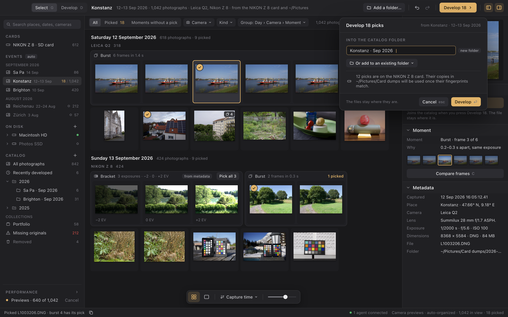

# Select, then develop: the catalog

Status: implementation in progress, on the recorded defaults of the proposals. This design covers how photographs get from a camera card or a folder into development, and how the photographs you develop are kept and found. Each choice the owner has not made is a numbered proposal with a recommended default under [proposals](#proposals). The implementation follows those defaults, but none is a decision until the owner accepts it and it is recorded in [product decisions](../decisions.md). The implementation plan is [tasks/catalog.json](../../tasks/catalog.json).

The contracts have landed:

- catalog format 12 ([storage](versions-and-lineage.md#storage-catalog-format-12));
- the index database;
- the shared types and every method's declared shape ([API](#api));
- generated data (`cargo xtask generate-catalog`);
- module skeletons.

Registered so far: browse views, facets, the selection and the event list (`browse.*`, `event.list`; [Views on the owner](#architecture)), which the desktop's Select workspace browses ([Workspaces](#workspaces)); picks and the journal of library changes (`pick.set`, `pick.list`, `library.journal`, `library.inspect`, `library.undo`, `library.redo`), catalog folders and collections (`folder.*`, `asset.move`, `collection.*`), availability and Locate (`source.check`, `source.locate`), resolving missing originals (`source.missing`, `source.find`, `source.relink`), developing picks (`pick.plan`, `pick.develop`, `asset.send-back`), batch preset and export (`batch.apply-preset`, `batch.export`), removing, putting back and emptying Removed (`asset.remove`, `asset.restore`, `catalog.empty-removed`), `catalog.info`, the index lane with its methods (`index.refresh`, `index.add-folder`, `index.remove-folder`, `index.folders`, `card.list`, `volume.list`, `disk.folders`), and, over the built preview lane and cache ([the index and previews cache](#the-index-and-previews-cache)), `preview.read`. Besides the views, the desktop's Select workspace sends `pick.set`, `library.undo` and `library.redo` for its picks and library undo; organizes the catalog with `folder.list`, `folder.create`, `folder.rename`, `folder.move`, `folder.merge`, `folder.delete`, `asset.move`, `collection.list`, `collection.create`, `collection.create-smart`, `collection.rename`, `collection.delete`, `collection.add` and `collection.remove` ([The catalog](#the-catalog)); resolves missing originals with `source.missing`, `source.find`, `source.relink` and `source.locate`; reads its sources through `card.list`, `volume.list`, `disk.folders`, `index.refresh` and `catalog.info`, and its previews through `preview.read` and `preview.region`; and sends none of the others yet. What the catalog does today is in [feature status](../features.md).

## Product

### What it is

Luxforge works in two steps.

1. **Select.** Browse the photographs on a camera card or anywhere on disk, very fast. Luxforge organizes them for you, without changing or copying anything: into **events** by date and place, then by day, camera and **moment**, where the frames of a burst or an exposure bracket sit together. Look at any frame full screen and at 100% to check focus, and **pick** the few worth developing.
2. **Develop.** "Develop 18" brings the picked photographs into the **catalog** and opens them in Develop, where the filmstrip holds that development set and nothing else.

The catalog is therefore the photographs you develop, not everything you shot. A thousand-frame trip from which you picked twenty adds twenty photographs to the catalog. The other 980 stay where they are on disk and are not Luxforge's to manage: the next time you browse that card or folder, Luxforge organizes it again.

This is deliberately unlike importing everything and culling inside the catalog, as Lightroom does. There, the library fills with every frame ever shot, flags and stars are the only way to find the few that matter, and the catalog, its previews and its backups grow with the shutter count rather than with the work. Here selecting is its own fast step, shaped around the decision that actually matters — which frame of this moment is worth developing — and the catalog stays the size of what you care about.

### The words

| Word | Means | Luxforge's to keep? |
| --- | --- | --- |
| **Filesystem** | Where your files are: the Mac's disk, external drives, camera cards | Never. Luxforge reads it and never writes to it |
| **Index** | What Luxforge has read from the files you browse — headers and embedded previews — so browsing is instant the second time | A cache beside the catalog. Deleting it loses nothing but time |
| **Event** | An automatic bucket of photographs taken close together in time and place ("Konstanz · 12–13 Sep"), computed from the index | Nothing to keep: computed, not created, named or deleted by hand |
| **Moment** | A burst or a bracket inside an event, computed the same way | Nothing to keep |
| **Pick** | A file you have marked to develop | Yes, until you develop it or clear it, so a long culling session survives a crash or a restart |
| **Catalog** | The photographs you developed: identity, fingerprint, recipe, history | Yes. This is what Luxforge is for |
| **Catalog folder** | Where a developed photograph lives in the catalog, one folder each: made from its event when you develop ("Konstanz · Sep 2026"), named then, and yours to rename, merge, nest and reorganize. Not a folder on disk | Yes |
| **Collection** | A set of developed photographs across folders, such as a portfolio | Yes |

There is no import and no "shoot" to create or manage. The only thing Luxforge keeps before you develop is your picks. Organization becomes yours at the moment you develop: an event, computed and disposable, becomes a catalog folder, which is kept.

### What selecting is for

- **Speed.** Hundreds of frames a minute. Frames appear as soon as their headers are read; stepping to the next frame never waits on a decode that could have been done ahead; nothing is developed to be looked at.
- **Sensible grouping without effort.** A camera card's `DCIM/100NZ8_1` tells you nothing. Events say where and when; days and cameras split them; moments gather what belongs together.
- **Moments, not a flat list.** A burst of six frames in 1.4 seconds is one decision, "which of these". A bracket of three exposures is a different decision: usually one photograph to merge, not three to choose between.
- **Detail on demand.** Fit to screen and a 100% focus check under the pointer, on any frame, immediately.

### Who it is for

- **The owner.** Copy the card to the internal SSD, or browse it in place; pick and develop the few; later move the folders to an external drive. Developed photographs keep their edits when their files move, and a whole folder is relinked in one verified step ([owner priorities](../decisions.md#owner-workflow-priorities): "full catalog with lazy shoot subsets", "bracket and panorama identification").
- **Photographers at large.** Mixed cameras on one trip, bursts from sport and wildlife, brackets for landscapes and interiors, drones and phones that record location. The design scale is 10,000 files in view browsing as fast as 100, and a catalog of 100,000 developed photographs, with 1,000,000 as the structural ceiling no data structure may make impractical.
- **Agents.** "Pick the sharpest frame of each burst in this event", "pick the middle exposure of every bracket", "add what I developed today to Portfolio": the same commands the desktop sends, attributed and undoable.

### Principles

- **References, never copies.** Luxforge never writes to, moves, renames, copies or deletes a file it browses or develops. "Develop" brings a photograph into the catalog; the file stays where it is.
- **Developing is the only way into the catalog.** A browsed file is not an asset. It becomes one, with a fingerprint, a recipe and a history, only when its pick is developed.
- **Selecting reads no pixels it does not need.** Browsing uses the files' headers and the camera's embedded previews, labelled as such. A frame is developed by Luxforge only when you develop it, or when a 100% check needs more detail than its camera preview has.
- **Organization is computed.** Events and moments come from capture time, place, camera body and exposure, with their rules recorded and adjustable; there is nothing to maintain.
- **The catalog is authoritative; the index and previews are a cache.**
- **Organizing is not editing.** Picks and collection changes are **library changes**: attributed, numbered, journaled and undoable, beside each photograph's history, never inside it.
- **Honest and programmable.** A preview says what it is; an offline file says so; every gesture is a command in the registry, and an agent's changes appear live.

### A day with it

1. The owner puts the Nikon's card in. Luxforge offers it ("NIKON Z 8 card connected · 612 photographs, organized into 3 events"); the owner has also copied the Leica's card to `~/Pictures/Card dumps/2026-09-12`, which is in an indexed folder. Under **Events** "Konstanz · 12–13 Sep" appears with 1,042 photographs from both cameras; within a second the first screen of frames is showing, grouped by day, camera and moment.
2. Space on a burst of six frames of a ferry fills the screen with the first frame. `→` steps through the six; `Z` shows the pointer's neighbourhood at 100%. Frame 3 is sharp: `P` picks it, and Luxforge moves on to the next moment.
3. A bracket of three frames is labelled a bracket: the exposure steps −2, 0, +2 EV in the metadata. The owner picks all three, to merge later.
4. After forty minutes, 18 of 1,042 frames are picked. "Develop 18" asks where they go — "Into the catalog folder: Konstanz · Sep 2026 (new)" — and notes that 12 of them are still on the card but already copied, so it will use the copies. Return accepts. The eighteen open in Develop; `→` moves through them, each appearing at once from its preview while its original prepares.
5. Next week an agent adds the eighteen to "Portfolio › Landscapes"; the change is in the journal with its actor.
6. In the spring the folder is on "Photos SSD", unplugged. The eighteen developed photographs are still browsable; the event shows its cached previews and says its files are offline. After the drive is reorganized, Missing originals shows the eighteen under the folder they came from; Find in a folder… on the drive's new layout finds and verifies each one, and Relink 18 points them there.

## How it works

### Workspaces

A segmented control at the title bar's leading edge switches between **Select** (`G`) and **Develop** (`D`). Select browses files and the catalog; Develop edits the development set. Switching never commits, discards or pauses anything, except that a Develop draft must be applied or cancelled first, under the [one start refusal](develop-workspace.md#interaction-rules).

Select's layout ([event board](catalog/event.png)) uses the Develop workspace's tokens and density:

| Region | Size | Contents |
| --- | --- | --- |
| Title bar | 44 pt | Workspace switch; the view's name and a summary (dates, count, cameras, where the files are); Add a folder…; Undo and Redo of library changes; **Develop N**, the one primary action; panel toggles |
| Sources panel (left) | 240 pt | A search field (places, dates, cameras). **Cards**: camera cards currently mounted. **Events**: by month, each with its picks and total, a hollow dot when its files are offline. **On disk**: the filesystem by volume, for browsing any folder directly. **Catalog**: All photographs, Recently developed, catalog folders by year, collections, Missing originals, Removed. Performance pinned at the bottom, as in Develop |
| Centre | remainder | Over files: All, Picked, Moments without a pick, with Camera, Kind and Group chips. Over the catalog: search, filter chips and the metadata browser. Then the grid or the loupe; a floating strip with Grid, Loupe, sort and size |
| Info panel (right) | 300 pt | For a file: preview, **Pick**, **Moment** (kind, why it was grouped, its frames, Compare frames), **Metadata** (including place). For a developed photograph: **Organize** (its catalog folder, its collections), **Metadata**, **Develop**. For several: the batch form |
| Status bar | 26 pt | What last happened, with Undo when it was a library change; "Camera previews · auto-organized" over files; counts in view, picked and selected |

**Built so far** (TASK-019). The switch is in both title bars; `G` in Develop shows Select, and `D` in Select waits for developing picks. Which workspace is shown is the desktop's own view state, like the developer gallery page: `session.state` does not carry it, and evidence records it with every captured frame. Switching to Select answers the one start refusal's one-draft half ("Apply or Cancel the crop draft before switching to Select"); nothing else holds it back, and each workspace keeps its state. Select draws its title bar (the view's name and summary; Add a folder…, shown disabled with a tooltip until indexed folders reach the desktop; Undo and Redo of this desktop's library changes; Develop N from the summary's picks, inert until developing picks lands; the two panel toggles), the sources panel, the filter bar (the pick segments with Picked's count from the Pick facet, Camera and Kind chips whose menus come from `browse.facets`, the Group chip), the grid over the view with the floating strip (Grid; Loupe, which opens the loupe; the sort; the size slider), the Info panel and the status line. Over the catalog the view is sorted newest first and ungrouped in the catalog's larger cells, with no pick segments or Group chip.

- **Sources.** The search is `event.list`'s `query`. **Cards** lists each mounted card from `card.list` by its volume's name, with the first camera its files were read from and how many files its last listing found; pressing one has the index lane read it (`index.refresh` of the card) and then views it. **Events** by month, each named without the dates its name ends with and shown beside it, an Undated event by its folder, with picks over total and the offline dot. **On disk** lists the volumes from `volume.list` but the cards, the startup disk first, each with its dot, filled while mounted and hollow while offline; a mounted volume opens with its chevron or a press to its subfolders (`disk.folders`), and each folder opens to its own. Pressing a folder has the index lane read it with its subfolders (`index.refresh`, a job whose end the desktop hears through its watch on the activity board and then reads with `job.read`, the status bar saying it is reading and a first look that takes a while showing its progress sheet) and then views it as the index listed it. Browse a folder… stays last, the native folder dialog, for a folder the volumes do not reach. **Catalog** is All photographs, Recently developed, Missing originals and Removed with `catalog.info`'s counts, Missing originals' in the clipping red while there are any; the cards, volumes and counts are read each time Select is shown, and the counts again after every library change. Performance is pinned under it.
- **The grid.** Cells draw their decoded previews ([the grid's decoded previews](#architecture)); a picked file carries the accent check. A day's heading counts its picks ("104 photographs · 9 picked") and a moment's header its own ("1 picked"), from the summary's day and moment `picked` counts; a bracket of files not all picked offers **Pick all N**, which picks its frames' files. A burst collapsed with `S` shows its pick, the first of its frames read as picked, or else its first frame, with its frame count.
- **The Info panel.** The active item's preview placeholder, the **Pick** band for a file ("Picked for Develop" in the accent tint, or "Pick", each with `P`, and once picked "Joins the catalog when you press Develop N. The file stays where it is."), the Moment and Metadata bands; or the count selected.
- **Picking and library undo.** `P` (or the Pick band) sends `pick.set {targets: {kind: selection}, picked, mutation}` with the desktop's actor, the request an agent sends. It clears only when the desktop has read the row of every selected item and each is picked, and otherwise picks, which leaves an item already picked as it was, so `P` never clears a pick the desktop has not shown. `Cmd+Z` and `Shift+Cmd+Z`, and the title bar's Undo and Redo, send `library.undo` and `library.redo` with the same actor, so they undo only this desktop's changes, never an agent's; Develop keeps its history's undo ([P10](#proposals)). Each is one synchronous owner call in the update of its key or press: the journal records the gestures in the order they were made, and a pick names the selection on screen, which the next arrow key's synchronous `browse.select` would otherwise overtake. The owner's work is one catalog transaction. What the change leaves is read as another client's change is, in owner tasks: the view evaluated again, keeping its scroll and, when it was on screen, the active item in view; the events and the catalog's counts; and the change's label from `library.journal`, which the status bar says with the key that takes it back ("Picked DSC_0412.NEF · Undo ⌘Z", "Undid Picked 3 files · Redo ⇧⌘Z"). A change that changes nothing says so ("Nothing to undo"); a refusal says why, an undo or redo naming the first item that changed since and how many others did ("Could not undo: DSC_0412.NEF changed since"), and a pick refused because the view went stale reads the view again. For the loupe's [P7](#proposals), `state/select.rs`'s `next_moment` answers where the loupe moves on to after a frame (the first frame after its burst or bracket, or the next frame after a single), and `Editor::pick_active` picks or clears the active frame alone (`pick.set` naming its file).

Not yet: the loupe, Develop N and its confirmation, Add a folder…, the notice when a card is connected (mount notifications are not built, so a card appears when Select is next shown), and the Missing originals view.

**Evidence.** Real-owner tests over a seeded catalog and index view an event, read its visible rows, select by click and arrow keys through the session and follow another client's `pick.set` through the wake; pick with `P` and Pick all, undo this desktop's changes newest first and never an agent's, find nothing left to undo, redo, clear with `P`, pick the loupe's active frame, and have an undo refused because an agent changed its item since, each gesture one synchronous owner call whose request is what an independent JSON client writes and whose effect that client reads back (`pick.list`, `library.journal`); and list the volumes, a volume's folders and the catalog's counts. The rendered `select` smoke scenario generates a catalog of 2,000 files and 3,000 photographs, shows Select with `G` (its cards, volumes and catalog counts checked against `card.list`, `volume.list` and `catalog.info`), opens "Konstanz · 12–13 Sep" from the sources panel, moves the active item and extends the selection with the arrow keys, sets the Group chip to Day, has a second client pick a file, sets the grouping back, clicks a single file and picks it with `P`, picks a bracket with its Pick all, undoes Pick all and then the pick with `Cmd+Z`, finds nothing more of the desktop's to undo while the agent's pick stays, redoes the pick with `Shift+Cmd+Z`, browses the generated folder of 120 real JPEGs (read by the index lane, then shown with its days, cameras, bursts and brackets from metadata, with their previews) and returns to Develop; each frame's view (count, picks, days, camera groups and moments, every item one cell) equals the core's own `browse.view` answer, each day heading and moment header says the picks the layout counts, each library request is what an agent writes with the desktop's actor, each selection equals the owner's `session.state` for the desktop, the folder's moments are its manifest's, and the catalog the run leaves holds both clients' picks and exactly their changes in its journal. The generated index has no image data behind it, so the event's cells are placeholders.

### Browsing the filesystem

- **Cards.** A mounted volume with a `DCIM` folder is offered under Cards and with a notice. Browsing it reads it in place.
- **On disk.** The filesystem, by volume: open any folder to browse its photographs, with the same grouping. It is named so that it is never confused with catalog folders.
- **Indexed folders.** **Add a folder…** (`Cmd+O`, the palette, or a drop on the window) adds a folder, with its subfolders, to the set Luxforge organizes into events: typically `~/Pictures` or a card-dump folder. It is a short list the person controls, remembered with the catalog; removing a folder from it forgets nothing but its cache.

Whatever is browsed is **indexed**: a bounded, cancellable walk that lists supported files and reads each one's header — capture time to the subsecond with its offset, GPS position when present, camera make, model and body serial, lens, exposure time, f-number, ISO, exposure bias and focal length, dimensions and orientation — and no image data. It follows no symbolic link out of its folders, crosses no volume boundary and refuses past its file limit with `resource-limit`. Files are identified by path and signature (length, modification time, file identity), with no fingerprint: hashing a thousand RAW files would cost more time than culling them. A preview lane then extracts each file's embedded previews, the frames on screen first. Returning to a folder re-lists it cheaply and reconciles by signature. A folder on an unmounted volume is **offline**: its cached previews stay browsable; developing waits for its files.

How it is built:

- **Supported files** are JPEG (`.jpg`, `.jpeg`) and the RAW containers the camera catalog admits (`.nef`, `.arw`, `.cr2`, `.cr3`, `.raf`, `.orf`, `.rw2`, `.pef`, `.dng`), by extension in any case. A file of one of those extensions whose container the header reader does not recognize is listed as unreadable, with the reason.
- **One job per listing.** `index.refresh` lists an indexed folder, a card, any folder or every indexed folder as an `index-refresh` job, one at a time on the index lane, at most 16 waiting; a source already waiting or running answers its job. The walk lists a folder at a time; two workers read headers of different files, at most 32 at once; the lane writes the index in batches of at most 512 writes or 500 ms, each advancing the index's revision in the same transaction and recorded as one event naming it (`index_revision`), which a view compares to go stale. A listing is on the activity board: while the walk is still discovering its extent it says how many files it has found, and "N of about M" when an earlier listing of the root found M; then the fraction of headers read. `job.cancel` stops it at its next folder and the workers skip what is queued; what was committed stays, and vanished files are dropped and the root marked listed only when a listing completes. A listing refused past 500,000 files (or 100,000 folders) keeps what it committed, as a cancelled one does; folders deeper than 64 below the root are not entered.
- **Volumes.** A volume is identified by the platform's volume UUID where it has one (macOS: every local volume, cards and disk images included), so a card is the same volume every time it is mounted; otherwise by its device number. Its label is its volume name, and whether it is removable is the platform's own flag (a card, a disk image). On macOS the startup disk's two file systems (the sealed system volume and the data volume that holds `/Users`) are one volume mounted at `/`. `volume.list` answers the mounted volumes, the startup disk first, and the volumes the catalog knows (a pick, a photograph or an indexed folder is on it) that are not mounted, offline. `card.list` answers the mounted volumes with a `DCIM` folder; listing a card lists its `DCIM` folder. `disk.folders` answers a folder's immediate subfolders without what indexing skips, for On disk. None of these waits on a volume: the owner reads the mount table, which waits on no file system, and answers the volume and card lists from what the index lane's survey last learned of each mounted volume (its identity and `DCIM` folder), so a volume taken out is gone from the next answer and one mounted since appears once a survey has learned it (each list asks for a new survey, until the mount notifications do); only the first call waits for the first survey. A folder's subfolders, a path to add, browse or refresh, and a card not yet surveyed are read on the lane's query thread while the call waits parked, at most 16 calls behind the one being read before `resource-limit`, so a volume that does not answer holds only the calls that asked about it and those behind them.
- **Indexed folders** are library changes (`index.add-folder`, `index.remove-folder`), journaled with their actor and undone and redone like any other. Adding one lists it; a folder inside or around an indexed one is refused with `conflict`, and a file, a package, another application's cache or one of Luxforge's own directories with `validation`. Removing one stops its listing and forgets its rows unless another root lists them; its undo adds it back and lists it again. `index.folders` says whether each is offline (not there, and its volume not mounted) and what its last listing found.

### Events

Events are Luxforge's organization over the indexed folders and mounted cards ([P3](#proposals)). They are computed, not stored (`organize::events`): a pure function of the files' header metadata, the gazetteer and the view's thresholds, so a changed threshold regroups at once.

- **Where one ends.** Photographs are sorted by capture time across every camera and folder. A new event starts:
  - at a **jump**: a photograph whose position is more than 25 km from the last positioned photograph of the current event. The last positioned one, not the one just before: a camera without GPS interleaves with a phone that has one, and must not hide the phone's move;
  - at a **gap** of more than 3 hours between consecutive photographs, unless the gap is a **stay**: under 24 hours, with the last positioned photograph before it and the first positioned photograph after it (before the next gap of more than 3 hours) within 25 km of each other. A trip stays one event across its nights ("Konstanz · 12–13 Sep"), and a long break at one place does not split a day. Without a position on both sides, each outing is its own event, because nothing says it did not move. A gap of 24 hours or more always starts a new event; the 24 hours are fixed, not a threshold.

  The known limit: a place photographed every day with positions, such as home, stays one event for as long as no day is skipped, since nothing tells home from a trip. A second limit comes from the clocks: photographs are ordered by their true instant when the camera records its offset from UTC, and by its wall clock read as UTC when it does not, so on one trip a camera that writes no offset (many Leica, Fujifilm and DJI bodies) is placed later or earlier than one that does by the time zone's offset. The 3-hour gap absorbs this in Europe; further from UTC the two cameras can fall into separate events. Proposal, not built: order events by each camera's wall clock, which travellers set to local time, instead of the instant.
- **Names** ([P4](#proposals)), from what the event holds, in this order:
  - **Its place**: the median of its positioned photographs' positions (component-wise; across the antimeridian, western longitudes are taken past 180° for the median), named from an offline gazetteer bundled with Luxforge, never an online lookup, whose places are GeoNames' `cities15000` extract, compiled in and credited in the notices under CC BY 4.0 ([bundled place names](../engineering/dependencies.md#bundled-place-names)). The name is the most populous place within 10 km when it has at least three times the people of the nearest place that is not a district of another, else that nearest place when it is within 50 km, else none. So the centre of Berlin is "Berlin", not "Mitte", and the Louvre is in "Paris", not "Paris 01 Louvre", while a town beside a bigger neighbour keeps its own name: Lindau beside Bregenz, Bregenz beside Dornbirn, Venice beside Mestre, Versailles beside Saint-Quentin-en-Yvelines, each of which the most populous place within 10 km alone misnames. A place with fewer than 15,000 people is not in the table: Reichenau is named "Radolfzell" (9 km), Zermatt "Sierre" (34 km), and Hallstatt nothing.
  - **A user-named folder** holding more than half of its photographs: not a camera's folder (`DCIM`, or a DCF name of three digits from 100 and five characters, such as `100NZ8_1`, `100MSDCF` or `101_FUJI`) and not only a date (digits and `-_. `). A leading date of four digits or more is dropped when a name remains: "2026-09-14 Lake" names "Lake · 14 Sep", while "100 Days" stays whole.
  - **Its dates and cameras**: "16 Sep · LEICA Q3, Apple iPhone 15 Pro", the cameras by frame count, two at most and then how many more ("NIKON Z 8, LEICA Q3 +1"); the dates alone when no photograph records its camera.

  An event also carries its **label**, the name without its dates (the place, the folder or the cameras; an Undated event's whole name; empty when the name is its dates alone), so a client never takes a name apart.

  Dates are camera-local days in English: "12 Sep", "12–13 Sep", "30 Sep – 2 Oct", with the years only when the event crosses one ("30 Dec 2025 – 2 Jan 2026"). The first query builds the gazetteer's index, under 10 ms in a release build; every later one takes about a microsecond, so the index is warmed from a worker, never on the catalog owner thread.
- Events are listed by month, newest first, each with its picks and total, and are searchable by place, date and camera from the sources panel.
- An event's photographs from several folders and cards are one view; the Info panel says where each file is.
- An event is identified by its first file's path and capture instant, so it keeps its identity while later files join it.

A photograph with no capture time joins an "Undated" event per folder ("Undated · From Anna"), sorted by file name and listed after every dated event, and identified by its folder.

**Corpus evaluation.** Generated data only (`cargo xtask generate-catalog`), recorded with the default thresholds:

- **Image folders** (`--images` 120, 600, 3,000 and 5,000; seeds 3, 1, 7 and 11): every file's header read through the index's header reader, organized and compared with the generator's manifest. All six events of each run are found with exactly their files, their places and their names: "Konstanz · 12–13 Sep" (two days, both Nikon bodies, the Leica and the phone), "Lake · 14 Sep" (no GPS at all, named by its folder), "Zürich · 16 Sep" and "Luzern · 16 Sep" (41 km apart within the hour, split by the jump), "Lindau · 18–20 Sep" (three days, with the drone) and "Undated · From Anna". The generator bridges each trip's nights with a tripod's frames under 3 hours apart; with those frames removed, 11 nights stayed inside their trips and the one night with no positioned frame on one side split, as the rule says.
- **Index rows** (`--files` 10,000 with seeds 1 and 5, and 50,000 with seed 2): events, days, cameras and moments equal the independent reference grouping of the tests, and each older trip's folder (29, 29 and 185 trips) is exactly one event holding nothing else.
- **Names** over the generator's 34 places and a dozen city districts, suburbs and border towns: the rule above names each place as expected except the places too small for the table (above). The most populous place within 10 km alone misnamed Lindau, Bregenz, Venice and Versailles; a same-country restriction misnamed Bregenz, Venice and Versailles. Kreuzlingen, 1 km from Konstanz across the border and a quarter its size, is named "Konstanz".
- **Misgrouping**: none on this data. A labelled corpus of real trips from several makes does not exist yet, and its evaluation is outstanding: the acceptance's corpus check is not claimed.

### Grouping inside a view

A view of files is shown **Day › Camera › Moment** by default ([event board](catalog/event.png)): the camera's local capture day, then the body (make, model and serial) when a day has more than one, then moments of consecutive frames of one body ([P5](#proposals)). Grouping is computed like events (`organize::group`) and changes with its thresholds at once. Undated files are one group after the days, with no camera groups or moments: they are ordered by folder and name.

1. **Close in time.** Frames of one body on one day less than 1 second apart are one run; frames less than 2 seconds apart whose aperture, ISO and focal length match are also one run, since bracketing at slower shutter speeds spaces frames further. Many cameras record capture time to the second only (no `SubSecTimeOriginal`: most DNGs, Olympus ORF); when both frames' times are whole seconds, a gap equal to the threshold joins too, so a 10 fps burst that crosses a second boundary, which such a clock shows as exactly 1,000 ms, stays one run.
2. **Burst or bracket.** A run whose exposure steps is a **bracket**; otherwise it is a **burst**.
   - **From metadata.** Exposure time, f-number and ISO give each frame's exposure value; when they are the same on every frame, the recorded exposure bias does, as some drones and phones write it. The two are never added, since a camera applies its bias through its settings. A run of 2 to 9 frames whose values are all distinct, each at least ⅓ EV from the next once sorted, is a bracket, labelled "from metadata". The ⅓ EV allows 0.13 EV for nominal values: cameras record third stops rounded, so 1/200 → 1/250 s records 0.32 EV, 1/50 → 1/60 s and f/3.2 → f/3.5 0.26 EV, and 1/13 → 1/15 s 0.21 EV, each a true ⅓ EV; a sixth of a stop (0.17 EV) does not count. A longer run, or one whose values repeat, that repeats one bracket's pattern (every frame within 0.13 EV of the frame a period later, and each period a bracket) is that many brackets, as an HDR panorama shoots them one after another.
   - **From previews.** When the metadata cannot say — no bias recorded and nothing else changing — organizing asks the preview check (`previews/bracket.rs`) about a run of 2 to 9 frames. It compares the frames' grid tiers through the fingerprint each kept when it was made ([below](#the-index-and-previews-cache)): a 24 × 24 grid of each frame's mean log luminance, weighted towards the centre, with clipped and dark pixels excluded and two frames compared only on the cells both keep. The frames are put in order of brightness and each is compared with the next brighter one: the framing must be unchanged (the cosine of their log-luminance gradients at least 0.8, which a pan of 3% of the frame fails), and the step consistent (all but a fifth of the frame moving the same way, by 0.35 to 2.5 times the step, give or take 0.15 EV, as an exposure step through a camera's tone curve does and a cloud's shadow over part of the frame does not). A frame without a fingerprint, another framing, or light that changes over part of the frame answers nothing, and the run is a burst. Distinct measured steps at least about ⅔ EV apart (⅔ EV less ¼ EV, since a camera's tone curve compresses a bracket's brighter steps) make a bracket, labelled "from previews" with the measured steps ([components board](catalog/components.png)). Organizing asks only about such runs, so a view whose runs the metadata classifies reads no fingerprint; for a run it asks about, the check reads that run's fingerprints in one indexed query and compares them in a few thousand operations, reading no photograph's file and decoding nothing; its time is measured with the feature's.

     What it measures is the step as the camera rendered it. Calibrated on six synthetic scenes encoded as grid tiers, brackets within ±2 EV: without a tone curve, as the generated folders render, every step measures 0.97 to 1.01 times true; through three camera-like curves (ACES's filmic fit, Hable's and Reinhard's) 0.56 to 1.50 times, a shoulder compressing the brighter links and a contrasty toe expanding the darker ones, so a ⅔ EV step measured 0.45 to 0.95 EV. ⅙ EV below ⅔ kept 25 of those 36 ⅔ EV brackets, ¼ keeps all 36 and still none of the 48 ⅓ EV ones. A cloud's shadow over 30 to 70% of the frame, or the sun going in, is refused; light that changes alike over four fifths of the frame or more is measured as a step, the limit of what brightness alone can tell.
   - A bracket's steps are relative to its metered frame: the one frame with no bias from metadata, else the median frame ("−2 · 0 · +2 EV").
3. Anything else is a single frame.

Thresholds are adjustable from the Group chip and apply at once; they are a view setting, not stored corrections. The Group chip also switches to Day only, or none. Panoramas and visually similar frames are later groupings ([scope](#scope)).

In the grid a moment is a framed row with a header naming its kind, span or exposures and how many are picked ("Burst · 6 frames in 1.4 s · 1 picked", "Bracket · 3 exposures · −2 · 0 · +2 EV · from metadata"). A burst collapses to one cell showing its pick, or its first frame, with the frame count (`S`).

**Corpus evaluation.** Generated data only, with the default thresholds. Over the four image folders above, every burst and bracket of the manifest is found with exactly its frames, kind, evidence and steps, and no other moment: 307 brackets from metadata (with the bias recorded, as the Nikons and the Fujifilm write it, and without, as the Leica does), 144 brackets from previews through a stand-in probe answering from the manifest (the drone's, whose metadata does not change), and 781 bursts; with no probe the 144 are bursts. The generator's moments are at least 6 seconds apart, so the tests' reference comparison covers the edges: 4,000 random frame sets from fixed seeds (about 440,000 frames), with gaps at every threshold, whole-second clocks, drifting and repeated exposures, nominal third-stop brackets, consecutive brackets and preview-only brackets, group exactly as an independent plain implementation. With the preview check itself (`--images` 240, 600 and 3,000; seeds 1, 1 and 7), each file's grid tier made by the preview lane's worker and the probe loaded from the index: every one of the 68 brackets only the previews show is found with exactly its frames, its steps measured within 0.016 EV of the manifest's (0.003 EV on average over 254 frames); the 129 brackets from metadata and 349 bursts are unchanged, and no burst is called a bracket. A labelled corpus of real bursts and brackets from several makes does not exist yet, and its evaluation is outstanding.

### Browsing at speed

- **Grid.** Virtualized: only visible rows and a margin exist. Each cell is the camera's embedded preview at grid size, drawn soft from the file's EXIF thumbnail until that preview is read; a picked frame carries the accent check; a file already in the catalog says so. States are on the [components board](catalog/components.png).
- **Loupe** (`Space` or `E`, [board](catalog/choosing-from-a-burst.png)) shows the active frame fitted to the screen, from a file's loupe tier (its largest embedded preview, at most 2560 px) or a developed photograph's large tier, with a bar naming the moment, the frame's position and time offset, its exposure and what the picture is with its size ("Camera preview · 2560 × 1707"). Under it, the moment's frames, numbered, each the grid's preview of its file. `←` `→` move through the view's frames, `↑` `↓` to the first frame of the previous or next moment (a single frame is a moment of its own there, so every frame is reached), `1`–`9` jump to a frame of the moment. `Tab` hides the side panels, as in Develop; `Esc` returns to the grid on the frame the loupe left. As built:
  - **Stepping** is the `browse.select` an API client sends, a synchronous call in the key's own update ([performance rule 12](../engineering/performance-rules.md#rules)), and the grid under the loupe scrolls with it so its rows window holds the frames the loupe names. With the look-ahead warm, the key's update adopts the session's new active frame and the next draw lends the view the handle already held for it: no task, worker or allocation hop between the key and the presented frame. Timing is the final task's.
  - **What is drawn is what is named.** Until a frame's tier is read, the preview `preview.read` answers meanwhile stands in (a file's grid tier or thumbnail, a photograph's camera preview labelled `embedded`) and the bar says "reading full size…"; an approximate render says "approximate". A picture is drawn only under the frame whose item it was read and decoded for, and the view borrows a handle by that item and its preview's key alone, so a decode that lands for a frame already passed is never drawn under the active frame's name (`app/loupe_frames.rs`, `state/loupe.rs`; the `loupe` smoke scenario checks it in every frame).
- **100% focus check** (`Z`) shows the region under the pointer at 100% in an inset over the photograph's lower right, with its box on the photograph, from the embedded preview when it is full size, decoded only for that region, labelled "100% · Focus check under the pointer". When a camera's preview is smaller than the sensor, the inset is a neutral Luxforge development of that frame, made on demand off the editor's source cache and labelled "100% · Luxforge development" ([P6](#proposals)). `preview.region` answers it ([the 100% region](#the-100-region)): the rectangle is the inset's size in the display's pixels, centred on the pointer (the middle while it is elsewhere) and held inside the frame, named in the frame the last region answered, else the header's upright size. At most one region is out — from the request through its job's end, which the lane wakes the desktop for, to its answer decoded — and of the rectangles asked for meanwhile only the newest waits (`app/loupe_region.rs`, the app's one coalescing slot), so the answer file is never read after the lane has replaced it.
- **Compare** (`C`) shows up to four frames of the moment side by side at the same zoom, a window that keeps the active frame in view, the active one outlined; the focus check and compare are exclusive.
- **Look-ahead.** The loupe reads (`preview.read` at `look-ahead` priority, the frame on screen first) and decodes, off the update loop at the size the screen needs, the next three frames in the direction you are moving and the next moment's first frame, within a byte budget of decoded frames (`DECODED_BUDGET_BYTES`, 256 MiB, the provisional desktop budget below), least recently wanted out first and never a frame on screen. A plan of decodes never holds more bytes than the budget, a newer plan starts after the decode running when that frame is still wanted and abandons it when it is not, and a frame the loupe has passed while its read still waits in the lane has its job cancelled, so a held arrow never leaves the lane or the decoder working through frames already passed. The status bar says "next frames ready" once they are.

### Keeping up with the disk

Organizing files is realistic because what it needs is small and near the start of each file. The expensive part is previews, so the design keeps the two apart.

- **What is cheap.** Events and moments need only header metadata, usually within a file's first 64 KB: well under a second for 1,000 files on the internal SSD, a few seconds from an SD card. Sorting, grouping and naming even 100,000 rows takes milliseconds. Most RAW files also carry a tiny thumbnail (about 160 px) beside their metadata, so the grid can draw every cell at once, soft, from the same reads. The bracket brightness check waits for the sharper grid tier, whose fingerprint it reads.
- **What is not.** A sharp grid cell or a loupe frame needs the camera's larger embedded preview, 1–3 MB a file. From a UHS-I card at about 90 MB/s that is 20–30 s for 1,000 files, about 8 s from the M4 Pro's UHS-II slot. So previews are read in priority order — the loupe's look-ahead, the visible cells, then the rest — and never block browsing. A camera whose files carry no usable preview (the Canon EOS R5 Mark II and R8, [inventory](../research/embedded-previews.md)) needs a real development of about 0.3–1 s a file, done lazily for what is on screen: the visible cells and the loupe's look-ahead are developed, one RAW at a time, and the rest of the view waits for them.
- **How it stays current.** Indexed folders are watched with the platform's change notifications, never polled: FSEvents on macOS, which also replays what changed while Luxforge was closed; the change journal or directory notifications on Windows; inotify on Linux. A card cannot be watched usefully — the camera writes to it elsewhere — so it is re-listed when it mounts, and reconciled by signature (length, modification time, file identity): unchanged files keep their rows and previews, changed ones are read again, new ones are added and vanished ones dropped. 1,000 files reconcile in well under a second. A network volume sends no reliable notifications, so it is re-listed when opened. Nothing wakes while nothing changes ([performance rule 8](../engineering/performance-rules.md#rules)). Built: reconciliation by signature on every listing, where returning to an unchanged folder costs its directory listing, one `lstat` per file and folder and one query per folder, and reads no header; a card mounted again under another device number keeps its rows when its volume UUID and each file's inode are the same. Built: the platform's notifications, in `luxforge-watch` — FSEvents, replaying from a persisted cursor, and Disk Arbitration on macOS; inotify and the mount table's own change events on Linux; `ReadDirectoryChangesW` and the configuration manager's volume notifications on Windows, compiled but not yet run there — and the index lane's use of them, verified on macOS:
  - **One watcher, on the lane.** The index lane's coordinator owns the watcher and watches every indexed folder (never a card or a folder only browsed): each from the end of its first listing, and every one as the catalog opens. The lane starts then, or when a client first asks about the disk, and sleeps on one bounded channel of 16 that carries both the watcher's events and the owner's word that it left work; a full channel costs a rescan of the root, never memory, and nothing wakes while nothing changes.
  - **Changes by signature.** A changed path is only a hint and is looked at: a file is reconciled by signature, as a listing does (read again when changed or new, carried by its file identity when it moved within its volume); a folder the index knows nothing under is listed with everything under it; a path gone, a link, a path on another volume, or one the listing skips (hidden, a package, a cache, a system folder, Luxforge's own) has its row and every row under it dropped. A path gone waits half a second (`GONE_AFTER`) for the path it may have moved to, since a rename can arrive in two reports, and is looked at again before its rows go. A subtree whose changes were not all reported (a full channel, FSEvents coalescing, wrapped event IDs) is listed again; a root that moved, was removed or lost its volume is listed again and watched anew, or recorded offline or missing.
  - **Its listings are jobs.** Each listing the lane runs on its own — a subtree or root listed again, a root that moved, a root listed again as the catalog opens or its volume comes back — is an `index-refresh` job no request started, like a card's listing: the lane posts it to the owner, which records it running, before it shows on the activity board ("Indexing" and the folder, with its `job_id`), so `job.read` answers it with its progress and report and `job.cancel` stops it at its next folder, keeping what it committed. Its batches and its end are announced as below, naming the job.
  - **Stale folders.** A listing of the lane's own that is cancelled or fails leaves its root stale, on its root row (`stale`, index format 5), and so does a unit of notifications that fails for every root it touched: `index.folders` reports the folder `stale`, it records no cursor, and it is listed in full before its next change is applied, as the catalog next opens (watched without its cursor, so the watcher asks for the listing) and when its volume comes back. A listing of the whole root that completes, a client's `index.refresh` included, makes it current again. Where the platform keeps no history, a root that moved whose listing was cancelled is listed again at once, as watching it anew asks for.
  - **Batches and events.** What the lane applies on its own commits in batches as a listing does, each advancing the revision and recorded as one event under method `index-watch` with an empty request id, as work no request made; a batch of one of its listing jobs also names the job. Every `index.refresh` job, and every listing job of the lane's own, also records one event as it ends, however it ends and even when it changed nothing, naming the request that started it (for the lane's own, `index-watch` and no request id), the job and the index revision it left, so a client learns from the event log that the listing ended.
  - **Replay (macOS).** Each watched root's cursor is kept on its root row (index format 5), recorded in the transaction that writes the last change before it, after every header read of those changes. A new root is listed first and watched from the cursor read before its walk, so what changed during the walk replays; as the catalog opens every indexed folder is watched from its cursor, so what changed while Luxforge was closed is caught up without a listing. A cursor of another history, a root without one, a stale root, and Linux and Windows, which keep none, are listed again instead.
  - **Volumes.** A volume mounted has the volumes surveyed again, its roots online, the indexed folders on it watched again, and, when it is a card, its `DCIM` folder listed as an `index.refresh` job no request made. A card already mounted as a catalog with indexed folders opens, which starts the lane, is listed the same way once the first survey that begins after the lane's watcher has found it; a catalog with none starts the lane when a client first asks about the disk, and a card mounted before then is listed when a client refreshes it. A volume taken out is gone from `card.list` and `volume.list` at once, and its roots are offline and out of the watcher.
  - **Not watched.** A folder on a network volume, whose changes are not reported, is re-listed when a client refreshes it. `index.folders` says for each folder whether it is watched, and why not (`unwatched`): not yet listed, offline, on a network volume, or past a platform limit such as Linux's inotify watches.
- **Moves.** A rename or move within a volume keeps its file identity, so the index carries picks across it, and a developed photograph whose file moved within its volume is found again by identity and confirmed by fingerprint without anyone asking.
- **Events may reshape.** Events are computed, so files added to a folder can merge or split them and change a name. Nothing is lost: picks follow files, and catalog folders, once made, are the person's.
- **What indexing skips.** macOS packages (such as a Photos library), other applications' caches and previews (such as Lightroom's `.lrdata`), hidden folders, system folders and Luxforge's own catalog and index directories. As built: packages by a named list of extensions (applications and plug-ins, Photos, iPhoto, Aperture, Lightroom's cloud library, Capture One catalogs, media libraries, documents and projects), since telling any directory with the package bit needs a Launch Services query; caches by name (`.lrdata`, Capture One's `CaptureOne`, Synology's `@eaDir`, QNAP's `@__thumb`); hidden entries by a leading dot and, on macOS, the `UF_HIDDEN` flag, which `~/Library` carries; system folders by name anywhere (`.Spotlight-V100`, `.Trashes`, `.fseventsd`, the Windows recycle bin, `lost+found`) and at a volume's root (`System`, `Library`, `Applications`, `private`, `usr` and the other system trees); and the catalog's index and artifact directories.
- **Clocks.** Camera clocks drift, lack a time zone or were never set. Moments are per body, so they do not care; events use a 3-hour gap, which absorbs small drift between bodies; a camera whose clock is badly wrong forms its own event, which the person can see and ignore. Correcting capture times is later work.
- **Scale.** The first index of a large folder — `~/Pictures` with 200,000 files — reads headers for a minute or two and runs in the background (below). Later visits cost only the changes.

### Long-running work

Luxforge always shows that intense work is happening, how far it has got and how to stop it ([P18](#proposals), [components board](catalog/components.png)).

- **Background by default.** Every job expected to take more than a second — indexing, reading previews, developing picks, searching for missing originals, batch preset and export — is a row in the Performance section with its progress, an estimate once one is truthful, and **Cancel**, through the one activity board and the progress model every activity already shares (`activity.list`; `job.cancel`). The section's cancel is the follow-up the [performance panel design](performance-panel.md) already lists. While any job runs, the status bar carries the busiest one with a small bar and the number of jobs; clicking it opens the Performance section. A finished job leaves a sentence in the status bar ("Indexed 12,408 files in ~/Pictures").
- **In front only when there is nothing to show.** When the view you are in cannot show anything yet — the first look at a card or folder before its file list and headers are read — its progress is a sheet in that view ("Reading the NIKON Z 8 card · 312 of 612 files · about 4 s left") with **Continue in background** and **Cancel**. It covers only the view that is waiting, never the rest of the window, and it goes away by itself when the first frames can be drawn. Nothing else is modal.
- **Honest numbers.** A count is shown when the work knows its extent ("48,210 of about 200,000 files" while a walk is still discovering it), an estimate only once the rate is steady, and "working" otherwise; a stuck job is never shown as nearly done.

**What is built** (TASK-024; the desktop's `app/long_work.rs`, `state/long_work.rs` and `view/long_work.rs`, and the board's watch in `crate::activity`):

- **What counts.** Long-running work is the catalog's jobs, the activity board kinds `catalog_types::jobs` names (`catalog_job`), shown once one has run half a second: the index lane's own listings among them, since each is an `index-refresh` job. The desktop's own preparations, RAW developments, renders and histograms keep their own indicators and their plain Performance rows.
- **Performance rows** are work rows with Cancel (`job.cancel` with the entry's `job_id`), the place the job works on in their label, the work's own count, a bar filled only with the fraction it reports and an estimate once its rate is steady — at least 4 updates over at least 2 s, the newest 4 updates' rate within 25% of the last 10 s's, kept within 50% and withdrawn past it, when the work stalls (quiet for three times its usual interval and at least 2 s) or when the time left has run out ([performance panel](performance-panel.md#long-running-catalog-work)). A cancelled job's row then reads `Cancelled 1 s ago` while nothing else long runs.
- **The status bar's job** is the running catalog job that began first — busy longest, and stable while it runs, so the bar never jumps between jobs as their estimates move — with its bar, its percentage or `working`, and the number of jobs running; pressing it opens the Performance section, showing the panel that holds it. A catalog job that ran over a second leaves a sentence when it ends, from its board entry and its `job.read` record: "Indexed 12,408 files in ~/Pictures" (`on` a card), "Cancelled indexing ~/Pictures", "Indexing ~/Pictures failed: …", "Read previews · 1,042 of 1,042". The job a view is waiting on is worded by that view instead ("Cancelled reading …").
- **The progress sheet** covers Select's centre, drawn over an empty canvas instead of the view it replaces, while its first look at a folder waits for its `index.refresh` job and that job has run half a second: "Reading images", the note, the bar, the count and the estimate once steady, **Continue in background** (the sheet goes; the job stays in the status bar and the section, and the status line is left to the status bar's job) and **Cancel**. It goes by itself when the job ends and the view can be drawn.
- **Truthful counts.** The index lane reports only a count while its walk is still finding files — the headers read by then are not the job's extent — and a fraction of the headers read once the walk has listed everything, so a first look of a new folder shows "5,120 files found" and no bar or estimate until its last headers.
- **Waking, not polling.** The desktop watches its owner's board for catalog kinds (`ActivityBoard::watch`): the next begin, phase, progress or end of a catalog job wakes it once through one signal, and it is not woken again until it reads the board, which it does on the update loop (the `activity.list` answer without an owner round trip, the re-arming under the same lock). A wake within 250 ms of the last read is read by a timer 250 ms later that exists only while such a read is due, so work reporting twenty times a second is read at most four times a second; while a catalog job runs the board is also read once a second, because the display threshold and a stall can only be seen as time passes. With no catalog job running nothing is read and no timer exists.
- **One board.** The Performance section's job rows are drawn from the same read as the status bar's job and the sheet: its sampler reads the board through this watch at its own tick, once a second while it is open, instead of asking the owner for `activity.list`, and every read long work takes refreshes the rows too. So the rows follow a catalog job's begin, progress and end between the section's samples, and the section and the status bar never show two reads of the board. The section's read is its own, on its own timer, and adds no timer or read to long work.

Not built: a card's first look, which has no browse flow in Select yet (the sheet's model names a card, "Reading the NIKON Z 8 card", when it has one); the sheet for a view that waits on anything but the index lane; an estimate for a listing still discovering its extent, which reports no fraction.

### Picking

A file is picked or not (`P` toggles; on a selection it picks or clears all). There are no stars, keywords, flags or rejects: selecting has one decision. Picks are kept by path and signature with their actor and time until they are developed or cleared, so a culling session survives a restart; a picked file whose signature changes keeps its pick and loses its cached previews. In the loupe, picking a frame of a burst moves on to the next moment ([P7](#proposals)), because one frame of a burst is usually the one; the others stay as they were. **Moments without a pick** narrows the grid to what is left to decide. Every pick and clear is a library change with undo. In the grid, `P` on a selection clears it only when every selected file is shown picked, and otherwise picks it; days and moments count their picks, and a bracket's **Pick all N** picks its frames ([built so far](#workspaces)). In the loupe, `P` sends the same pick for the active frame, and its answer, in the same update, moves the loupe on after a burst's pick (`Editor::loupe_picked`).

### Developing picks

**Develop N** in the title bar (`Cmd+Return`) brings every pick in the current view into the catalog, then opens Develop on the first with the filmstrip holding them. It first asks, in a small confirmation under the button ([event board](catalog/event.png)), which **catalog folder** they go into ([P15](#proposals)):

- The default is a new folder named after the picks' event ("Konstanz · Sep 2026"), selected for typing, so Return accepts it and typing names it. **Or add to an existing folder** chooses another.
- Picks from an event that already has a catalog folder — you come back next month for another frame — default to that folder.
- Picks from several events default to one folder per event, listed in the confirmation with their counts.
- The confirmation also says what is about to happen to picks on a card (below). Escape cancels and nothing changes.

Then: `D` on a frame that is not picked picks it and does the same. Bringing a file in is a job on its own lane: for each file a bounded read that streams its fingerprint (the SHA-256 the catalog already uses), reads its RAW interpretation without developing it, and creates the asset with its Original entry and its capture metadata. A cancelled or failed Develop keeps what it committed and nothing partial; the picks it committed are cleared, the rest stay.

- A file whose bytes are identical to a photograph already in the catalog is linked to that photograph rather than added twice, and the grid marks it "In the catalog". A file whose name and size match a photograph whose original is missing, and whose fingerprint matches, relinks that photograph instead ([source recovery](../specs/source-recovery.md)). A linked or relinked photograph that is in Removed is put back in the same library change, so undoing the Develop returns it to Removed.
- **Brackets.** Developing a bracket's picked frames brings each in as its own photograph, linked by the moment they came from. **Pick all 3** in the moment header picks them together. One photograph merged from the bracket is a later merge module's job ([HDR and other merges](#hdr-and-other-merges)).
- **Removable media.** Before developing files that are on a card or other removable volume, Luxforge says so. If the same bytes are already in an indexed folder — the card was copied — it offers to use those files instead, matched by name and size and confirmed by fingerprint. Otherwise the person confirms, and the catalog points at the card ([P8](#proposals)).
- **Changing your mind.** A developed photograph with no edits can be sent back: its catalog record, which holds only its Original entry, is deleted and the file is picked again. An edited one leaves the catalog only through Remove ([P9](#proposals)).

A single file opened directly (Open, a drop on Develop, or `luxforge --open FILE`) is developed at once — `pick.develop` of its path, into the plan's folder, confirming removable media because the person chose it — then prepared (`source.prepare`) and adopted as the client's photograph (`job.adopt`). The preparation takes what the Develop read instead of reading the file again, so an open reads, hashes and decodes its file once (**Reading**, below). A file already in the catalog, or whose bytes a photograph has, opens that photograph.

**What is built** is the API (`crate::library::develop`, `api/owner/library/develop.rs`): `pick.plan`, `pick.develop` and `asset.send-back`. The confirmation under **Develop N**, `D` and the filmstrip are the Select workspace's, to come. Opening a file is built: the desktop's open, the startup open and every JSON client open a file as a Develop of it, a preparation and an adoption, and a photograph enters the catalog no other way (`EditorService::import` is the blocking helper for tests and tools that does the same: it develops one file into the top-level folder named after its folder on disk, then prepares it). A file an opened client names that the index does not list is an undated frame of its folder, so it goes into that folder's Undated folder, or the folder of the newest photograph developed from its folder on disk.

- **Planning.** A plan groups its files into events with `organize::events` over every file the index lists in their folders, not over the files alone, so an event keeps the span and identity it has among its own files and a later Develop from it finds the folder this one made. A file the index does not list is an undated frame of its folder. Moments come the same way (`organize::group`), and each developed frame of a burst or bracket records its moment. Each event proposes the newest catalog folder made from it — whose stored event key is its identity, else whose stored span overlaps its span — or, for an Undated event, which has no span, the folder of the newest photograph developed from its folder on disk. Otherwise it proposes a new top-level folder named after the event: its place with the month and year of its first day ("Konstanz · Sep 2026"), else the event's own name ("Lake · 14 Sep"), or for an Undated event the name of its folder on disk ("From Anna"), with " 2", " 3"… when a top-level folder or another event of the plan has that name.
- **Where each event goes.** `pick.develop`'s `into` names an event's folder by its `event_id`; an entry with no `event_id` covers every event no entry names, and an event nothing covers takes the plan's proposal, so `into: []` accepts the plan. Events given the same new folder share it. A new folder is made by the first batch that puts a photograph in it, with the span of the events it is made from and, when it is made from one, that event's identity; a relinked or linked photograph stays in its own folder.
- **Reading.** One file at a time on lane C's worker, off the owner and the source worker: one bounded read (128 MiB for a JPEG, 512 MiB otherwise) in 1 MiB chunks that streams the SHA-256, cancellable between chunks, the file's signature the same before the first read, after the last and when its batch commits; the header from the same bytes through the index's header reader, with the place the gazetteer names; and the interpretation, without developing. A JPEG's is its size and orientation, its header checked as a decode checks it before its first row (frame kind, size, colour space, ICC profile) without decoding its scans: a full decode would cost a frame and tens to hundreds of milliseconds a file to find only a damaged entropy stream, which the photograph's first preparation reports. A RAW's is its decoder's metadata, which `RawSource::decode` answers only after unpacking the mosaic: LibRaw measures the black levels from the mosaic's masked pixels as it unpacks (Canon's CR2 and CR3), a DNG's bad-pixel repair is planned from its samples, and a damaged mosaic is refused only there, so no metadata-only read answers what a preparation checks the photograph's interpretation against. Nothing is demosaiced. A Develop of one file, which opening a file is, keeps what it read — a JPEG's bytes, a RAW's unpacked sensor with the capture metadata of its bytes — for the preparation that follows: the next preparation takes it, and uses it in place of reading, hashing and decoding the file only for that photograph's file with the signature and fingerprint it was read with, so a file changed since is read afresh. The next one-file Develop replaces it, sending its photograph back drops it, and nothing else is evicted for it: the prepared source stays as it is until that preparation completes. Any other Develop drops each file's read with the file, and its photographs' first preparations read them.
- **Outcomes.** A file that is a photograph's original (its path or file identity) with the same bytes, or whose bytes a photograph with an available original has, is **linked** to it; a file another photograph names with other bytes is refused (`conflict`, naming it). A photograph whose original is not where the catalog looks is **relinked** to a file of its name, length and fingerprint, or to its own file moved within its volume (its identity and fingerprint), as Locate relinks (`asset-source`), keeping its folder, collections and history; a file with the bytes of such a photograph but another name is linked and relinks nothing. Anything else is **created**: the asset with its fingerprint, interpretation, catalog folder, source folder, volume and moment, its capture row, its Original entry and its state, written by the one writer of a new photograph. Identical bytes are never added twice, within a batch too.
- **Removable media.** A file is on removable media when the catalog records its volume as removable, and its copies are files the index lists with its name and length in an indexed folder, on another volume that is not removable. A Develop with such picks is refused up front (`conflict`, naming the volume, with `data: {volume_id, label, count, with_copy}`) unless `use_copies` covers each with a copy or `confirm_removable` is set. With `use_copies` a card's pick is read, then its copies' fingerprints are streamed until one matches, and the photograph points at that copy (`used`); with none it is developed from the card only when `confirm_removable` is set, and otherwise fails and stays picked. A file that is not there, on a recorded volume that is not mounted, is **offline**: the plan counts it, and a Develop reports it failed with `source-unavailable` and leaves it picked.
- **Batches.** The first batch commits one file, so Develop can show it at once, then up to 100 files or 5 seconds' reading, never across an event. Each is one library change of the Develop's request (its `catalog-folder`, `developed-asset`, `asset-source` and `pick` items), labelled "Developed DSC_0412.NEF" or "Developed 17" and announced as one event, clearing the picks it committed. A file that fails is reported with its refusal and stays picked; a cancel stops between files, keeping every committed batch whole and writing nothing of the one being gathered. Progress ("3 of 18") is on the activity board. A retry answers the first job; after a restart, a finished job with the report its recorded changes give, in which a linked pick, which records no photograph, is not listed.
- **Sending back.** `asset.send-back` deletes a photograph's catalog record — asset, capture, Original entry, state and request log — when it has no history beyond its Original, no named version and no collection, and picks its file again with its signature now, as one library change; otherwise it is `conflict`, saying why ("DSC_0412.NEF has been edited since it was developed"). A photograph whose original is not at its locator is refused too, since its file could not be picked again. The `developed-asset` item going absent does it, so `library.undo` of a Develop sends every batch's photographs back at once and re-picks their files, and is refused naming an edited one; a sent-back photograph is developed again with `pick.develop`, so redoing that undo, or undoing a send-back, is `conflict`. The photograph's cached head, entries and prepared source are forgotten.

Not built: the owner's clients' sessions and the preview cache are not told of a photograph sent back.

### Develop and the development set

Develop's filmstrip ([board](catalog/development-set.png)) is a 92 pt strip under the canvas, between the side panels, holding the **development set**: the photographs Develop was opened with — what was just developed, Recently developed, a collection or a catalog search. Its header names the set ("Development set"). `←` `→` move through it. Moving shows the photograph's cached large preview at once, labelled a preview in the status bar's render slot, while its original is prepared through the existing source path; the controls enable when it is ready and the exact render replaces the preview, as it does today. The filmstrip collapses with `Cmd+Option+F`.

### The catalog

The catalog's photographs are browsed in Select through the **Catalog** sources ([board](catalog/catalog.png)): All photographs, Recently developed, **catalog folders** grouped by year, collections, Missing originals and Removed. Over the catalog the filter bar holds a search field (`Cmd+F`: file names, places, camera, lens), chips for Kind and Edited, and **Metadata**, which opens a browser of four columns (Date, Place, Camera, Lens) with counts, each value narrowing the view. **Save as smart collection…** saves the source, filter and sort. Sort is Capture time (default, newest first), Date developed, File name or Last edited.

The catalog is organized by **catalog folders**. Every developed photograph is in exactly one, the one it was developed into. The sources panel lists them under their year (the year of a folder's earliest photograph, a grouping only), newest first. A folder can be renamed, nested in another folder, merged into another, or deleted when it is empty; photographs move between folders by dragging or **Move to…**; `+` in the Catalog header makes an empty folder. Nothing on disk changes when catalog folders do ([P15](#proposals)).

Across folders there are **collections**, sets a photograph can be in any number of (a portfolio, a print order), and **smart collections**, saved searches that may not refer to another smart collection. There are no ratings, keywords or flags ([P2](#proposals)): what is in the catalog was chosen when it was picked, and folders, collections, places and dates find it. With several photographs selected, the Info panel moves them to a folder or adds them to or removes them from collections as one library change, and offers **Apply preset…** (each photograph its own history entry, `Preset: <name>`, with any it could not apply to listed, never skipped silently) and **Export…** (the existing JPEG export of each current entry into one folder, by the existing naming rule, [P11](#proposals)).

The API is `crate::library::folders`, `collections` and `tree`; the Select workspace sends it ([Built in the desktop](#built-in-the-desktop), below). Folders and collections follow the same rules:

- **Names.** A name is trimmed, holds 1 to 128 characters and no control character, and is unique among its siblings ignoring case, the top level counting as one parent. A clash is `conflict` naming what is already there ("there is already a folder named Lakes in Travel"). Collections, smart collections and groups share one set of names per group.
- **Changes.** Each change is one library change of `catalog-folder`, `asset-folder`, `collection` and `membership` items, labelled as a person reads it ("Created folder Konstanz · Sep 2026", "Moved 5 photographs to Konstanz", "Merged Konstanz · Sep 2026 into Alps", "Added 5 to Portfolio › Landscapes"), and undone and redone by the journal like any other. Moving photographs already in the folder, or adding members a collection already has, leaves them out, and the member keeps when it joined.
- **Folders.** A folder moves anywhere but into itself or a folder inside it. A merge moves every photograph of the folder, removed ones too, into the other folder, then its subfolders under it, then deletes it; a subfolder whose name the receiving folder already holds refuses the merge, naming it, and the receiving folder takes the merged folder's event span when it has none, so later picks from that event still propose it. Only an empty folder is deleted, one that holds no photograph, even a removed one, and no folder; the refusal says what it holds. `folder.list` answers every folder, parents first and siblings by name, with the photographs directly in it (removed ones excepted) and the capture year of its earliest dated photograph by capture instant, in one query.
- **Collections.** A group holds collections, smart collections and groups, and no photographs. One moves into a group or to the top level, never into itself or a group inside it, and a group is deleted only when empty. Deleting a plain collection deletes its memberships in the same change, so its undo restores every member with when it joined. `collection.list` counts a plain collection's members, removed photographs excepted.
- **Smart collections.** A smart collection keeps its query as given, with its defaults filled in: a query `browse.view` accepts over photographs. A source over files (an event, a folder on disk, a card) is refused, as is a `collection` source naming a smart collection, a group or an unknown collection, and a `catalog-folder` source naming an unknown folder. A query that names a folder or collection later merged away or deleted is kept as saved.

What a smart collection finds is evaluated by the views: its stored query's source and filter, under the view's own filter and sort.

**Batch preset and export** are built as the API (`batch.apply-preset` and `batch.export`, `crate::library::batch`). Each is one job on the library lane's worker that takes its photographs one at a time, each on the catalog owner between two of its messages, so a batch is N single calls with one report:

- **Apply preset.** The library preset is read once. Each photograph then gets exactly what `edit.apply-preset` with the preset's settings, name and identity gives it: the module action against its current revision, by the request's actor, under the request identity `<request_id>/<asset_id>` (32 hex digits of the batch's request identity's SHA-256 in its place when the two would not fit in 128 bytes), one entry `Preset: <name>` and one event naming the photograph and its new revision. A done photograph that some of the settings do not apply to (a RAW development on a JPEG) is listed with those settings under `settings_skipped`, as the single call lists them.
- **Export.** Each photograph's current entry is planned on the owner as `export.jpeg` plans it, then rendered, encoded and published on the worker through the export's own steps, one frame at a time, into one existing folder as `<original name>-edited.jpg`, or the next free name the export's rule gives there, never replacing a file. It is named just before its file is written, so two originals of one name get two names. Each written file records an event, as a single export does. A photograph whose original is not prepared is prepared first through the owner's one preparation path, for the calling client, while the worker waits: each original is read and decoded as opening it would be, and each preparation replaces the editor's one prepared source, so the photograph open in Develop is prepared again when it is next shown.
- **Left out.** Every photograph left out is reported with a code and a reason, and nothing is written for it: `removed` (in Removed); for a preset, `draft-open` (the caller holds a draft on it), `history-selected` (the caller previews its history), `unchanged` (it has the preset's settings already) and `not-applicable` (none of them apply to it); otherwise the code and words the single call refuses it with, such as `source-unavailable` for a missing or offline original and `conflict` when every name the export's rule reads is taken. A missing original does not stop a preset, which reads no pixels.
- **Progress and cancel.** The activity board and `job.read` say "3 of 18" with the fraction done, and `job.read`'s `result` is the report so far. `job.cancel` stops a batch between photographs, or within the photograph being exported, whose temporary file is removed; every photograph finished stays finished. A cancel while a photograph's original is being prepared takes effect when that preparation ends. A cancelled batch's report is not kept: what it finished is in the photographs' histories and in the folder.
- **Retries.** A retry is answered with the first job. After a restart, a batch preset's retry answers each photograph as its first attempt did, from the catalog's request log, and applies nothing twice; a batch export keeps no durable record, as a single export keeps none, so its retry after a restart exports again under the next free names.

#### Built in the desktop

TASK-022; [catalog board](catalog/catalog.png). The catalog is its own seam within the Select workspace (`app/select_catalog.rs`, `state/select_catalog.rs`, `view/select_catalog.rs`, the `luxforge-ui` catalog pieces). Every row, count and chip is the owner's answer, and every gesture the request an API client sends:

- **Sources.** Under All photographs and Recently developed, `folder.list`'s folders by year, newest first, then Undated (folders of undated photographs) and Empty: a top-level folder under the capture year of the earliest photograph in it or its subfolders, counting them all, and its subfolders under it once opened; the newest year and Empty are open by default. Then `collection.list`'s collections, a group open over what it holds. Both are read with `catalog.info`'s counts — when Select is shown, after each library change of this desktop's, and after another client's change reaches it — one read in flight, one waiting. A folder or plain collection is viewed with `browse.view` of its source, newest first; a smart collection in the sort it was saved with; the title bar names it. A folder's menu (a right-click) is **Rename…** (the name typed in its row, Return sending `folder.rename`, Escape or a click elsewhere changing nothing), **New folder inside…**, **Move to…** (every folder but itself and those inside it, or the top level: `folder.move`), **Merge into…** (`folder.merge`; a merged folder on screen is replaced by the one it went into) and **Delete folder**, offered only for a folder with no photograph and no folder, saying why otherwise (`folder.delete`; a deleted source on screen is replaced by All photographs). The Catalog heading's `+` makes a folder, a collection or a group (`folder.create`, `collection.create`), its name typed in place; a collection's menu renames it and deletes it, a group only when empty (`collection.rename`, `collection.delete`). A refused name stays in its field, the status bar saying why.
- **The filter bar over the catalog.** The search field (`Cmd+F`) is the query's `filter.text`, trimmed and bounded, sent as typed with one evaluation in flight and the newest text waiting for it; **Metadata** opens the browser; **Kind** is the shell's own chip; **Edited** (Edited or Not edited, cleared with its ✕) is `filter.edited`; each metadata condition set is a chip in the accent with its clear ✕ ("September 2026", a place, a camera by its label, a lens). At the right, **Save as smart collection…** and the view's size: "9 of 55" against the source counted with no filter (`browse.facets` of Kind over the source, summed, read again only after a library change), or "55 photographs" with no filter. Save as smart collection… asks for a name and sends `collection.create-smart` with exactly the query `browse.view` answered for the view shown — source, filter, sort, grouping and thresholds — refused, saying why, while that source is itself a smart collection. The strip's sort offers capture time (newest first), date developed, file name and last edited, as before.
- **The Metadata browser.** Four columns under the filter bar, from the shell's own `browse.facets` over the view's source and filter, which asks Date, Place, Camera, Lens and Kind over the catalog; the core counts each column's values with that column's own condition replaced, so each count is the view pressing the value gives. Date folds the facet's days into years and, for the year the condition is in (else the newest), its months, newest first; Place, Camera and Lens list "All" (their sum: the view with that column's condition cleared) and each value by its label. Pressing a value sets that column's condition to it alone (a year or a month as its date range), and pressing the chosen value again, or All, clears it. A value no condition can name — undated, no place, no lens, an unknown camera — is listed with its count and does nothing: `ViewFilter` has no condition for a value's absence.
- **The Info panel over photographs.** One photograph: its grid preview (the grid's own decoded handle), its name, **Organize** (its catalog folder and collections, from its row), its Metadata band, and Develop's Edited. Several: the first five selected photographs' previews, "5 selected" and the active one's name, their folders and collections as chips saying how many of the selection each holds when not all ("2 of 5"), a Metadata summary (when they were captured, places, cameras, kinds, whether their originals are available) and "Edited 4 of 5". **Move to…** is `asset.move {targets: {kind: selection}, folder_id}`, the folder that holds them all refused; **+ Add to…** is `collection.add` of the selection into any plain collection; a collection chip's menu removes the selection from it (`collection.remove`) or adds the rest. The chips need every selected photograph's row: those not held near the screen are read with `browse.rows` for the selection's ranges, at most 1,000 rows, one read in flight; past that the panel says so and Move to… and Add to… still act on the whole selection. Apply preset… and Export… are drawn disabled, saying they come with batch presets and batch export (`batch.apply-preset` and `batch.export` are not registered yet).
- **Library changes.** Each organizing gesture is one library change of this desktop's actor, sent synchronously in the update of its press like every library gesture of the shell's, and followed as they are: the view evaluated again (a selection-target change refused because the view went stale reads it again), the events, counts, folders and collections read again, and the change's label from the journal in the status bar ("Added 5 to Print order · Undo ⌘Z"). `Cmd+Z` and `Shift+Cmd+Z` undo and redo them with the shell's `library.undo` and `library.redo`.
- **Previews.** The grid's decoded-preview cache reads a photograph's grid tier with `preview.read {item: {kind: photo, asset_id}, tier: grid}` — its current entry's rendered tier, or its camera preview until the first render — keyed by the item and each answer's preview `key`, under the same budget and rules as a file's; a cell whose held preview is `approximate` says "approximate" in its footer, quietly, where a bracket frame's exposure step goes.
- **Keyboard.** `Cmd+F` puts the focus in the catalog's search field over the catalog, and in the sources panel's search otherwise; Escape closes a catalog menu or a name being typed.

Every chip, column value, sort and organizing gesture is the request an independent JSON client writes, and every count its own answer (`cargo test -p luxforge-app catalog_browse`, against a real owner over a seeded catalog); the `select` smoke scenario's catalog steps are described in [development](../engineering/development.md). Not matched to the board: photographs are not dragged onto a folder — the grid publishes no drag, so Move to… is the way; the Metadata browser is closed until opened, and its set conditions are chips of their own rather than the one date chip the board draws; the batch form's Develop band has no note under Apply preset… and Export…, which are disabled; a folder's menu opens with a right-click rather than a visible control; collections cannot yet be moved between groups (`collection.move` is not sent). Not built yet: Remove from catalog… and Removed's Put back (`asset.remove`, `asset.restore`), Apply preset… and Export… for several photographs, and changing a smart collection's query (`collection.update-smart`).

### Library changes and undo

Every pick and clear, folder and collection change, Develop and relink is one **library change**: a numbered row naming the actor, request, method and a label ("Picked L1003206.DNG", "Added 5 to Portfolio › Landscapes", "Developed 18"), with each item's value before and after. The journal is append-only. `library.undo` reverts the calling client's latest change not yet undone by appending its inverse, and is refused, naming the items, when any of them changed since; `library.redo` reverts that undo under the same rule. In Select, `Cmd+Z` and `Shift+Cmd+Z` are these; in Develop they stay the photograph's history ([P10](#proposals)). A Develop is undone by sending its unedited photographs back; one already edited refuses the undo with that reason.

How it works (picks, catalog folders, collections and Locate record through it; every later library change records through the same core, `crate::library::journal`):

- A method says only what each item is to become. In one catalog transaction the journal reads each item's value, leaves out the items that already have it, writes the rest and records each with its value before and after; a change that changes nothing records nothing and announces nothing. One reader and one writer per item kind (`library::items`) serve every change, its undo and its redo, so undo and redo revert any change the same way: an undo writes each row's `before` back in reverse order, and records that as a change that `undoes` the first.
- The calling client is the request's `actor` (`library_changes.client_key`), so an undo survives a restart. Undo reverts the actor's latest change or redo not yet undone; redo reverts its latest undo not yet redone, made since its latest new change, which ends what can be redone as in an editor. A request that recorded its change in parts — a Develop commits a batch at a time — is undone and redone as the one change it was: every part at once, newest first, each part's inverse recorded as a change of its own, answered and announced as one.
- An item "changed since" when a later change that is still in effect touched it — a later change and its undo, or a later undo and its redo, cancel out — or when its value is no longer the one the change left, whoever changed it. The refusal is `conflict` with the items in `data.items` (the first 100, and `data.count`); nothing changes.
- A retried request, the same actor, request identity and method, is answered with the change its first attempt recorded, after a restart too, before its targets are resolved again.

One change covers at most `MAX_LIBRARY_BATCH` items (provisionally 50,000, set by measuring the owner transaction); a larger request is refused with `resource-limit`, never split silently.

### Missing originals

Catalog folders are the catalog's own organization and need not mirror the disk, so recovering originals works per photograph, not per catalog folder. Each developed photograph records the **folder on disk it was developed from** (`source_folder`), which is what lets many photographs be resolved at once.

Each developed photograph also records its original's last observed availability and when it was checked (`assets.availability`, `checked_ms`): **available** (its recorded file, by length and file identity, is at its path), **offline** (its volume is not connected), **missing** (the volume is there and the file is not) or **changed** (another file is at its path). Availability is an observation, not a library change: it is written outside the journal, never undone, and replaced by the next look. Three things observe it:

- **`source.check`** looks at the photographs its targets name, as a `source-check` job on lane C's worker, off the owner. One look at a volume's mount point makes all its photographs offline when the mount point is gone or is another volume now; otherwise each path costs one stat. A photograph whose file moved within its volume is found again by its file identity in the index, which lists a moved file under its new path, and confirmed by a streamed fingerprint; the owner relinks it as one library change by the actor `system` under the check. Nothing else is relinked without being asked. The owner records every observation with the check's time, in the transaction of any relink, and announces it once.
- **A refusal.** Develop (`source.prepare`, and any evaluation of the photograph) and export read the original through one check, a stat, which is all a present original costs. An original that is not there is refused `source-unavailable`, naming why ("the volume Photos SSD is not connected", "the original DSC_0412.NEF is missing from /Volumes/Photos SSD/2026-09-12") with `data: {availability, locator, volume?}`, and the refusal records what it found.
- **A preparation** that read and verified the original records it available.

Checks run when a client asks for one; running them for the visible view first and the rest in the background, never outside known folders, is not built yet. An offline or missing photograph stays browsable and organizable with its cached previews; Develop and export need the original. Develop's Original not found notice offers **Locate original…** (built); export's refusal does not yet.

**Locate** (`source.locate`) points one photograph at a file a person chose, as the accepted [Locate](../specs/source-recovery.md#locate-missing-original) describes, as a `source-locate` job. A relative path, a folder, a file of another length and a file another photograph already names are refused before anything is read, the last naming that photograph; photographs are never merged. Lane C's worker streams the file's SHA-256 in bounded chunks, cancellable, with the file's signature taken before and after, and it must be the stored fingerprint. The owner then commits, if the file is unchanged since and still unclaimed, one library change of the photograph's `asset-source` item, with its volume and its availability, which `library.undo` reverts like any other. A cancel, a mismatch, an unplugged volume or a failed commit changes nothing. It is the one relocation write; the check's relinks go through it too.

**Missing originals** in the Catalog sources ([board](catalog/resolve-missing.png), [P11](#proposals)) lists every photograph whose original is not where it was, **grouped by the folder on disk it was developed from**, each group saying how many photographs it holds, which catalog folders they are now in, and why they are missing ("Photos SSD is not connected", "the folder is gone from Macintosh HD"). A group whose volume is merely unplugged needs nothing but the drive; connecting it resolves the group.

- **Find in a folder…** on a group searches one chosen folder, with its subfolders, for each of the group's files, bounded and cancellable: first by file name and size, then by fingerprint for every candidate. Each photograph gets its own result: **found, same bytes** (with the new path); **different bytes** at the same name, left as it was; **several files with the same bytes**, to choose between; **not found**; or still checking. A file that another photograph in the catalog already points at is reported, never taken.
- **Locate…** on one row picks one file for one photograph and sends `source.locate`.
- **Relink N** commits every verified result at once, in one transaction, as one library change that can be undone. Filters narrow the list to Found, Needs you or Not found. Nothing changes until Relink; stopping a search or unplugging a drive leaves every photograph as it was.
- Relinking changes only where the catalog looks for a file. The photograph's catalog folder, collections, edits and history stay; its recorded source folder becomes the new one.

How it works (`crate::library::missing`; the view's three methods):

- **`source.missing`** answers every photograph not removed whose recorded availability is offline, missing or changed, grouped by `source_folder` with one grouped query over the recorded availability, in folder order. Each group has its volume, its count, the catalog folders its photographs are in now and its reason: `volume-offline` with the volume's label when the volume is not mounted (one look at its mount point per volume), `folder-gone` when the volume is mounted and the folder is not there, `changed` when every photograph in it was recorded changed, and `files-gone` otherwise, a group mixing missing and changed originals included. Nothing is looked at per file, so the list is what checks and refusals recorded: a photograph nothing has looked at since its original went is not listed yet, and a group recorded offline whose drive is connected again reads `files-gone` until a check records where its files are.
- **`source.find {search_root, targets | source_folder}`** is a `source-find` job on lane C's worker, and changes nothing. It looks for the photographs `targets` names, or every missing photograph developed from `source_folder`. It walks the chosen folder and its subfolders once: it follows no symbolic link, enters no other volume, skips hidden folders, packages and other applications' caches, and refuses past 500,000 files or 100,000 folders with `resource-limit`. It stats only files that have a sought photograph's file name, ignoring case on macOS and Windows. Each same-name file of the original's length is streamed through Locate's verification: one 1 MiB buffer, cancellable between chunks, with the file's signature taken before and after. Each file is read once and one at a time. A file of another length differs without being read. Before anything is read the owner says which photographs already name each candidate, by path or file identity, and it says again when the search ends. Each photograph's row is one of:
  - `found {path}`: one file with its bytes;
  - `several-identical {paths}`: more than one, waiting for a choice;
  - `different-bytes {path}`: a same-name file whose bytes differ, or one that changed while it was read; it is left as it is;
  - `claimed {path, by}`: a file with its bytes that another photograph names; it is never taken;
  - `not-found`.

  While the job runs, `job.read`'s `result` is the report so far, with `checking` for photographs not yet looked at. Its progress counts the files looked at, then the photographs checked, with the fraction of candidate bytes read. A folder or file that cannot be read fails the search (`read-error`) rather than reading as not found, and a drive disconnected while it runs fails it with `source-unavailable`. When the search ends, the owner remembers each photograph's `found` and `several-identical` files with the signature each was verified with: at most 100,000 files, a photograph's newer result replacing its older one. A cancelled or failed search remembers nothing.
- **`source.relink {pairs, mutation}`** commits every pair in one transaction as one library change of `asset-source` items ("Relinked 18 originals"), as Locate writes one. Each photograph's source folder becomes its file's folder, its volume is recorded and its original is recorded available; `library.undo` reverts all of it. A pair whose photograph already names its file needs nothing. Any other pair must name a file that no other photograph names, that a finished search verified for that photograph, and that still has the signature it was verified with. Otherwise the whole request is refused, naming each such pair in `data.pairs` with its reason (`not-verified`, `changed`, `gone`, `claimed` or `same-file`): `source-unavailable` when a file is gone, `conflict` otherwise. A file found changed is forgotten and must be searched again. A retry is answered with the first change.

**Built in the desktop** (TASK-023; [resolve board](catalog/resolve-missing.png)). Choosing Missing originals in Select's sources draws the view in place of the grid, its own seam (`app/select_missing.rs`, `state/select_missing.rs`, `view/select_missing.rs`, the `luxforge-ui` resolve pieces). Every row and every action is the API's:

- **The list** is `source.missing`, with `volume.list` for the labels its sentences name ("Old SSD is not connected: connect it, or find the files elsewhere", "the folder is gone from Macintosh HD", "the files are gone from the folder", "other files are at their paths now"), read once for each evaluation of the Missing originals source by the Select shell — choosing it, or the shell evaluating it again after another client's change reached the desktop — and again after the desktop's own Relink or Locate, whose answers wake nothing. A group's detail names its count and the catalog folders its photographs are in; the title bar says how many are missing and which drives are not connected, and the status line how many are missing and found.
- **Find in a folder…** on a group asks the native folder dialog and sends `source.find {search_root, source_folder}`, one search at a time (another group's Find says so on hover). The running search, and a running Locate, are read with `job.read` as soon as each is named and then whenever long-running work reads the activity board, which its watch wakes it to do as the search reports each photograph it settles and when it ends ([waking, not polling](#long-running-work)), as the shell follows `index.refresh`; no timer asks after them, and one read is out at a time, a board read meanwhile asking for one more: its rows fill in from the report so far, `checking` until each is settled, and its header says how far it has got. **Stop search** in the floating bar is `job.cancel`; a stopped search remembers nothing, so its group goes back to its header and the status bar says nothing changed. A search that fails says why in its header.
- **The rows**, one per photograph of a searched group: its preview's place, its name, its catalog folder when the group's photographs are in one, and its result — *Found, same bytes* with the folder it was found in under the searched folder; *Different bytes at the same name*, left as it is; *N files with the same bytes*, with **Choose…** listing them (a choice is the desktop's own until Relink sends it); *Not found under* the searched folder; *Another photograph uses this file*, never taken; *Checking…* — and **Locate…** on a row that is not found, differs or is claimed. The filter segments narrow the rows to Found (found or chosen), Needs you (different, several not yet chosen, claimed) or Not found, with their counts, leaving out groups with none. The groups draw their first 500 rows under the filter together, each saying how many more it has; Relink still sends every verified pair.
- **Relink N** sends `source.relink {pairs}` with exactly the pairs finished searches verified — each found file, and each chosen one of several identical files — never a result of a search that is still running, stopped or failed; while a search runs, the bar counts what it has found and verified but Relink waits for it to end, saying so on hover. The relinked photographs leave the list, which is read again; the change is one library change that `library.undo` reverts (Select's `Cmd+Z` for library changes is the shell's, not yet built).
- **Locate…**, the Info panel's **Locate a different file…** and Develop's **Locate original…** ask the native file dialog and send `source.locate {asset_id, path}`, read with `job.read` like a search; a file whose bytes differ, a claimed one or a cancelled Locate changes nothing and the status bar says why. A located photograph leaves the list; one Develop asked for is opened again from its new file through the Open path the desktop already has (`catalog.import` of that file, which the catalog knows as the photograph's original).
- **The Info panel** describes the selected row: Was (`asset.state`'s locator), Found, Check (a green dot for the same size and fingerprint), Folder, Edits (`history.list`'s newest entry, "kept as they are"), Locate a different file… and the note that relinking changes only where the catalog looks.

Every request is the one an independent JSON client sends for the gesture (`cargo test -p luxforge-app resolve_missing`, which also runs each against a real owner over reorganized copies of fixtures and compares every row with a second client's answer); the rendered `resolve-missing` smoke scenario is described in [development](../engineering/development.md). Not matched to the board: the rows' and the Info panel's previews are placeholders (Select draws no photograph previews over the catalog yet); a row whose group spans several catalog folders names none, because neither `source.find` nor `source.missing` says which folder each photograph is in, and a group's detail names its folders without their counts; paths are in the interface font, not a monospaced one, and a long one gives way in the middle, keeping the folders it ends in; a row whose bytes differ says it is left as it is rather than "rewritten since", which a search cannot know; the filter counts are in the accent, as every filter segment's are, not Found's green; Relink has no Return hint, because `Return` does not relink: the key table belongs to the shell; the Original band does not collapse. Not built yet: background checks, a Missing originals count in the sources panel, and Locate original… in export's refusal. A Locate's verification is not remembered for `source.relink`, because a Locate commits its own change. The search's exclusions are its own short list of packages and caches, until it shares the index's.

### Removing

"Remove from catalog…" (`Delete`, with a confirmation naming the count) moves photographs to **Removed**, hidden elsewhere, with their edits, history and collections kept and Put back available. Their files are untouched. **Empty Removed…** permanently deletes their catalog records, the only destructive catalog operation, and only the desktop or `luxforge-json --permission-authority` may run it ([P12](#proposals)).

**What is built** is the API (`crate::library::remove`, `api/owner/library/remove.rs`): `asset.remove`, `asset.restore` and `catalog.empty-removed`. Removed is the `removed` source of `browse.view`; Remove from catalog…, Put back and Empty Removed… in Select are to come.

- **Removing and putting back.** Each is one library change of `asset-removal` items ("Removed DSC_0412.NEF", "Removed 5 photographs", "Put back DSC_0412.NEF"), undone and redone like any other. A removed photograph records when it was removed (`removed_ms`); removing it again keeps that time, and putting back one that is not removed changes nothing. Nothing else about it changes: its edits, history, versions, catalog folder and collection memberships stay, and nothing on disk is touched.
- **Hidden elsewhere.** Every source but Removed leaves a removed photograph out — All photographs, Recently developed, a catalog folder, a collection or a smart collection, Missing originals — and a view of files no longer counts its file as in the catalog. So do the counts: `catalog.info` (but `removed`), `folder.list`, `collection.list`, `source.missing` and the facets. A batch preset or export skips it (`removed`). A folder that holds only removed photographs is still not empty: it cannot be deleted, and a merge moves them with the rest. Put back returns it to every view and count exactly as it was. Developing its file again puts it back too, in the Develop's own change.
- **Emptying.** `catalog.empty-removed` is `forbidden` to a client without permission authority, which only the desktop's own client and `luxforge-json --permission-authority` have. Otherwise, in one catalog transaction, it deletes each removed photograph's catalog record — its history entries, state, request log, versions, capture row, collection memberships, its entries' artifact references and its asset row — then every stroke its entries named that no remaining entry names, and every artifact row its entries referenced that no remaining entry references and no task of this process published. Of the triggers that keep history permanent, only the artifact references' stands in the way (an entry's and a stroke's immutability refuse an update, not a deletion): it is dropped inside that transaction and created again, from the SQL the catalog stored for it, before the transaction commits, so a failure anywhere rolls everything back with the trigger in place. Once it commits, the photographs' cached heads, entries and prepared source and the artifacts' verified bytes are forgotten, their rendered previews are forgotten, every client's view is marked stale (the deletion moves neither the library sequence nor the index revision a view is stamped with), one event records it, and the collection `artifact.collect` queues is queued for the deleted artifacts' files; with the source queue full they wait as orphans for the next collection.
- **Not a library change.** Nothing it deletes can be restored, and it leaves the journal as it is: an undo or redo that names a deleted photograph finds its value gone and is refused with `conflict`, naming it.
- **Bounded.** One call empties at most `MAX_LIBRARY_BATCH` (50,000) photographs, earliest removed first, and answers how many removed photographs are left (`remaining`) for the next call, so each call is one bounded transaction and the owner serves other clients between calls. A retry is answered with the first answer, by the owner's request table.
- **Cost.** SQL on the owner: one delete per table for the photographs together, one read of their entries' text, and, only when those entries named a stroke the store holds, one read of every remaining entry's text that names a stroke, since a stroke carries no count of the entries that name it and two photographs share a stroke painted alike. It is measured in the final task; a stroke reference table, like `artifact_refs`, would make the second read a lookup, at the cost of a format change.
- **The one path that deletes history.** No other path deletes an entry. Sending back deletes a photograph's record only while it holds nothing but its Original entry ([P9](#proposals)), and every other library change, undo and redo leaves entries as they are.

Not built: a view evaluated before an emptying is not marked stale by it, since the view's stamp is the journal's and the index's and neither moves, so a Removed view answers `conflict` for a deleted row until it is evaluated again; and, as for a photograph sent back, the owner's clients' sessions and the preview cache are not told of a deleted photograph.

### Keyboard

| Keys | Select | Develop |
| --- | --- | --- |
| `G`, `D` | Grid; develop the active frame (picking it if needed) | Select's grid; — |
| `Space` or `E`, `Esc` | Loupe; back to the grid | — |
| `←` `→`, `↑` `↓` | Frames; moments (loupe) or rows (grid); with `Shift`, extend the selection | Previous and next in the development set |
| `1`–`9` | Jump to that frame of the moment (loupe) | `1` stays 100% |
| `P` | Pick or clear | — |
| `Z`, `C`, `S` | 100% focus check; compare the moment; collapse or expand a burst | — |
| `Cmd+Return` | Develop the picks in view | — |
| `Cmd+O` | Add a folder… | Add a folder… (a single file lands in Develop) |
| `Cmd+A`, `Cmd+D`, `Cmd+F` | Select all in view, select none, search | — |
| `Cmd+Z`, `Shift+Cmd+Z` | Library undo and redo | The photograph's history |
| `Tab`, `Cmd+Option+F` | Side panels | Side panels, filmstrip |
| `Delete` | Remove from catalog… (catalog views only) | — |

Letters act only when no text field has focus, from the one keymap table (`app/keymap.rs`).

### HDR and other merges

Not built, and not proposed for the first version; this is the room the design leaves for it. A bracket's frames are already detected and, when all are developed, linked by their moment. A later **merge module** would add a third source kind beside JPEG and RAW: a photograph whose source is an immutable derived artifact — the merged, scene-linear result of named input photographs, their fingerprints and the merge's parameters — produced by a module task through the existing [module capabilities](module-capabilities.md) (tasks, resources and derived artifacts beside the catalog). The merged photograph has its own recipe and history; its inputs stay in the catalog; a missing or changed input makes its regeneration fail explicitly, never silently. In Select the bracket header would then offer **Pick as HDR** beside Pick all, which the [components board](catalog/components.png) draws as a later state. Panorama stitching would use the same source kind with a panorama moment. Merging stays unselected until the owner selects it ([decisions](../decisions.md#owner-workflow-priorities)).

## Screens

The boards are on the design canvas with the Develop boards, under "Select, then develop — the catalog (proposal)", at 1440 × 900 with the Develop workspace's tokens, widgets and density, rendered here at 2×. Thumbnails are CC0 sample files from raw.pixls.us across fourteen camera models, plus the owner's Sapa JPEG; the burst and bracket frames are made from single samples, and names, places, times, lenses, counts and the agent are illustrative.

| Board | Shows |
| --- | --- |
| [An event](catalog/event.png) | An auto-organized event across a card and a folder, grouped by day, camera and moment: a burst with its pick, a collapsed burst, a bracket from metadata with Pick all 3, the Info panel's pick, moment and place, and Develop 18's confirmation naming the new catalog folder |
| [Choosing from a burst](catalog/choosing-from-a-burst.png) | The loupe with panels hidden: one frame at Fit, the 100% focus check inset, the moment's numbered frames with the pick, and the keys |
| [Development set](catalog/development-set.png) | Develop with the workspace switch and the filmstrip holding only developed picks, showing a cached preview while the original prepares |
| [The catalog](catalog/catalog.png) | Developed photographs with catalog folders by year in the sources, the metadata browser (Date, Place, Camera, Lens), filter conditions, Save as smart collection and a five-photograph batch with its folders and collections |
| [Resolving missing originals](catalog/resolve-missing.png) | Missing originals grouped by the folder on disk they were developed from, one group being searched in a new location with a result per photograph, and Relink for the verified ones |
| [Components](catalog/components.png) | Cells, a burst, brackets from metadata and from previews with the later HDR state, the Develop button's states, cards and events, the removable-media warning, and long-running work: Performance rows, the status bar's job and the in-view progress sheet |

Visual rules beyond the [Develop visual language](develop-workspace.md#visual-language): the photograph stays the only colour. The accent marks a pick (a filled check), the active frame's outline, a set filter condition, the pick counts and the one primary action, Develop N. Moment rows sit on a step between the canvas and the panel (`#202024`) with a hairline outline; a moment's evidence ("from metadata", "from previews") is a neutral tag. The clipping red is used only for unavailable originals and unreadable files.

## Model

### Storage

The catalog, format 12, adds:

| Table | Holds |
| --- | --- |
| `picks` | Per picked file: path, signature, actor, time and the request that picked it. Removed when the file is developed or the pick cleared |
| `indexed_folders` | The folders on disk the person added for events |
| `catalog_folders` | Catalog folders: name, parent, creation time and the event span they were made from, so later picks from the same event find them |
| `assets` (new columns) | `catalog_folder_id`, `source_folder` (the directory on disk), `volume_id`, `file_name`, `developed_ms`, `removed_ms`, `availability`, `checked_ms`, `develop_moment` (the burst or bracket it was developed from); its `row_id` is the stable integer key a view holds |
| `capture` | Per asset: capture time (UTC milliseconds and camera-local text with offset), position and place name when known, make, model, body serial, lens, exposure time, f-number, ISO, exposure bias, focal lengths |
| `volumes` | Mount point, label, whether removable, and the platform's volume identifier where one exists |
| `collections`, `collection_members` | Collections, smart collections (with their query) and groups |
| `library_changes`, `library_change_rows` | The journal, with each item's value before and after |

A photograph's position is kept because places are how the catalog is searched; it stays on the Mac, and export's metadata rules are unchanged (stripped by default, the design's field set when kept). As for every earlier format, a format-11 catalog is refused by name without being rewritten, and the owner starts a new catalog; there is no migration ([current shapes only](../../AGENTS.md#engineering-rules)).

### The index and previews cache

`<catalog>.index/` beside the catalog holds everything disposable, and can be deleted while Luxforge is closed at the cost of time only:

- `index.sqlite`: one row per file seen (path, signature, header metadata, where its embedded thumbnail sits), the roots listed, the preview records of files and developed photographs, and each complete grid tier's brightness fingerprint. It is its own database with its own format marker (format 5, whose roots keep each watched folder's notification cursor and whether it is stale), opened on first use, so rebuilding it never touches the catalog's; a mismatched format, a database SQLite cannot read, or another catalog's index is discarded and recreated. Events and moments are computed from it on demand and cached in memory.
- `previews/`: JPEG previews. **For a file**, keyed by signature: the **grid** tier from its EXIF thumbnail or embedded preview, and the **loupe** tier (the largest embedded preview, stored at up to 2560 px on the long edge). The 100% check reads the original's embedded full-size preview for the region it needs, or develops the frame and keeps that one development in memory ([below](#the-100-region)), and caches nothing here. **For a developed photograph**, keyed by asset, entry and tier: **grid** (512 px) and **large** (2048 px, for Develop's instant switch), rendered from the current entry through the proxy path; until the first render a photograph shows its camera preview (a RAW's embedded preview, a JPEG original itself), labelled `embedded`.

Grid tiers are kept (about 40 KB each); loupe and large tiers share a byte budget with least-recently-used eviction ([P8](#proposals)). A changed renderer generation discards the rendered tiers.

**Built for files** (`core/src/previews/`, `api/owner/previews.rs`):

- **Tiers.** Every tier is a baseline JPEG, upright (the file's EXIF orientation applied, so a client draws it as it is), fitted within its long edge and never enlarged, with the file's ICC profile kept. The **grid** tier, at most 512 px, arrives in two stages: the file's thumbnail (origin `exif-thumbnail`, which `browse.rows` reports as `thumbnail`), then its embedded preview (`embedded`, reported `ready`), which replaces it. For a JPEG original the thumbnail is the EXIF thumbnail the index row locates, read at its offset and length, and the embedded stage and the loupe tier are the original itself, decoded at the DCT scale that covers the tier and box-downscaled with the proxy's own downscale. For a RAW one `EmbeddedPreviews` open serves both stages: the thumbnail is the smallest extractable image (a JPEG, or on most Nikon bodies a 160 × 120 bitmap) when the file carries another, and every other tier comes from the largest JPEG by stored length, then the other JPEGs, then the largest bitmap. A camera JPEG with bytes after its last EOI (every Canon CR3's full-size preview, the Leica CL's, Q2's and SL2's, some DJI files') is cut at that EOI before the strict codec decodes it. The **loupe** tier is the largest embedded preview at most 2560 px: a DJI's 960 px preview stays 960 px.
- **Validity and names.** A tier records the signature of the file it was made from and is served only while that equals the index row's signature; a stale row, or one whose file is missing or empty, is never served and is removed, row first, by the next task that makes that tier. Each file is named from what made it, `previews/files/<xx>/<file>-<tier>-<origin>-<signature hash>.jpg`, so a replacement never overwrites a path a client may be reading, and `key` names the file's row, signature hash, tier and origin.
- **Writes.** A worker writes the JPEG to a temporary file beside its name, renames it into place, then writes its row, then removes the file the row named before. Nothing is flushed: the cache is disposable.
- **Budget.** Loupe tiers and developed photographs' large tiers (`photo_previews`, rendered or camera previews) share 4 GiB (`SHARED_PREVIEW_BUDGET_BYTES`), a parameter of the lane: after a worker writes a loupe or large tier it removes the least recently used of either until they fit, never the one just written. A served loupe or large tier records its use at most once a minute. Grid tiers are never removed.
- **A RAW with no usable preview** (only H.265, as on the Canon EOS R5 Mark II and R8, or nothing that extracts and decodes) is developed neutrally instead, through one seam (`develop_instead` in `previews/extract.rs`): the frame developed as [the 100% region](#the-100-region)'s fallback develops it, one RAW at a time in the process and off the editor's source cache, fitted within the tier and labelled `developed`. The same development stays kept for the frame's 100% regions, and a grid and loupe read of the same file develop it once. It is done only for what is on screen: a visible or look-ahead task develops, while a background task (a view job's) ends deferred — counted done in its view job, not failed, `pending` in the grid — and is remembered, per tier and signature, so a later view does not read it again; a background `preview.read` of it answers `not-ready`, and a visible request that joins a deferred task makes it run again and develop. Both Canon bodies are in Luxforge's RAW catalog: a sample of the R5 Mark II in RAW and in C-RAW and one of the R8 each develop once into their grid and loupe tiers and 100% regions.
- **Failures.** A file that cannot give a tier keeps its own error: a corrupt file is `invalid-input` (a JPEG original that does not decode, a RAW LibRaw cannot open), a colour or ICC profile it cannot read `unsupported-color` or `unsupported-profile`, one past a limit `resource-limit`, and a RAW with no usable preview that Luxforge cannot develop (a camera or mode outside its RAW catalog) `unsupported-input` naming why. The lane remembers these in memory, per tier and signature, up to 20,000 of them, never in the index: `preview.read` answers the failure again at once, the grid reports `unavailable`, and the file is read again once it changes or Luxforge restarts. A file that is gone, changed or unreadable, a cancellation or a failed write is tried again.
- **Fingerprints.** When a worker writes a complete grid tier (embedded or developed, not the thumbnail stage), it makes the tier's brightness fingerprint from the tier's own JPEG, decoded at the DCT scale that leaves two samples a cell (a quarter for a 512 px tier, at most the tier itself), never from another read of the file: 581 bytes, the tier's size and a 24 × 24 grid of mean log2 luminance in 1/20 EV, each cell marked unusable when more than an eighth of its pixels are clipped (a channel at 250 or more) or dark (every channel below 16). It is written to `grid_fingerprints` in the transaction that writes the tier's row, naming the tier's file, and removed when a thumbnail stage replaces the tier; it is served only while the file's grid row names that file and is valid for the file's signature, as the tier is. A grid tier with no fingerprint (only its thumbnail stage, or one that did not decode) leaves its runs to the metadata. `grid_fingerprints` is its own table so the scans of `previews` that keep the budget and answer `catalog.info` stay small. When a view job that wrote any fingerprint ends, the lane advances the index's revision once and records one index event naming the revision and the view job (method `preview-extract`, the job's `job_id`), as a batch of the index lane does, so a browse view grouped before the fingerprints existed is stale and groups its metadata-less runs again; view jobs that end in one pass (clients whose views waited on the same last tier) share that revision, each named by an event of its own, and a view job replaced or cancelled first records none, the view that replaces it holding only the tiers still missing.
- **Reads for the other lanes.** `previews::grid_states` (one query over a list of files, for `browse.rows`; the owner's lane adds `unavailable`), the owner's `view_grid_states` (a view's items, files and developed photographs alike, in at most three queries), `previews::cache_bytes` (the cache's bytes by tier and its file count, for `catalog.info`), `decode_preview` (a cached preview decoded for a client to draw, fitted to the size it needs, on the client's own worker: the desktop's Select grid) and `previews::bracket_probe` (for `browse.view`: the `BracketProbe` organizing measures a run through, over the index, which reads a run's valid fingerprints, 581 bytes a file, in one indexed query when organizing asks about that run and nothing otherwise; a photograph answers nothing).

**What cameras embed** ([inventory](../research/embedded-previews.md), 120 files from 103 cameras). `luxforge-raw` lists a RAW file's embedded images and extracts one by positional reads, without unpacking it ([its README](../../crates/luxforge-raw/README.md#embedded-previews)); listing read 17 to 205 KB a file. Which tier needs the development fallback follows from the camera:

| Cameras | Largest embedded preview | Needs a development for |
| --- | --- | --- |
| 53: every Nikon, Pentax, Ricoh and Leica; every Canon but the EOS R5 Mark II and R8; Sony A1, A7 IV, A7C II, A7CR, A7R V, A7S III and a6700 | Full-size JPEG | Nothing: the 100% check reads the preview |
| 43: every Fujifilm, OM System, Olympus and Panasonic; Sony A7 III, A7R II–IV, A7C, A9 and a6000–a6600 | JPEG of 1616–4416 px | The 100% check |
| 5: the DJI drones, the owner's Air 2S among them | JPEG of 960 px | The loupe and the 100% check |
| 2: Canon EOS R5 Mark II and R8 | H.265 only, which is not extracted | Every tier, the grid included |

#### The 100% region

`preview.region` answers one rectangle of a frame at full resolution, of a file of the index or of a developed photograph's original (read from the catalog's record of it, answered exactly as a file). The region functions (`previews/region.rs`) run on the preview lane's region worker, never on the catalog owner, and read the file's current signature first: a file that changed since it was indexed, or is gone, is `source-unavailable`, as is an original that is gone or is no longer the file the catalog recorded.

- **The frame.** A rectangle is in the image's upright full-resolution pixels: a JPEG original's frame after its EXIF orientation, and for a RAW the upright size of Luxforge's own development, which the fallback shows and a full-size embedded JPEG approximates (0.99 to 1.00 of it). A caller that knows the rectangle against another upright frame, such as the header's dimensions or the loupe's preview, names that frame; each path then maps the rectangle's centre proportionally into its own source's frame and keeps its size at 1:1, since a 100% region is never resampled. The rectangle is clamped to the source, and the answer reports the rectangle it returns in the frame it cut it from. A rectangle of no pixels, one starting outside its frame or one past 32 MiB of pixels is refused.
- **From the embedded preview.** A JPEG original is its own full-size image. For a RAW, the largest embedded JPEG is full size when both its edges are at least 95% of the visible image's, long edge against long edge (the inventory's rule); a listed size that already fails it saves extracting the preview. The JPEG is cut after its last EOI marker (Canon CR3, Leica and some DJI previews carry bytes after it), the rectangle is mapped to the stored preview through the inverse of the file's orientation, `luxforge-jpeg`'s region decode reads only the rows and columns it needs, and the pixels are turned upright: byte for byte the same rectangle of the preview's whole upright decode, allocating the rectangle and one strip of it. The pixels are shown as stored, as the loupe shows the preview, with no ICC profile applied. Labelled `embedded`.
- **From a development.** Where the preview is not full size, or the file carries none, the frame is developed as the editor shows an unedited RAW: the Original's rendering, its RAW development at the camera's as-shot white balance, read through one bounded read of the file, decoded, developed and rendered on the caller's thread without the editor's source cache or source worker. One development runs at a time in the process; at most four callers wait for it, each cancellable while it waits, and a fifth is `resource-limit`. The last development is kept, keyed by the file's path and signature, as upright display bytes (within the 512 MiB frame limit), so the next region of the same frame is a copy of its rows and a frame the slot keeps answers before the embedded preview is listed again; it is released before another frame is developed. The same development makes a downscaled tier, up to the loupe's 2560 px, for a RAW with no usable preview. Labelled `developed`. A camera outside Luxforge's RAW catalog is `unsupported-input`.
- **The answer's JPEG** is written at quality 95 with 4:4:4 chroma, so fine detail is not averaged away.

**On the lane** (`previews/regions.rs`, `api/owner/previews/regions.rs`):

- **The job.** Each request is one `preview-region` catalog job, planned on the owner from SQL alone (the file's index row, or the photograph's asset record) and run on one region worker, a thread of its own started on the first region and blocked on its channel while idle, apart from the two extraction workers: a development of a second or more never holds up a grid or loupe preview, and an extraction worker never runs a region. The owner checks the rectangle's size and the named frame at once (`validation`, `resource-limit`); the rest is the job's. While a region runs it is a "Checking focus" row on the activity board with its job, which the Performance section can cancel.
- **Latest wins per client.** A client's next region cancels its previous one, waiting or running, since the pointer moved: the job table records it `cancelled`, and a running one stops at its next checkpoint. Regions of different clients wait in one FIFO, at most 9 (one per live client and the desktop's), and one past it is `resource-limit`.
- **The answer file**, `<catalog>.index/previews/regions/<client>-<sequence>.jpg`, is written through a temporary file and a rename, never flushed, and is valid until the client's next region: the previous one is removed when the next is written, the client's last when it disconnects, and one written for a job cancelled meanwhile at once. The region worker clears the directory when it starts. No region is a row of the index.
- **Errors keep their kind**: a corrupt preview or RAW is `invalid-input` (a region reads only the rows it needs, so a JPEG cut short answers regions of the rows it holds), a RAW without calibration `unsupported-color`, an unreadable file `read-error`, and a camera outside the RAW catalog `unsupported-input`.
- **The one development** is shared with the developed tiers of files with no usable preview. Every cancel of running work — `job.cancel`, a client's next region, a task nothing wants any more, the lane stopping — wakes the callers waiting for it, so a cancelled one returns at once. The kept development is released when a client's view is replaced (`browse.view`), when the last client that asked for a region or was served a developed tier disconnects, and when the lane stops.

#### Rendered previews

The core's rendered-preview functions (`previews/rendered.rs`) make a developed photograph's grid (512 px) and large (2048 px) tiers from one of its entries, the current one unless another is named.

- **Planned on the owner.** The catalog owner plans a render in `O(layers)` from the entry cache: the asset record, the shared entry, how the original is verified and developed, the providers, and the entry's artifacts — the verified bytes it already keeps ready, and how the rest are read. It reads no file of the photograph and never touches the editor's source cache. A layer without an available provider is refused then, naming its layers.
- **Rendered on a lane worker.** The worker reads the original itself, through the one source preparation the editor uses, off the editor's source cache and source worker: the file is checked against the asset (its identity, length and fingerprint), decoded, and a RAW developed at the gains the entry's development asks for, as `render_current` would. Artifacts the owner did not keep ready are read and verified the same way. Nothing prepared is handed back to the editor.
- **The proxy path.** Each tier is the entry rendered against a proxy source fitted to the tier's square bounds, by the Fit preview's own steps, so a tier is byte for byte the Fit preview's proxy frame at those bounds and carries its approximation (a spatial layer's neighbourhoods scaled with the tier, a mask thinner than two proxy pixels supersampled). A stage that already fits the tier is the exact render; a stack the proxy cannot take (a pixel-stage layer) is rendered exactly once and area-averaged to each tier, and says why. A tier's `approximate` is true exactly when its proxy render is approximate; an exact render, a camera preview and a file's tiers are never approximate. The label is stored in the tier's row (`photo_previews.approximate`), so a tier read back from the cache says what its render said. Both tiers come from one preparation. A tier is upright sRGB, written as a baseline JPEG at quality 85 with 4:2:0 chroma and no metadata; an edited Nikon Z 6 photograph's grid tier takes 33 KB and its large tier 272 KB.
- **Keys.** A tier is keyed `photo:<asset>:<entry>:<tier>:r<generation>` and written as `previews/photos/<ab>/<asset>-<entry>-<tier>-r<generation>.jpg`, so a commit, a new entry, never overwrites a file a client may be reading. A change that alters a rendered tier's bytes bumps the renderer generation (`RENDERER_GENERATION`, recorded in `photo_previews.renderer`), which makes every older tier stale. The stale rows of a photograph are its other entries' rows and its rendered rows of another generation; a camera preview row of its current entry stays until a render replaces it.
- **Failing honestly.** An original that is missing, offline, replaced or changed is `source-unavailable`, and nothing is rendered from other bytes; an artifact that is gone is refused naming the layers that reference it; a cancelled render answers `cancelled`.
- **Never delaying Develop.** A render uses nothing of the editor's preview path: not its source worker or source cache, the desktop's preview worker and its proxy cache, or the point worker; it renders with a render context of its own, on the lane's own render worker, and the owner only plans it, in `O(layers)`, reading no file. A backlog competes with Develop only for CPU on the shared Rayon pool. Two unit tests hold a backlog while an open photograph's Fit and exact frames arrive through the preview queue: one of prepared renders, each holding its decoded original, and one through the owner, with the render worker held on one render and more waiting behind it, the open photograph's own large tier among them. Timing is measured in the final task.
- **Memory.** A render holds one preparation. By the sizes of its buffers (not measured), its peak is about 230 MiB of decoded frame for a 60 MP JPEG (within the 512 MiB frame limit), beside the file's bytes while it decodes, and about 570 MiB for a 40 MP RAW (the file's bytes and mosaic, then the float planes; the mosaic is released before rendering), plus a proxy of at most 48 MiB and its frame; the exact path adds one exact frame. The one render worker renders one photograph at a time, so that is the lane's peak for renders; a camera preview is an extraction worker's task, a decode at the DCT scale that covers the tier, as a file's.

**On the lane** (`previews/renders.rs`, `previews/photos.rs`, `previews/camera.rs`, `api/owner/previews/renders.rs`):

- **`preview.read` of a photograph.** The owner reads the photograph's record and current entry from the catalog's rows, never through the editor's caches, and its rows of `photo_previews` in one query. A tier is `ready` only when it is the entry's rendered tier at this generation (`is_current`) and its file is intact; a served large tier records its use at most once a minute. Otherwise the answer is `queued` with a `preview-render` job and the best other row as the `fallback`, labelled by its own key and origin: the same tier before the other, a render before a camera preview, the entry's own before another's. A `loupe` tier, an unknown photograph and an entry not its own are `validation`.
- **Render jobs.** A render is one photograph at one entry, making every tier wanted of it from one preparation; requests for the same (asset, entry) join it, and each tier has one job shared by every request for it, whose result is the tier's preview. A new render is planned once when it is asked for, so a stack no render could make is refused at once, and again with its final tiers when it is handed to the worker. Renders wait in the lane's order — the look-ahead (Develop's filmstrip neighbours), then visible cells newest first, then the background — in a queue of at most 2,000 (`RENDER_QUEUE_CAPACITY`, `resource-limit` past it), and run one at a time on the **render worker**, a thread of its own started on a photograph's first render and blocked on its channel while idle, apart from the extraction and region workers. A tier asked for while its render runs without it is rendered next. While a render runs it is a "Rendering previews" row on the activity board with its job. `job.cancel` of a tier's job removes the render from the queue, or stops it at its next checkpoint through its render token, once no tier of it is wanted.
- **Writes and collection.** The worker writes each tier and its row as a file's tier is written (`photos/<ab>/…`, a temporary file and a rename, then the row, then the removal of the file the row named before), collects the photograph's stale rows and files (`stale_rows`) once the new tiers are written — only when it rendered the entry that was current when the render was planned, never for a named earlier one — and keeps a large tier within the shared budget. Rows and files are the cache's: deleting the index directory loses only the time to render them again.
- **Leaving the catalog.** `forget_photographs` (`api/owner/previews.rs`) forgets photographs that have left the catalog, for lane C's `asset.send-back` and `catalog.empty-removed` to call once their change has committed, with that change's photographs (at most `MAX_LIBRARY_BATCH`); neither calls it yet. It cancels their work first: a waiting render (a commit's re-render among them) or camera preview leaves its queue, a running one stops at its next checkpoint, each render tier's job ends `cancelled` naming why ("the photograph left the catalog"), whoever waited is woken, and a view job counts their camera previews no more. The lane forgets their remembered failures and deferrals, which name the photograph, since a later photograph may be given a deleted one's row. Then the owner deletes every `photo_previews` row of theirs — every entry, tier, renderer generation and origin — 1,000 photographs to a short write transaction, each found by the table's key, and hands the files those rows named to a short-lived thread that removes them and ends; the owner removes no file. A worker's write checks its work's cancel while it holds the index's write lock, so a render or camera preview that was running writes no row after the deletion. A running camera preview stays its worker's until it answers, so a request for the same task meanwhile joins it, and it runs again for that request. Rows it could not delete are never served, since their photographs are gone, and cost only their bytes; a second call does nothing.
- **The camera preview.** Until a photograph has any row of a tier, a read of it also asks the extraction workers for its camera preview at the read's priority: the original checked against the catalog's record (its identity and length), its preview extracted as a browsed file's (a RAW's largest usable embedded image, a JPEG original itself), fitted within the tier, upright, written as the row of the entry then current with origin `embedded`, and answered as the fallback of the next read. It is the same whichever entry is current, so any entry's serves as a fallback. A render of the entry replaces its row, and it is never written once a render of its tier exists. A RAW with no usable camera preview is not developed for it — its render is its first preview — and is remembered, as is a corrupt original, so the lane does not read it again until Luxforge restarts. For a JPEG photograph with no edits the camera preview is the original itself, fitted, and is still replaced by its render: every photograph's tier is its rendered entry under one rule, one currency test and one state, byte for byte Develop's Fit proxy, where the camera path decodes at a DCT scale and keeps the file's ICC profile.
- **Following every commit.** Every change the owner records names the asset it changed (`Owner::record_announced`), so a commit, an undo, a redo or a restore by any client is seen in one place. Currency is by key, so the next read renders the new entry, with the old tier as the fallback meanwhile; and once a photograph's preview has been asked for in the process, a photograph that had a rendered grid tier has its new entry's grid tier rendered in the background at once, so views stay current. A newer commit supersedes such a re-render that has not started, and a re-render whose entry is no longer current when its turn comes is dropped.
- **Views over photographs.** A view job (`want_view_items`) makes, in the background, only the camera previews of the photographs with no grid row at all, never a render: renders run for visible and look-ahead requests, never for thousands of photographs in the background. They take the room the view's files leave in the extraction queue, in the view's order. The view job's result is `{items, read, deferred, failed}`, `items` counting every tier it read, a file's or a photograph's camera preview. The grid reports a photograph `ready` for its current rendered grid tier, `thumbnail` for a camera preview only or a render of another entry or generation, and `pending` otherwise.
- **Renderer generation.** When the render worker starts, a short-lived thread discards the rows of other renderer generations with their files, 256 at a time in short write transactions, and ends; none of them is ever served meanwhile, since its key is not current.

## API

The methods, in the one method table with declared parameters. Every shape is declared once in the core's `catalog_types` module: each method's parameter struct, answer, envelope, job and error codes in `catalog_types/api.rs` (`CATALOG_METHODS`), and the types they name beside their concept (`identity`, `header`, `disk`, `organize`, `browse`, `library`, `previews`, `jobs`). Each lane adds its methods to the method table when they work (so far `event.list`, the `browse.*` methods, `pick.set`, `pick.list`, the `library.*` methods and `catalog.info`), so `schema.list` never lists a method that does nothing, and a test holds every registered catalog method to its declaration. Mutations carry `{request_id, actor}` (`mutation`) and the owner answers their retries; only `catalog.empty-removed` needs permission authority. A method that starts a job answers `{job_id, status, deduplicated}` at once, and the job's result, read with `job.read` and cancelled with `job.cancel`, is the answer named here. Every method may also answer `protocol` and `internal`.

`targets` is `{kind: paths, paths}`, `{kind: files, file_ids}`, `{kind: assets, asset_ids}` or `{kind: selection}` (the caller's selection in its current view), at most `MAX_LIBRARY_BATCH` (50,000) items; a larger request is `resource-limit`. A file is named by its index row (`file_id`, valid while the index exists) and always also by its `path`; a photograph by its `asset_id`.

| Method | Takes | Answers | Errors | Lane |
| --- | --- | --- | --- | --- |
| `index.add-folder` | `path`, `mutation` | `IndexFolderAnswer {change, folder, job_id?, deduplicated}`: a library change, and the `index.refresh` job that lists it; a folder already indexed changes nothing | validation, read-error, resource-limit, conflict, catalog | A |
| `index.remove-folder` | `path`, `mutation` | `LibraryAnswer {outcome, change?, items, deduplicated}`; the folder's rows are forgotten unless another root lists them | validation, resource-limit, conflict, catalog | A |
| `index.folders` | — | `IndexFolders {folders: [{path, volume_id, added_ms, actor, offline, files?, listed_ms?, watching, unwatched?, stale?}]}`: `stale` (omitted while false) when a listing the index lane ran on its own was cancelled or failed, until a listing of the folder completes | resource-limit, catalog | A |
| `card.list` | — | `Cards {cards: [{volume, dcim, files?, cameras, events?}]}` | resource-limit, catalog | A |
| `volume.list` | — | `Volumes {volumes: [{volume: {id, mount_point, label, removable, platform_id?, last_seen_ms}, offline, card, startup}]}`: the mounted volumes, the startup disk first, then the known ones not mounted, offline | resource-limit, catalog | A |
| `disk.folders` | `path` | `DiskFolders {path, folders: [{name, path}], truncated}`: a folder's immediate subfolders without what indexing skips, at most 2,000 from 50,000 entries | validation, read-error, resource-limit | A |
| `index.refresh` | `source`: `{kind: indexed-folder, path}`, `{kind: card, volume_id}`, `{kind: folder, path}` or `{kind: all-indexed}` | job `index-refresh` → `IndexReport {roots, files, added, changed, moved, removed, unreadable, headers_read, unreadable_folders, offline?, missing?}` | validation, source-unavailable, read-error, resource-limit, cancelled | A |
| `event.list` | `month?` (`YYYY-MM`), `query?` | `EventList {events: [Event {id, name, label, place?, first_day?, last_day?, months, cameras, count, picked, offline, roots, volumes, undated}], months: [{month, events, files, picked}]}`, newest first | validation, catalog | D |
| `browse.view` | `source`, `filter?`, `sort?`, `grouping?`, `thresholds?` (a `ViewQuery`) | `ViewSummary {revision, query, count, picked, in_catalog, unavailable, groups: {days, cameras, moments}, library_sequence, index_revision}`: evaluates the query into the caller's one view, held by the owner | validation, resource-limit, catalog | D |
| `browse.rows` | `from`, `count` (1–1000), `revision?` | `ViewRows {revision, from, rows: [ViewRow {position, item: file {file_id} or photo {asset_id}, path, file_name, kind, dimensions?, orientation?, capture?, place?, camera?, lens?, exposure, moment?: {index, frame}, picked, developed_as?, edited, folder_id?, collections?, availability, preview}]}`: a photograph's catalog folder and the plain collections it is in, which the Info panel's Organize band shows | validation, conflict | D |
| `browse.facets` | `source`, `filter?`, `facets`: `[date, place, camera, lens, kind, pick]` | `Facets {counts: {facet: [{value?, label?, count}]}}`: each count the size of the view that value gives | validation, resource-limit, catalog | D |
| `browse.select` | `mode?` (replace, add, remove, toggle), `items?`, `range?: {start, len}`, `all?`, `active?`, `revision?` | the session: `session.state`'s `browse {query?, revision, count, stale, selection: {count, ranges, active?}}` | validation, conflict | D |
| `pick.set` | `targets`, `picked`, `mutation` | `LibraryAnswer` | validation, resource-limit, conflict, catalog | C |
| `pick.list` | `source?`, `after?`, `limit?` | `PickPage {picks: [Pick {path, signature, volume_id, actor, request_id, picked_ms, file_id?}], next_after?}` | validation, catalog | C |
| `pick.plan` | `targets?` (default: the picks in the caller's view) | `DevelopPlan {events: [{event_id?, name, count, folder: {kind: existing, folder_id} or {kind: new, name, parent_id?}, folder_name?, removable: [{volume_id, label, count, with_copy}]}], count, offline}` | validation, catalog | C |
| `pick.develop` | `into: [{event_id?, folder}]` (an entry with no `event_id` covers every event no entry names, and an event nothing covers takes the plan's proposal, so `into: []` accepts the plan), `mutation`, `targets?`, `use_copies?`, `confirm_removable?` | job `develop-picks` → `DevelopReport {developed: [{path, used?, asset_id, outcome: created, linked or relinked}], failed, changes}`; opening a file is a Develop of it | validation, source-unavailable, resource-limit, conflict, catalog, cancelled | C |
| `folder.list` | — | `CatalogFolders {folders: [{id, name, parent_id?, created_ms, event?: {start_ms, end_ms, event_id?}, count, year?}]}` | catalog | C |
| `folder.create` | `name`, `mutation`, `parent_id?` | `FolderAnswer {change, folder, deduplicated}` | validation, conflict, catalog | C |
| `folder.rename` | `folder_id`, `name`, `mutation` | `LibraryAnswer` | validation, conflict, catalog | C |
| `folder.move` | `folder_id`, `mutation`, `parent_id?` (absent: the top level) | `LibraryAnswer` | validation, conflict, catalog | C |
| `folder.merge` | `folder_id`, `into_id`, `mutation` | `LibraryAnswer` | validation, conflict, resource-limit, catalog | C |
| `folder.delete` | `folder_id`, `mutation` | `LibraryAnswer`; conflict when the folder holds photographs or folders | validation, conflict, catalog | C |
| `asset.move` | `targets`, `folder_id`, `mutation` | `LibraryAnswer` | validation, resource-limit, catalog | C |
| `asset.send-back` | `targets`, `mutation` | `LibraryAnswer`: deletes unedited photographs' records and picks their files again; conflict for one with history beyond its Original, a version or a collection, or whose original is not at its locator | validation, conflict, resource-limit, catalog | C |
| `collection.list` | — | `Collections {collections: [{id, name, parent_id?, kind: collection, smart or group, query?, created_ms, count?}]}` | catalog | C |
| `collection.create` | `name`, `kind` (collection or group), `mutation`, `parent_id?` (a group) | `CollectionAnswer {change, collection, deduplicated}` | validation, conflict, catalog | C |
| `collection.create-smart` | `name`, `query` (a `ViewQuery` over photographs, never naming a smart collection), `mutation`, `parent_id?` | `CollectionAnswer` | validation, conflict, catalog | C |
| `collection.update-smart` | `collection_id`, `query`, `mutation` | `LibraryAnswer` | validation, catalog | C |
| `collection.rename` | `collection_id`, `name`, `mutation` | `LibraryAnswer` | validation, conflict, catalog | C |
| `collection.move` | `collection_id`, `mutation`, `parent_id?` | `LibraryAnswer` | validation, conflict, catalog | C |
| `collection.delete` | `collection_id`, `mutation` | `LibraryAnswer`: a collection with its memberships, or an empty group | validation, conflict, resource-limit, catalog | C |
| `collection.add`, `collection.remove` | `collection_id`, `targets`, `mutation` | `LibraryAnswer` | validation, resource-limit, catalog | C |
| `library.journal` | `after?`, `limit?` (1–500) | `LibraryJournal {changes: [{sequence, actor, request_id, method, label, time_ms, item_count, undoes?, redoes?, undone_by?}], next_after?}`, oldest first | validation, catalog | C |
| `library.inspect` | `sequence` | `LibraryChangeDetail {change, rows: [{item: {kind, …}, before, after}]}` | validation, catalog | C |
| `library.undo`, `library.redo` | `mutation` | `LibraryAnswer`; conflict, naming the items, when a later change touched them | validation, conflict, resource-limit, catalog | C |
| `asset.remove`, `asset.restore` | `targets`, `mutation` | `LibraryAnswer`: one library change of `asset-removal` items; a removed photograph keeps its edits, history, folder and collections and leaves every source but `removed` | validation, resource-limit, catalog | C |
| `catalog.empty-removed` | `mutation` | `EmptyRemovedAnswer {outcome, deleted, remaining, deduplicated}`: the removed photographs' records deleted, at most 50,000 a call, with the strokes and artifact rows nothing left names; not a library change; permission authority only | forbidden, catalog | C |
| `source.check` | `targets` | job `source-check` → `AvailabilityReport {rows: [{asset_id, availability, checked_ms}]}` | validation, resource-limit, cancelled | C |
| `source.missing` | `grouping?` (source-folder) | `MissingOriginals {groups: [{source_folder, volume_id, count, catalog_folders: [{id, name}], reason: {kind: volume-offline, label}, {kind: folder-gone}, {kind: files-gone} or {kind: changed}}], count}` | validation, catalog | C |
| `source.find` | `search_root`, `targets?` or `source_folder?` | job `source-find` → `FindReport {rows: [{asset_id, file_name, result: found {path}, different-bytes {path}, several-identical {paths}, not-found, claimed {path, by} or checking}]}`, the report so far while it runs; changes nothing | validation, read-error, source-unavailable, resource-limit, cancelled | C |
| `source.locate` | `asset_id`, `path`, `mutation` | job `source-locate` → `LibraryAnswer` | validation, read-error, source-unavailable, conflict, resource-limit, cancelled, catalog | C |
| `source.relink` | `pairs: [{asset_id, path}]`, `mutation` | `LibraryAnswer`: every pair a finished find verified, in one transaction; any other pair refuses the request, naming the pairs in `data.pairs` | validation, source-unavailable, conflict, resource-limit, catalog | C |
| `batch.apply-preset` | `targets`, `preset_id`, `mutation` | job `batch-preset` → `BatchReport {done, skipped: [{asset_id, code, reason}], settings_skipped?: [{asset_id, settings: [{action, parameter?, reason}]}]}`: each done photograph its own entry, as `edit.apply-preset` writes it | validation, resource-limit, cancelled | C |
| `batch.export` | `targets`, `destination` (a folder), `mutation`, `keep_metadata?` | job `batch-export` → `BatchReport {done, written, skipped}`: each done photograph's current entry exported as `export.jpeg` exports it, named by its rule in the folder | validation, read-error, resource-limit, cancelled | C |
| `preview.read` | `item`: `{kind: file, file_id}` or `{kind: photo, asset_id, entry_id?}`, `tier` (grid, loupe, large), `priority?` (look-ahead, visible, background) | `PreviewAnswer`: `{state: ready, preview: {item, tier, path, width, height, origin, approximate, bytes, key}}` or `{state: queued, job_id, fallback?}` (`approximate` true only for a photograph's rendered tier made through an approximate proxy), job `preview-extract` for a file, `preview-render` for a photograph's tier (grid or large; its fallback its camera preview until the first render, then its earlier entry's tier); a RAW file with no usable preview is developed for a visible or look-ahead request and `not-ready` for a background one | validation, source-unavailable, read-error, unsupported-input, unsupported-color, unsupported-profile, invalid-input, incompatible, resource-limit, not-ready, cancelled | B |
| `preview.region` | `item`, `rect: {x, y, width, height}`, `frame?: {width, height}` (the upright frame `rect` is in, such as the loupe's preview or the header's dimensions; default the source's own) | job `preview-region` → `RegionAnswer {item, rect, frame, path, width, height, origin}`: `rect` as returned, clamped, in the upright full-resolution `frame` it was cut from; `path` valid until the client's next region, which cancels this one | validation, source-unavailable, read-error, unsupported-input, unsupported-color, unsupported-profile, invalid-input, resource-limit, cancelled | B |
| `catalog.info` | — | `CatalogInfo {path, catalog_id, format, index_format, counts: {photographs, recently_developed, removed, unavailable, folders, collections, picks, indexed_folders, library_changes}, index: {path, bytes, files}, previews: {path, bytes, files}}` | catalog | C |

A preview's `origin` is `exif-thumbnail`, `embedded`, `developed` (a neutral Luxforge development) or `rendered` (a photograph's entry), which every surface that shows it names. Photographs are listed by `browse.view` and `browse.rows`, and come into the catalog only through `pick.develop`; opening one in Develop is `source.prepare`, whose ready result `job.adopt` takes as the client's photograph when it is the latest preparation that client asked for. A library change records one event naming its sequence (the event's `library_sequence`), an index batch one event naming the index revision it left (`index_revision`) under the request that started the listing (method `index-watch` and no request id for what the lane applies from the platform's notifications), an `index.refresh` job — and each listing the index lane runs on its own, an `index-refresh` job under `index-watch` — one more as it ends, naming its request, its job and the revision it left, and a develop batch one event naming the assets, so no batch can overrun the 256-event log.

## Architecture

- **Index lane.** Directory listing and header reads, never image data, two workers on different files, writing the index's own database. The owner is not involved: the index is a cache, not catalog data. One watcher per indexed folder, on the platform's notification API through a pinned dependency or thin per-platform code, feeds the lane changed paths; mount notifications trigger card reconciliation. Every lane publishes to the activity board with progress. Built (`crate::index`): one coordinator thread walks, reconciles and writes batches on its own connection, and two header workers read, all started on the lane's first work and blocked on their channels while idle; the owner keeps the lane's queue, opens and finishes its jobs and records one event per committed batch (`api/owner/files.rs`). The coordinator also opens the index (creating or recreating it) and hands the owner a connection; a query thread reads what a client's call names and a survey thread what the volume and card lists answer from, local volumes before network ones, each started on first use and asleep while idle, so the owner never touches a file system beyond the mount table. The coordinator owns the one watcher (`luxforge-watch`), watches every indexed folder with it and applies what it reports between the owner's work ([keeping up with the disk](#keeping-up-with-the-disk)), running each listing of its own as an `index-refresh` job it posts to the owner before the job shows on the board; a volume mounted or taken out reaches the owner too, which surveys the volumes again and lists a card mounted, and, as a catalog with indexed folders opens, every card mounted then.
- **Organization.** Events and moments are pure functions of ordered header metadata, the gazetteer and the thresholds; the preview comparison for brackets reads the fingerprints the preview lane kept when it made each grid tier, and never a file. Each is testable in isolation against labelled data.
- **Preview lane.** A priority queue on the owner — the loupe's look-ahead, then visible cells (newest first: the last scroll wins), then the rest of the view (oldest first) — of tasks, each one file's tier, deduplicated so a second request joins the task and raises its priority, and bounded at 20,000 (the design's 10,000 files in view, two tiers each; `resource-limit` past it). At most two worker threads, started on the first task and each blocked on its own channel while idle, extract embedded previews through `luxforge-raw` and make scaled JPEG decodes through `luxforge-jpeg`; the owner hands the highest-priority task to an idle worker, and the worker reads the file, decodes, resamples, encodes, writes the file and its row through its own index connection, evicts, and posts its outcome back. The owner does only SQL and bookkeeping. Before reading a file a worker compares its signature with the index row's, and refuses a changed file (`source-unavailable`, nothing written); it checks again before writing and discards what it made if the file changed meanwhile. A client's `preview.read` of a missing tier opens one catalog job per task (`preview-extract`, shared by every request for it, its result the preview); `job.cancel` removes the task from the queue or stops it at its next checkpoint, unless a view still wants it. `want_view` (for `browse.view`) queues, in the background, the grid tiers a client's view lacks as one job per client, "Reading previews", with an `n of N` count and a truthful fraction on the activity board and its `job_id`, replacing the client's previous one; its cancel drops the tasks only it wanted, and its running tasks finish into the cache. `OwnerHandle::watch_previews` wakes a client on the owner thread when something its own request waits on is written or ends — each stage of a tier its `preview.read` was answered `queued` for, a photograph's camera preview and render, its `preview.region` — and never for a view job's progress, which the activity board carries; nothing polls. A task of a RAW with no usable preview develops it on its worker when it was handed out at visible or look-ahead priority and is deferred otherwise. `preview.region` runs on a third thread, the region worker, one region at a time from a FIFO of at most 9 with the latest region of each client winning ([the 100% region](#the-100-region)); the RAW developments of both workers go through the process's one development slot. Developed photographs' tiers render on a fourth, the render worker, one photograph at a time from its own queue of at most 2,000 in the same order, and their camera previews are the extraction workers' tasks ([rendered previews](#rendered-previews)). The lane never touches the editor's one-slot source cache.
- **Develop lane.** One file at a time on lane C's worker, off the source worker, so developing picks never waits behind or delays a Develop preparation; the RAW interpretation is read without demosaicing. `luxforge-raw` answers a RAW's interpretation only from `RawSource::decode`, which unpacks the sensor data, and has no metadata-only path: a Canon CR2's or CR3's black levels, a DNG's bad-pixel warnings and a damaged mosaic's refusal come from the unpack. Opening a file does not unpack it twice: the Develop of the one file keeps its unpacked sensor (a JPEG's bytes) for the preparation that follows, which develops it (decodes them) without reading the file. Measured on the owner's M4 in a release build with the files in the page cache, on a shared host at load 35 to 44, so provisional (`develop_picks_reads_the_owners_raw_interpretations_without_developing`, three runs each): the Nikon Z6 NEF (30.6 MB, lossless) reads and hashes in 67 to 82 ms and decodes in 82 to 115 ms, 150 to 327 ms a file in all; the Fujifilm X100VI RAF (85.1 MB, uncompressed) 188 to 215 ms and 23 to 35 ms, 209 to 236 ms; the DJI Air 2S DNG (41.0 MB) 92 to 109 ms and 8 to 11 ms, 114 to 128 ms. Hashing and reading dominate but for the Z6's lossless decompression; from a card the read is bound by the card.
- **Views on the owner** (built: `crate::browse`, `api/owner/views.rs`). One ordered item list per client, 16 bytes an item, evaluated over the index (files) or the catalog (photographs), so a window, a range selection, the loupe's next frame and the filmstrip's neighbours cost no query. The owner does SQL and bookkeeping only, and reads no file:
  - **Evaluation.** `browse.view` reads the source's compact columns in one pass — an event's files through the event cache, a folder's or a card's by range over the index's folder key, photographs from the assets and capture rows — with each folder, body, lens and place stored once. A file's pick and its developed photograph (a photograph, not removed, whose original's canonical path is the file's) are read per folder of the view by range over the catalog's keys, and its availability from the index's offline roots. A source of more than `MAX_VIEW_ITEMS` items is refused with `resource-limit`, whatever the filter.
  - **Moments without a pick** is decided per frame over the whole source, before any other condition: the source is grouped Day › Camera › Moment under the query's thresholds, and a frame is left out when it is picked or its moment has a picked frame. It is the moment as shot, whatever the other conditions, the sort or the grouping. Every other condition is a predicate of one item, so a facet count is exactly the size of the view it predicts.
  - **Order.** The capture-time sort orders with the organize functions under the query's grouping, which applies only to it; the other sorts order by their key, reversed when descending, then capture time (undated last), the file name ignoring case, and the path (folder, then name) for files or the row for photographs. A smart collection evaluates its stored source and filter, then the view's own; one that names a smart collection, or whose query is over files, is refused, and a catalog folder or collection it names that has since been merged away or deleted gives it nothing rather than an error.
  - **Staleness.** A view is stamped with the catalog's latest library change and the index's revision, read before its rows. It is marked stale after every change the owner records and whenever its session is read (`session.state` and every answer that carries the session); `browse.rows` and `browse.select` check it too. A stale view still answers rows for its items, refuses a window whose item has gone (`conflict`), and is refused as a library change's `{kind: selection}` target; the client evaluates it again.
  - **Windows and selection.** `browse.rows` reads a window in a fixed number of statements whatever its size. `browse.select` changes the selection's position ranges without reading the view, except that naming items finds them in one pass; a view evaluated again carries the selection and the active item over by item.
  - **Events** are computed on demand from the files under the indexed folders (online or offline) and the mounted cards, and cached by index revision and event thresholds, two computations at most, each holding its events' summaries and file rows; `event.list` counts picks afresh on each call, and an event source resolves its identity through the cache under the view's thresholds.
  - A file's place is the bundled gazetteer's nearest to its position. Every view asks the preview lane for the grid tiers its files and photographs lack (`want_view_items`, one background job per client, replacing the client's last; a refused job leaves the view as it is, and its visible cells are read through `preview.read`), and a row's preview state is the lane's answer for files and photographs alike (`view_grid_states`). A view of files groups with the preview lane's brightness check (`previews::bracket_probe`, made for each grouping over the index), which reads a run's grid fingerprints only when organizing asks about that run, so a run the metadata cannot classify is a bracket from previews once its grid tiers are written; a view evaluated before they are groups it as a burst, and is not yet grouped again when they land. Photographs group without it.
  - If evaluation at the design scale misses its budget, catalog views move to a read-only connection, which needs the catalog's exclusive locking revisited ([P13](#proposals)).
- **Desktop.** The Select workspace is its own seam within the enforced layering: `app/select.rs` (its messages in `app/message/select.rs`), `state/select.rs` and `view/select.rs`. The view model holds what Select last read — the event list, the view's summary and facets, and a window of its rows — and derives the regions from it after every message; with Develop shown it derives nothing. Every change of source, filter, sort or grouping sends `browse.view` with the whole query, followed in the same owner task by `session.state` for the selection the owner carried over; `browse.facets`, `event.list` (one in flight, the newest search text waiting) and `browse.rows` are owner tasks whose answers carry the evaluation or view revision they belong to, so an overtaken answer is dropped. A card or a folder browsed on disk is first read by the index lane (`index.refresh`); its progress and its end reach the desktop as changes on the activity board, which long-running work watches ([long-running work](#long-running-work)), and the job's record is read with `job.read` when the board no longer lists it running — or when it is first named, or another catalog job began or ended while it waited — so no timer asks after it; the card or folder is then viewed as the index listed it. The summary's group layout becomes the grid's blocks once per summary or collapsed burst (days, camera groups, moments with their kind, span, steps and evidence, the singles between them), and the `luxforge-ui` layout is rebuilt only then, relaid out for a new width or cell size and never built in `view()`. Rows are read in aligned blocks of 200 for the cells on screen and one screen either side, one request at a time, at most 16 blocks kept and the furthest dropped first, so a 10,000-file view holds only what is near the screen; a block the owner refuses is not asked for again until the view is evaluated again. `browse.select` is session-only and runs synchronously in the update of the click or key ([performance rule 12](../engineering/performance-rules.md#rules)); the grid draws the selection and active item the session reports for the revision on screen. The desktop's library changes (`pick.set`, `library.undo`, `library.redo`) are synchronous too, one catalog transaction each, so the journal keeps the keys' order and a pick of the selection names the selection on screen; what one leaves is read in owner tasks, as another client's change is (the view, the events, `catalog.info`, the change's label from `library.journal`). The sources panel's `card.list`, `volume.list` and `catalog.info` are owner tasks when Select is shown (`catalog.info` again after a library change), and `disk.folders` when a volume or folder is opened. The owner's wake for another client's change, which the event sync already receives, reads `session.state` while Select is shown (and once on showing it after a wake while hidden); a view the session reports stale is evaluated again with its query, the scroll kept (moved as little as keeps the active item in view when it was on screen), and the events and the catalog's counts read again; the status sentence says it changed elsewhere only when a library change was recorded since (the summary's `library_sequence`), so the index alone moving — grid previews' fingerprints, a folder's files changing on disk — reads it again without a word. While a card or folder is being read for this desktop, whose index batches make every view stale, the title names what is being read and the view it is to replace is not evaluated again; that view is evaluated again once, without a status sentence, only if the reading ends without replacing it (failed or cancelled). Sent to the background, the reading leaves the view on screen, which a staleness check evaluates again without calling the change one made elsewhere. Choosing another source while a card or folder is being read leaves the job to the status bar: its end no longer replaces the view. The loupe is its own seam with its look-ahead cache (below). Develop keeps one document; switching photographs replaces it through the open path with the large preview drawn first, and neighbouring photographs are not prepared ahead in the first version.

  **The loupe and long-running work.** The loupe is its own seam (`app/loupe.rs` with `app/loupe_frames.rs` and `app/loupe_region.rs`, `app/message/loupe.rs`, `state/loupe.rs`, `view/loupe.rs`): `Space` or `E` over the grid sends its Open and `Esc` its Close, Select's centre draws the loupe in place of the grid while its state is open, and `state/loupe.rs`'s `subject` hands it the view's revision and count, the active item's position and its moment. Its decoded frames are a cache of their own beside the grid's, keyed by preview item and charged against 256 MiB, and the grid's `watch_previews` registration, the one wake a client has, passes the owner's wake on to it ([browsing at speed](#browsing-at-speed)). The hooks it adds to Select's files: its keys ahead of the grid's in the keymap, Select's quiet check waiting for it, its block in Select's evidence summary, its images in the view's borrow, the status line while it is open, the strip's Loupe entering it, and its frames released when Select is left. Long-running work has its own seam too (`app/long_work.rs`, `app/message/long_work.rs`, `state/long_work.rs`, `view/long_work.rs`): its model, derived after every message from the board it reads through its watch, carries the status bar's busiest job, which both status bars draw, and the in-view progress sheet, which Select's centre draws over the empty canvas of a view with nothing to show yet, with Open Performance, Cancel and Continue in background as its messages ([long-running work](#long-running-work)).

  **The grid's decoded previews** (`app/select_previews.rs`) are a cache of their own beside the shell. After every message the shell hands it the files of the cells on screen and of those within one screen of them, nearest first, the view's revision and the pixels a cell's photograph box needs. Each wanted file's grid tier is read with `preview.read` — `visible` priority on screen, `background` in the margin, never for a row the view reports `unavailable` — at most 64 to one owner task and one task at a time; a file is asked once per view revision, a refusal is not asked again until the next, and a `queued` file is read again only when the owner wakes the desktop for a preview it waits on (`OwnerHandle::watch_previews`, a signal only): nothing polls. One latest-job worker, started with the first decode and asleep while idle, decodes the newest plan — cells on screen first, at most 512 — with the core's `decode_preview`, at the DCT scale that covers the cell's size and box-downscaled to it, never enlarged; a plan that wants a decode the running one lacks supersedes it after its current decode, so cells scrolled away are not decoded. Each decoded preview becomes its image handle once, on the update loop, while it is still the preview the file's newest answer names (its `key`), and the grid's cells borrow it, so its texture is uploaded once; the thumbnail stage is drawn until the embedded preview replaces it in place. Held previews are keyed by file and charged their RGBA bytes against a 192 MiB budget and 4,096 handles: the least recently wanted go first, a cell on screen never, and a preview that cannot fit so is dropped. Leaving Select drops every handle and answer, and the worker sleeps.
- **Select widgets.** `luxforge-ui` holds the Select workspace's widgets, used by the Select shell and the loupe except the filmstrip, long-running work and the catalog search field, each plain data and callbacks, drawn to the boards and shown on the components gallery's five Select pages:
  - `thumbnail_grid` over a `GridLayout`: the view's days, cameras, moments and singles as blocks that flow into lines as the boards' CSS does, a moment framed with its header (kind, span, picks, evidence tag, action), a collapsed burst one cell with its count, a moment wider than the view wrapping inside one frame. The layout is computed once per grouping, width or cell size, with prefix-sum lines, so the visible range, a hit test, an item's cell, `reveal` and arrow-key `neighbour` are binary searches; the widget draws only the visible lines with renderer primitives and asks the caller for the visible cells alone, as plain data borrowing the caller's image handles. Scroll is held by the caller; the widget publishes presses (with modifiers and double click), scrolls, a moment's action and its own size. Select (136 × 122 pt) and catalog (168 × 176 pt) cell presets scale with a size slider. The loading placeholder takes the photograph's shape from its header; offline and unreadable files carry a badge in the clipping red.
  - The sources panel's headings, month labels and rows (volume dot, picks over total, the red count of Missing originals, dimmed offline rows) and search field; the filter bar's segments with counts, chips with menus or a clear cross, and the catalog's search field; the title bar's workspace switch and Develop N (ready, busy with its bar, disabled at 0); long-running work as the status bar's busiest job, a Performance row with an estimate and Cancel, and the in-view progress sheet, each drawing exactly the fraction it is given or none; the floating strip (`select_strip`: Grid, Loupe, the sort with its menu and the size slider); the loupe's info bar, its numbered frame strip over a caller's window of frames, the 100% inset labelled a camera preview or a Luxforge development, the region box and the key hints; and the Develop filmstrip over a caller's window of the set.

## Delivery plan

The work divides into four lanes that run in parallel after one contracts task, so at most four implementers work at once, each in its own worktree, integrated on one branch. The task list is [tasks/catalog.json](../../tasks/catalog.json); its first task is the owner's answers to the [proposals](#proposals).

### Contracts first

One task fixes everything the lanes share before any lane starts, so no lane waits on another's internals:

- **Storage.** Catalog format 12 (picks, indexed folders, catalog folders, capture, volumes, collections, the journal, the new asset columns) and the index database's schema, created and refused as the design says.
- **Types.** The shared shapes in one core module: file and photograph identities, header metadata, events and moments, view queries and rows, picks, library changes, job progress. Every lane codes against these.
- **Method declarations.** The design's API written down as parameter and result shapes with error codes, in the design's [API](#api) table and the types module. Each method is registered in the method table by the lane that implements it, when it works, so `schema.list` never lists a method that does nothing.
- **Generated data.** `cargo xtask generate-catalog` writes deterministic indexes and catalogs at the design scale — trips with positions, bursts, brackets with and without exposure bias, undated files, picks, catalog folders, collections, missing originals — with no image files, plus small generated image folders with real embedded thumbnails for the preview and desktop lanes. Every lane tests against these, so the desktop is built before the core lanes finish.
- **Module skeletons.** Empty modules in the places each lane owns (below). The owner gets one file per lane for that lane's owner-side state, worker messages and handlers (`api/owner/files.rs`, `previews.rs`, `library.rs`, `views.rs`). The hot shared files get a marked section per lane, so parallel work rarely touches the same lines: `api/methods.rs`, `jobs.rs`, `editor/catalog.rs`, `editor/catalog_rows.rs`, `lib.rs`, and the desktop's `app/keymap.rs`, `app/message.rs`, `app/mod.rs` and `state/mod.rs`.

### Lanes

| Lane | Delivers | Owns | Consumes |
| --- | --- | --- | --- |
| **A · Files** | Header metadata, the index lane with reconciliation and exclusions, watchers and cards, events and moments from metadata | `core/src/index/`, `core/src/organize/`, `export/metadata` (typed accessors), the gazetteer asset | Contracts |
| **B · Previews** | The preview lane and cache, embedded extraction per camera, the preview-brightness bracket check, the 100% region and development fallback, rendered previews of developed photographs | `core/src/previews/`, `luxforge-raw` (embedded previews), `luxforge-jpeg` (scaled and cropped decode) | Contracts; the index's file identities (A) |
| **C · Catalog** | Picks and the library journal, catalog folders and collections, developing picks, removal, batch jobs, availability, Locate and resolving missing originals | `core/src/library/`, the develop lane, `editor/source.rs` changes | Contracts; header metadata (A) for developing |
| **D · Views and desktop** | Browse views, facets and selection; the Select workspace, loupe and compare, the Develop confirmation and filmstrip, catalog browsing, missing-originals UI, long-running-work UI | `core/src/browse/`, `app/select*`, `state/select*`, `view/select*`, new `luxforge-ui` widgets, the new smoke scenarios | Contracts and generated data first; each core lane's methods as they land |

Each lane works through its tasks in order: A reads metadata, then builds the index lane, events and moments, then the watchers; B builds the preview lane, the 100% region and rendered previews, then the bracket check once events and moments exist; C does picks and the journal, folders and collections, developing picks, availability and Locate, resolving missing originals, then removal and batch jobs; D builds browse views once events and moments exist, then the Select workspace, long-running work, the loupe, the Develop confirmation and filmstrip, catalog browsing and the missing-originals view. The plan lists the order with its task IDs.

A lane's task says what it consumes and produces. A lane that needs another's result before it has landed works against the generated data and the declared shapes, and replaces its fake with the real call when the other task is merged.

### Integration

- An integration branch holds the contracts and every merged task; each implementer starts from it and rebases on it.
- While building, each task runs only its own tests (`cargo test -p CRATE FILTER`); `verify --tier quick` once at hand-off. The integrator reviews every diff and runs `rendered` when a desktop task merges.
- Timing runs, the design's performance targets included, happen once, in the last task, on the integrated build.
- Every task answers the performance-rules checklist for what it changed; any new dependency (a watcher crate, the gazetteer data) is pinned and noted in the dependency policy, with the manual review still deferred.

## Performance

Provisional targets, measured once on the owner's M4 when the feature is complete, with a real 1,000-frame RAW trip on the internal SSD and on an SD card reader, a generated 10,000-file folder and a generated 100,000-photograph catalog, and recorded with their scope in [performance](../specs/performance.md). Nothing is claimed until measured; misses are reported with figures.

| What | Provisional target |
| --- | --- |
| Browsing a 1,000-frame card or folder for the first time, internal SSD | The first screen of the grid within 1 s; every file, event and moment within 5 s; grid previews for all reported. From a card reader: reported |
| Returning to a known 1,000-file card or folder | Reconciled and drawn within 1 s |
| First index of a 200,000-file folder | Reported, in the background, with the editor responsive throughout |
| Grid scroll over 10,000 files | Presented frames p95 within 16 ms at 120 Hz |
| Loupe stepping with the look-ahead warm | The next frame presented in the frame after the key; a held arrow presents every frame at the key-repeat rate |
| 100% focus check | From a full-size embedded preview, within 50 ms of `Z`; from an on-demand development, reported per camera |
| Bracket detection from previews | Under 1 ms a run, from the grid tiers' fingerprints |
| Developing 20 RAW picks | Reported; Develop shows the first photograph's preview as soon as it is committed |
| Switching photographs in Develop with a cached large preview | Presented in the frame after the key |
| `browse.view` over 10,000 files or 100,000 photographs | p95 under 50 ms; `browse.rows` of 200 under 2 ms |
| Memory | Decoded grid and loupe previews in the desktop under byte budgets (provisionally 192 MiB and 256 MiB) whatever the view's size; the owner grows by the view's id list |

`cargo xtask catalog-measure` takes every target above in one run and one report, each row with its scope and the load it was taken at, and a reason for any row it does not take ([development](../engineering/development.md#commands)).

The performance-rules checklist is answered in the implementation tasks: browsing decodes only embedded previews, never an original's image data; the only new development is the 100% fallback and the rendered catalog previews, each bounded to one RAW at a time off the editor's cache; the owner's new work is SQL and bookkeeping; the only new timers are the availability and card checks, gated on an open catalog, and long-running work's throttle and refresh, gated on a read being due after a wake and on a catalog job running.

## Scope

**In:** cards, folders and indexed folders; the index, with change notifications and reconciliation; progress for every long-running job; events by time and place with offline place names; days, cameras and moments (bursts, brackets from metadata or previews); the Select workspace with grid, loupe, 100% focus check and compare; picks as journaled library changes; developing picks and sending unedited ones back; Develop's workspace switch and development-set filmstrip; the catalog's search, metadata browser, collections and smart collections; availability, Locate and resolving missing originals per photograph by source folder; remove, restore and empty; batch preset and export; the index and previews cache; the whole API.

**Later, each by its own decision:** merging brackets to HDR and stitching panoramas (a merge source kind, [above](#hdr-and-other-merges)); panorama and visual-similarity grouping; sharpness or closed-eye hints to help choose within a burst; renaming or hand-correcting events and moments; copying files from a card on develop; ratings, keywords, flags or colour labels; custom collection order; virtual copies (versions cover a second interpretation); sidecars and writing metadata to files; catalog backup, portability and sync; neighbouring-photograph prefetch in Develop.

**Not in scope:** anything that writes, moves or deletes a file; online place lookups; cloud or multi-user catalogs.

## Acceptance

- Browsing, indexing, picking and developing never change a file's bytes, time or location (checked by hash and `stat` before and after), and browsing reads no image data beyond embedded previews and the 100% fallback.
- Events and moments agree with an independent grouping of the same metadata and previews over a labelled corpus of trips, bursts, metadata brackets, metadata-less brackets and single frames from several camera makes, with the thresholds and any misgrouping recorded.
- Developing proposes the event's catalog folder, or the existing folder for a later pick from the same event; catalog folder renames, moves, merges and deletions are journaled and never touch a file on disk.
- Picks survive a restart; pick and clear are journaled with their actor; undo and redo restore exact prior values and refuse, naming the items, when a later change touched them.
- Developing creates exactly the picked photographs, with fingerprints, interpretations and Original entries; cancellation keeps what was committed and nothing partial; an identical file links rather than duplicates; a missing original relinks only on a fingerprint match; a card's pick uses its copied file when the fingerprint matches.
- Every Select gesture's request is the request its API equivalent sends, and an agent's picks appear in the desktop without a reload.
- The loupe never shows a frame under another frame's name; previews report what they are; deleting the index directory loses nothing but time.
- Offline files and offline photographs stay browsable; Develop and export refuse with Locate offered; resolving missing originals relinks only fingerprint-verified files, reports every other photograph with its reason, and changes nothing on stop or failure.
- Empty Removed is refused to a live-session client.
- The measurements above are recorded, and the rendered `select`, `loupe`, `develop-picks`, `filmstrip` and `resolve-missing` smoke scenarios pass with correlated state and logs.

## Proposals

Recorded defaults awaiting the owner's decision; the plan's first task asks for them.

| # | Question | Recommended default | Why |
| --- | --- | --- | --- |
| P1 | Browse, pick, develop | Files are browsed through the filesystem and an automatic event layer, never imported; only developed picks enter the catalog; nothing about unpicked files is kept but a disposable index | The owner's direction; the catalog stays the size of the work, and selecting is fast because nothing is hashed, developed or managed |
| P2 | Ratings, keywords and flags | None, in selecting or in the catalog; collections, places and dates organize the catalog | Selecting is the one decision; a second rating system would repeat it (owner, 2026-09-30, pending confirmation) |
| P3 | Event rules | A new event at a gap over 3 hours, unless it is under 24 hours with positions within 25 km on both sides (a stay), or at a jump over 25 km from the event's last position | Keeps a trip together across its nights and separates outings and trips, with or without GPS; checked on generated data, a labelled corpus of real trips outstanding |
| P4 | Place names | An offline gazetteer of populated places bundled with Luxforge (for example GeoNames `cities15000`, CC BY 4.0, about 30,000 places, a few megabytes compressed), subject to the deferred asset review; no online lookups | Names events and makes places searchable without sending positions anywhere |
| P5 | Moment rules | Runs of one body under 1 s apart, or under 2 s with matching aperture, ISO and focal length (up to and including them for clocks of whole seconds); a run is a bracket when exposure steps by ⅓ EV or more in the metadata (nominal values within 0.13 EV), or, lacking metadata, by about ⅔ EV in the previews with unchanged framing; 2–9 frames, and a longer run repeating one bracket is several. Adjustable per view | Burst by speed; bracket by exposure, from metadata first and previews otherwise, as the owner asked; checked on generated data, to be checked against a labelled corpus before it ships |
| P6 | What the loupe and 100% check show | The camera's embedded preview, labelled; where it is smaller than the sensor, a neutral Luxforge development of that frame for the 100% inset, on demand | Instant for most cameras; honest where the preview cannot show focus |
| P7 | Picking a burst frame in the loupe | Moves on to the next moment | One frame of a burst is usually the one |
| P8 | Cards and cache budgets | Browse cards in place; before developing from removable media, use a copied file when its fingerprint matches, otherwise confirm; loupe and large previews share 4 GiB with LRU eviction | Luxforge references files where they are; copying is the open storage question |
| P9 | Sending a developed photograph back | Allowed while it has only its Original entry; after an edit, only Remove | Changing your mind before editing costs nothing; nothing with history is erased |
| P10 | Undo across workspaces | Library undo in Select, history in Develop | Keeps both undo models exact |
| P11 | Resolving missing originals and batch export in the first version | Yes: per-photograph resolution grouped by the folder on disk each was developed from, searched by name and size and verified by fingerprint; batch export with the existing JPEG settings only | Catalog folders need not mirror the disk, so recovery follows the recorded source folder; it is the owner's moved-drive workflow |
| P12 | Who may empty Removed | The desktop and `--permission-authority` only | An agent should never be able to erase history |
| P13 | Scale and where views are evaluated | 10,000 files in view and a 100,000-photograph catalog; views on the owner; a read-only catalog connection only if a measurement fails | One writer and one connection until a measurement says otherwise |
| P14 | How files come in | Cards, folders and Add a folder… replace import; a single opened file is picked and developed at once | One way into the catalog; today's single-photograph flow keeps working |
| P15 | How the catalog is organized | Catalog folders, one per photograph: Develop proposes a folder named after the event (Return accepts, typing renames, or choose an existing one), later picks from the same event default to it, and folders are then freely renamed, nested, merged and reorganized; collections for sets across folders | Gives the catalog the event organization by default, a name chosen at the natural moment, and full control afterwards, without recomputing anything the person may have changed |
| P16 | Naming | The filesystem section is "On disk"; "folder" in the catalog always means a catalog folder | Two kinds of folder in one panel would otherwise be ambiguous |
| P17 | Keeping the index current | Platform change notifications for indexed folders (FSEvents with replay on macOS), re-listing cards on mount and network volumes on open, reconciling by signature, carrying picks across moves by file identity, and skipping packages, caches and hidden and system folders | No polling, fast returns, and a whole `~/Pictures` indexable without surprises |
| P18 | Showing long-running work | Every job over a second in the Performance section with progress, estimate and Cancel, and the busiest in the status bar; a progress sheet only in a view with nothing to show yet, never over the whole window | The owner's requirement that intense work is always visible, without turning the app modal |
