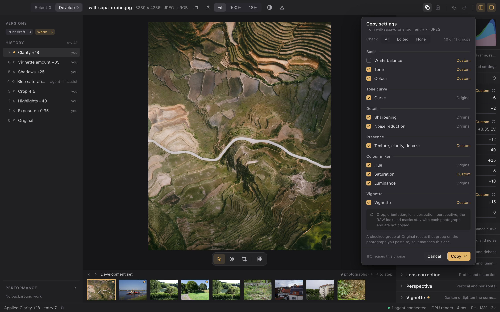

# Copy and paste settings

Status: **planned; implementation is not authorized by the planning request**. The owner asked for a plan for copying settings from one photograph and pasting them onto others, and on 2026-10-07 chose: adjustments only in the first delivery, every group except white balance checked by default, multi-selection in Develop's filmstrip, and Paste from previous. Everything else below is a recorded default the implementer may refine within this contract. [Tasks](../../tasks/interface/copy-settings.json) contain the implementation work.

Copy settings reads chosen adjustment groups from one photograph into a settings clipboard. Paste settings applies the clipboard to the open photograph, or to the photographs selected in the filmstrip or in Select, as one history entry per photograph. It reuses the [presets](presets.md) machinery: a settings set, `preset.capture` and the composite field-patch action. It is not a second preset system: a clipboard is transient, it names its source photograph rather than a library preset, and it never touches the library.

## Boards

Proposed boards, drawn at 1440 × 900 logical points and rendered at 2×. Each one is also a standalone HTML page under [copy-settings/html](copy-settings/html/index.html). The photographs are the Develop and catalog boards' own; the values, names and times are illustrative.

| Board | Shows |
| --- | --- |
| [Copy settings…](copy-settings/copy.png) | Develop with the chooser open under the title bar's Copy button: one checkbox per adjustment group with its Custom or Original caption, All · Edited · None, the note naming what stays with each photograph, and Copy |
| [Pasted, filmstrip selection](copy-settings/paste.png) | Develop after a paste: the history entry, the status bar's skipped white balance with Undo, the Paste tooltip, four photographs selected in the filmstrip and the menu a right press on one of them opens |
| [Paste in Select](copy-settings/select-paste.png) | Select with six photographs selected: the Info panel's clipboard card and **Paste settings to 6**, and the confirmation every paste to more than one photograph asks for |
| [Components and states](copy-settings/components.png) | The title-bar buttons in each state, chooser rows, status-bar sentences, palette entries, the batch report and filmstrip cells |

## What a person does

- **Match a shoot.** Edit one frame, press `⌘C`, step through the others with the arrow keys and press `⌘V` on each. Each paste is one entry in that photograph's history, undone with `⌘Z`.
- **Choose what to carry.** `⇧⌘C` opens the chooser to pick the groups, for example everything but the vignette. That choice is remembered, so the next `⌘C` carries the same groups without asking.
- **Paste to many.** In Develop, `⌘`-click or `⇧`-click photographs in the filmstrip and press `⌘V`. In Select, select photographs in the grid and press `⌘V`, or use **Paste settings to N** in the Info panel. One confirmation covers them all; each photograph gets its own entry.
- **Carry on from the last frame.** `⌥⌘V` pastes the remembered groups from the photograph shown just before this one, without copying first and without changing the clipboard.

## What is copied

The first delivery carries the **adjustment groups**: the groups of every presettable field-patch action, which is exactly what a preset carries. Today these are Basic's White balance, Tone and Colour; the Tone curve; Detail's groups; Presence; the colour mixer's Hue, Saturation and Luminance; and the vignette. `ModuleRegistry::patch_action` is the single authority, so a module added later with presettable patches, such as colour grading, appears in the chooser with no change here. Copy carries values, never a recomputing step: once the planned [Auto tone](auto-tone.md) lands, copying Basic's Tone group carries the values Auto set on the source, not an Auto step re-analysed on each target.

**White balance follows each photograph's kind**, as presets do. The White balance group copied from a RAW photograph is the RAW development's (`set-raw`: As shot, or a temperature and tint in kelvin). Copied from a JPEG, it is Basic's relative temperature and tint. A RAW white balance pasted onto a JPEG is skipped, and so is a JPEG's relative pair pasted onto a RAW photograph's global target. Nothing converts between the two. The paste reports each skip with its reason; it is not a failure.

**Stays with each photograph** and is not copied: crop and orientation, lens correction, perspective, the RAW look and masks. Each is either per-photograph geometry, not presettable by an earlier decision, or needs a transfer policy that is not designed yet ([later](#later)). The chooser says so in one line, with no disabled checkboxes for them.

**Masks.** Copy reads only the global layer of each module, as capture does, and paste writes only the global layers. A masked layer on the source is not copied, and one on the target is neither read nor changed.

**A checked group at Original resets that group on the target.** A copied group carries all of its fields. A group at its declared defaults therefore makes the target's group match it, which is what "make this photograph look like that one" needs. A group that is not checked is not in the clipboard, and the target keeps its own values for it.

## The settings clipboard

One clipboard per desktop window, held in the desktop's view state and lost when the window closes. It holds:

- the settings set `preset.capture` returned, which is values, not a reference;
- the chosen groups' labels;
- the source photograph's display name, asset ID and entry ID, and its kind;
- the time of the copy.

The values are read **when Copy runs**. A later edit to the source does not change the clipboard, and neither does editing or deleting a library preset. A newer copy replaces the clipboard. Nothing is written to the system clipboard, and agents do not see the desktop's clipboard ([parity](#programmability)).

**The remembered choice** is the set of groups the last confirmed Copy checked in this window. It starts as every adjustment group except White balance, the owner's default, matching the create-preset form, because white balance is usually per photograph. `⌘C` copies the remembered choice. The chooser opens with it checked. Paste from previous uses it too.

## Copy

**Quick copy (`⌘C`)** copies the remembered choice from the source photograph's displayed entry. The status bar says what happened: "Copied 10 groups from will-sapa-drone.jpg · Paste ⌘V".

**The chooser (`⇧⌘C`, or the title bar's Copy button)** is a popover under the button, sized like the Export menu's family of popovers:

- A header names the source photograph, its entry and its kind.
- A **Check** segmented control offers All, Edited and None, with a count ("10 of 11 groups").
- Rows are grouped under module headings, in registry order, labelled as the create-preset form labels them (`presettable_groups`). Each row has a checkbox, the group's name and the source's caption for that group: **Custom** in the accent, or **Original**. Edited checks exactly the Custom rows. A module heading checks or clears all its rows and shows a mixed state.
- A group that cannot be captured is listed unchecked with the registry's reason, and Copy leaves it out. This covers a group whose module is unavailable, and an `ambiguous` capture where the source has two global layers.
- The one-line note about what stays with each photograph, and the line about Original groups resetting.
- Cancel, and Copy (`↩`), which confirms the choice, remembers it and copies.

Escape or a press outside closes it without copying. The captions come from one capture of every group from the source entry, compared with each field's declared default. That is payload work only, with no render. Copy captures again with the checked fields, so an agent's commit while the chooser is open is still read at the moment of the copy.

**Which photograph is the source.** In Develop it is the open photograph's **displayed** entry, so copying during a historical preview copies that earlier entry. A filmstrip cell's menu copies from that cell's photograph at its current entry, open or not. In Select it is the active photograph. Select over files on disk or on a card has no developed photographs, so Copy there is disabled with the reason "Only developed photographs have settings".

## Paste

Paste is disabled while the clipboard is empty ("Nothing copied yet · Copy settings ⇧⌘C"). When the clipboard holds settings, the title bar's Paste button carries the accent dot, and its tooltip names the source, the time and the groups.

### Into the open photograph

With no other photograph selected in the filmstrip, `⌘V` pastes into the open photograph at its current entry. It sends `edit.paste-settings`, which follows the ordinary action path: one entry labelled **Paste settings from DSC_4471.NEF**, `asset.state`, one preview job and a history merge. The status bar names what was pasted and anything skipped, with Undo ("Pasted 6 of 7 groups from DSC_4471.NEF · White balance skipped: a RAW white balance does not apply to a JPEG · Undo ⌘Z"). A paste that changes nothing makes no entry and says so ("Nothing changed: IMG_2201.JPG already has these settings").

Paste is disabled, with the same reasons the Presets rows give, while a draft is open, during a historical preview, while a request is in flight and with no photograph.

### Paste from previous (`⌥⌘V`)

Paste from previous captures the remembered choice from the photograph this window showed in Develop **just before** the current one, at that photograph's current entry, and pastes it into the open photograph as one entry with the same label. The clipboard is unchanged. It is Develop-only and targets only the open photograph, even when others are selected. With no previous photograph in this window it is disabled ("No previous photograph in this window"). If the previous photograph is no longer in the catalog, it is refused with the core's reason.

### The filmstrip selection

The filmstrip gains a selection, with the open photograph always in it:

| Gesture | Effect |
| --- | --- |
| Click | Opens the photograph and selects it alone, as today |
| `⌘`-click | Adds or removes a photograph other than the open one, without opening it |
| `⇧`-click | Selects the range from the open photograph to the clicked one, without opening it |
| `⌘A` (focus not in a text field) | Selects the whole development set |
| Arrow keys, Escape | Arrow keys step as today and select the new photograph alone; Escape selects only the open photograph |
| Right press | Opens the menu (below) |

Selected cells draw a quiet accent border and tint, and the open cell keeps its full accent border. The strip's header says "4 of 9 selected" whenever more than one photograph is selected. The selection is the desktop's view state. It is cleared when the set changes, and photographs that leave the set leave the selection.

With more than one photograph selected, `⌘V` pastes to **all** of them. After the [confirmation](#confirmation-and-report), it sends `batch.paste-settings` with their asset IDs. The open photograph is pasted like the others, and the event sync reads it again, as after a batch preset.

**The cell menu.** On a selected cell, the menu offers Paste settings to N photographs… (`⌘V`), Copy settings from that photograph, Copy settings from that photograph…, Select all N (`⌘A`) and Select only the open photograph. On a cell outside the selection, it offers Paste settings to that photograph and the two copies, and leaves the selection unchanged. A paste to one photograph that is not open is a batch of one, with no confirmation.

### In Select

`⌘C` and `⇧⌘C` copy from the active photograph. `⌘V`, the grid's right-press menu (Copy settings, Copy settings…, Paste settings to N) and the Info panel's **Paste settings to N** all paste to the selection. They send `batch.paste-settings {targets: {kind: selection}}` synchronously in the update of the gesture, as Apply preset… does, so it names the selection on screen; a stale view's refusal reads the view again.

The Info panel's Develop band shows a **clipboard card** whenever the clipboard holds settings: the source's grid preview, "Settings from DSC_4471.NEF", the group count, time and entry, and the groups as chips. The Paste button sits under it, before Apply preset… and Export N…. With an empty clipboard the band is as it is today. One batch of this desktop's runs at a time, shared with Apply preset… and Export, and the band and status bar report its progress as theirs do. Over Removed, paste is refused as the other batches are.

### Confirmation and report

Every paste to **more than one** photograph asks first, over the centre: "Paste settings to 6 photographs?". The sheet names the groups and the source, says that each photograph gets its own entry which its own history undoes and that there is no undo for the whole paste, and names what will be skipped. That last sentence comes from the clipboard's kind and the selected rows' kinds ("The RAW white balance applies to the 4 RAW photographs; the 2 JPEGs keep their own"). Enter or **Paste to 6** sends it; Cancel, Escape or a press beside it sends nothing. If the selection changed meanwhile, the sheet asks again.

While the batch runs, the status bar and the Performance section show it with Cancel ("Pasting to 6 photographs · 3 of 6"). When it ends, the status bar says what it did ("Pasted to 5 photographs · 1 left out · 2 without white balance") with **Report**. The report lists every photograph left out by file name, with the owner's code and reason, and every photograph done without some settings, with why, plus Copy as JSON. It is the batch preset report's layout. A cancelled or failed batch says so and keeps no report.

## Keys, menus and palette

Text fields keep their own `⌘C`, `⌘V` and `⌘A`. These bindings apply only when focus is not in one.

| Key | Develop | Select (photograph views) |
| --- | --- | --- |
| `⌘C` | Copy the remembered groups from the displayed entry | From the active photograph |
| `⇧⌘C` | Copy settings… (the chooser) | Same, for the active photograph |
| `⌘V` | Paste into the open photograph, or to the filmstrip selection when it holds more than one | Paste to the selection |
| `⌥⌘V` | Paste from previous into the open photograph | Not bound |
| `⌘A` | Select the whole development set in the filmstrip | Unchanged (select all) |

The title bar gains **Copy** and **Paste** icon buttons before Undo, in both workspaces. Copy opens the chooser, because a press is the deliberate gesture that should show what is copied. The command palette lists Copy settings, Copy settings…, Paste settings (with the target count when more than one photograph is selected) and Paste settings from previous photograph, each disabled with its reason when it cannot run.

## Programmability

Every gesture is an existing or new command service call, and the desktop holds no logic the core lacks:

| Gesture | Request |
| --- | --- |
| Copy, quick or chosen | `preset.capture {asset_id, entry_id, fields}` (existing; read-only) |
| Paste into the open photograph, Paste from previous | `edit.paste-settings {asset_id, settings, source, source-asset?}` (new action), after a capture of the previous photograph for Paste from previous |
| Paste to photographs (filmstrip, cell menu, Select) | `batch.paste-settings {targets, settings, source, source_asset_id?, mutation}` (new host method), then `job.read` and `job.cancel` |

**`paste-settings`** is a second action of `luxforge.presets`, beside `apply-preset`, and is not a field patch. Its parameters are `settings` (kind `settings`, required), `source` (`string {max_length: 128}`, required, the source photograph's display name) and `source-asset` (`string {max_length: 96}`, optional provenance the host does not look up). It parses and plans exactly as `apply-preset` does: one `Compose` step per settings key, the same skips and refusals, and one entry. Its label is `Paste settings from <source>`. The entry stores the settings and the provenance, so the history and Copy as JSON request describe exactly what was pasted. It declares no control: the desktop's paste is a host feature, like the preset library's palette entries. Making it a separate action, rather than `apply-preset` with a synthetic name, keeps the history label honest ("Preset: …" would be wrong) and lets a client tell a paste from a preset.

**`batch.paste-settings`** is the inline-settings sibling of `batch.apply-preset`. It takes the same `targets` and `mutation`, validates the settings once against the registry and runs a `batch-paste` job on the library lane, one photograph at a time, each through `edit.paste-settings`'s own path. Request IDs are `<request_id>/<asset_id>`. The skips are the same: removed, `draft-open` and `history-selected`. The report is the same `BatchReport {done, skipped, settings_skipped}`. Both batch methods share one implementation that is handed the action input to run, so their behaviour cannot drift.

An agent copies and pastes with the same two calls. The desktop's clipboard and filmstrip selection are view state, like a collapsed group or a selected tab: they change no recipe or catalog data, and every paste they lead to names its settings and its targets explicitly. A session clipboard on the owner is [later](#later).

## Engineering constraints

- **Owner and UI threads.** Captures, pastes and batch submissions run as owner tasks off the update loop, except the Select paste naming `{kind: selection}`, which is synchronous in the gesture's update as every selection-target library request is ([performance rule 12](../engineering/performance-rules.md#rules)). Nothing is computed in `view()`.
- **No new renders.** Capture reads payloads only. A paste into the open photograph costs the ordinary commit and one preview job. A batch costs what `batch.apply-preset` costs per photograph.
- **Bounds.** A clipboard is one settings set within the existing 16-action and 64-field bounds, about a kilobyte. The filmstrip selection is at most the development set's size. A batch is bounded by `MAX_LIBRARY_BATCH`.
- **Source preservation.** A paste writes only recipe history entries. Originals are untouched, and an unavailable module refuses the paste explicitly rather than silently dropping its effect.

## Acceptance

- **Core.** `paste-settings` writes one entry equal to `apply-preset`'s stack for the same settings, with the label `Paste settings from <source>`. The tests cover:
  - a no-op that makes no entry;
  - partial groups keeping the target's untouched fields, and a checked Original group resetting;
  - RAW-to-JPEG and JPEG-to-RAW white balance skipped with reasons;
  - masked layers neither read nor written;
  - an unavailable module refused;
  - undo and restore.

  `batch.paste-settings` yields per-photograph entries and the batch preset report's shape over mixed kinds, a removed photograph, an open draft and a historical selection, with cancellation between photographs. JSON CLI parity: capture, paste, batch paste and undo through `luxforge-json` equal the same edits made with `edit.set-*`.
- **Desktop.** Unit and real-owner tests cover:
  - the remembered choice and its default;
  - chooser captions against capture, Edited, mixed module headings, unavailable and ambiguous rows;
  - copying from a historical preview;
  - each disabled reason;
  - the filmstrip selection rules in the table above, including set changes;
  - `⌘V` choosing the open photograph or the selection;
  - Paste from previous with and without a previous photograph;
  - text-field focus keeping the system keys;
  - each request being exactly what an independent JSON client sends.
- **Rendered.** A `copy-settings` smoke scenario runs in the background bundle over supplied JPEG and RAW fixtures:
  - copies with `⌘C` and through the chooser, and pastes into the next photograph in the set;
  - undoes, pastes from previous, and pastes to a three-photograph filmstrip selection through its confirmation;
  - pastes to a Select selection with a RAW-to-JPEG white balance skip, then opens and reads the report.

  Every frame correlates the clipboard, the selection, the revision and entry, the history label, the stored layer payloads and the status sentence, and the target photographs' pixels move in the source's direction.
- **Documentation.** Feature status, the user guide, the Develop workspace's tool array and keyboard table, the catalog design's Info panel, the presets design's Later table and the roadmap describe delivered behaviour only.

## Decisions

Owner, 2026-10-07:

1. The first delivery copies adjustment groups only, the presettable settings. Crop, orientation, lens correction, perspective, the RAW look and masks are later.
2. Every group except White balance is checked by default, and neutral groups are included so the target matches the source. The last confirmed choice is remembered for the window, and `⌘C` copies it without asking.
3. Develop's filmstrip gains multi-selection, and `⌘V` pastes to it.
4. Paste from previous (`⌥⌘V`) is in the first delivery.

Recorded defaults, which the implementer may refine within this contract: the title-bar placement of Copy and Paste; Copy's button opening the chooser; one in-memory clipboard per window, not written to the system clipboard; the `Paste settings from <source>` label; a confirmation for every paste to more than one photograph; the clipboard card in Select's Info panel; the filmstrip selection gestures; Paste from previous targeting only the open photograph; and the sizes, wording and layout of the boards.

## Later

| Item | Needs |
| --- | --- |
| Geometry: crop, orientation, lens correction, perspective | A transfer rule for photographs of other sizes, orientations, cameras and lenses: a normalized crop and its ratio and angle, a lens profile only where it matches |
| Masks | The transfer policy [masking](masking.md) leaves undesigned: gradient coordinates, brush strokes, range selections and artifacts |
| Sync and Auto Sync | A multi-photograph draft, so every selected photograph follows a slider while it moves |
| System clipboard document | A `luxforge.settings` text format and a bounded clipboard read, so a copy pastes across windows and into agents |
| Save the clipboard as a preset | A `preset.create` from the clipboard's settings and a name |
| A session clipboard on the owner | A `session.state` slot, if agents need to paste what a person copied |
