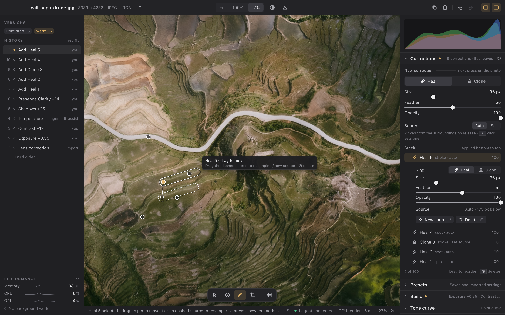

# Corrections in the Develop workspace

Status: **decided by the owner on 2026-10-09, with the defaults under [decisions](#decisions); not implemented.** This is the design of the Corrections mode, its canvas gestures, its panel and its keys. What a correction *is* stays the [Corrections design](corrections.md)'s: the repair stage before Detail, ordered Clone/Heal operations that each sample only the operations before them, content-space paths in the shared stroke store, the `draft.*` lifecycle and `preset: false`. This design adds what the person sees and does, plus the three contract changes it needs: automatic sources, moving a correction's destination, and a larger operation limit.

Where something isn't specified here, the reference is Lightroom Classic's Healing tool, for familiarity rather than as a checklist. The modifier keys follow Photoshop and Lightroom wherever the two agree.

## Boards

Boards, drawn at 1440 × 900 logical points and rendered at 2×. Each one is also a standalone HTML page under [corrections/html](corrections/html/index.html). The photograph is the owner's Sapa drone JPEG at 27%. The repairs drawn on it are real offsets of its own pixels, so they blend as Clone would. Names, values and history are illustrative.

| Board | Shows |
| --- | --- |
| [Placing](corrections/place.png) | Corrections mode with four corrections and nothing selected: a pin on each, the brush with its `+` over an unrepaired blotch, the band's **New correction** group with Heal, Size, Feather, Opacity and Source **Auto**, and the stack |
| [Selected and stacked](corrections/selected.png) | Heal 5, a stroke painted over Heal 2, selected: its outline, dashed source, arrow and source pin; Heal 2's pin still visible inside it; the selected row expanded with its own settings, **New source** and **Delete** |
| [Painting from a set source](corrections/source.png) | A Clone stroke in progress after `⌥`-click: the live repair, the faint painted footprint, the source crosshair moving with the brush at the set offset, the draft bar, a drafting row at the top of the stack and Source **Set** in the accent |
| [Components and states](corrections/components.png) | Cursors for each gesture, pins and handles in each state, stack rows, the row menu, the key map, notices and status-bar sentences |

## Principles

- **A press on the photograph adds a correction.** Only a pin or the selected correction's handles can catch a press. Every other press adds a new correction, including one that lands inside an earlier repair. The brush cursor carries a `+` to say so, the band's first group is titled **New correction**, and the status bar names the kind that will be added.
- **New and selected are separate controls.** The **New correction** group always describes the next press. A selected correction's settings appear only in its own expanded row. One slider never means both.
- **People never see an ID.** A correction is named by its kind and a number the photograph never reuses (`Heal 5`). It is chosen by its pin or its row, never by typing a number. The API still uses the stable operation ID.
- **The source is automatic unless the person sets it.** A click or stroke with no source set takes the best match from the surroundings. The chosen source is shown at once and can be dragged or replaced with `/`.
- **Corrections stack.** Each one samples the photograph as the corrections below it left it. Painting over a correction repairs the repair, and the stack's order is visible and can be changed.
- **Every gesture is one entry.** Placing, moving, resampling, resizing, changing kind or settings, reordering and deleting each commit one undoable entry with its own label. Pointer motion writes nothing.

## Entering and leaving

Corrections is a mode-strip entry after Mask, with the healing icon and the tooltip "Corrections (Q)". The module's canvas declaration names icon `heal` and shortcut `q`; `Q` is Lightroom's letter, and the [AI editing design](ai-editing.md#the-flow) already proposes it. It can also be entered from the palette, or by expanding the Corrections section from the tools panel.

While the mode is active, the tools panel shows the **Corrections band** under the histogram, expanded, followed by the other sections as usual. This is where the Masks band sits in Mask mode. Outside the mode, the Corrections section sits collapsed in its registry place with the hint `5 corrections`. Pins and outlines are drawn only in the mode, and the corrections render everywhere.

The mode is left with `Q`, another mode, or Escape once Escape has nothing else to undo (see [keys](#keys)). Leaving the mode with a stroke held cancels the stroke first.

## The canvas

### Adding

The brush is always in hand. The cursor is the brush's outer circle with a dashed inner circle at the feather's start and a `+` at its centre.

- **Click** (the pointer moves less than 3 pt before release): adds a **spot**, a one-point path at the current size.
- **Drag**: paints a **stroke**. Capture uses the shared path grid. Release commits one entry, and Escape while the button is down discards the stroke.
- **`⇧`-click**: adds a straight stroke from the end of the last stroke this window placed in this mode to the click. With no such stroke, it adds a spot.
- **`⌘`-drag** (Ctrl elsewhere): Lightroom's gesture. The press places a spot, and the drag pulls its source out to the release point, with the source outline following live. It commits one entry with a set source.

With an automatic source, the painted footprint is tinted faintly while the button is down, because no source exists yet. On release, the command service picks the source (see [automatic sources](#automatic-sources)) and commits. With a set source, the stroke renders as a live repair through the draft, under the same tint.

A new correction is selected when it commits, so its source is visible immediately, as a committed gradient is in Mask mode. The status bar says where the source came from: `Added Heal 7 · source picked 96 px left · / tries the next`.

### Setting a source

- **`⌥`-click** (Alt elsewhere) sets the source for new corrections, as in Photoshop. While `⌥` is held, the cursor becomes the source crosshair at brush size, and pins ignore the press. The next press stores the offset from the source to its own position. Following presses keep that offset, which is what cloning a pattern across several strokes needs. While painting, an accent crosshair at the offset follows the brush and shows exactly what is sampled.
- The band's **Source** control shows **Auto** or **Set** with the offset (`150 px above`). Choosing **Auto**, or pressing Escape with nothing selected and no press held, clears it.
- Shift is not a source key. Both reference applications use it for straight lines, and it does the same here.

### Pins, selection and handles

Every correction has a **pin**: a 12 pt white ring on a translucent dark fill. A spot's pin is at its centre and a stroke's is at its first point, as in Lightroom, so a stroke painted across another correction does not hide that correction's pin. Hovering a pin draws the correction's outline, its dashed source outline and an arrow from the source to the destination, and shows a tooltip. A press on a pin selects its correction, and the pin turns accent.

The **selected** correction shows:

- **Its outline** (white), the envelope of the painted path at its radius.
- **Its source** (dashed white) with a smaller hollow source pin, and the arrow from source to destination.
- **A size handle** (white square) on the right of a spot's outline. A stroke is resized from its row.

Drags, each one draft and one entry on release (`Move Heal 5`, `Move Heal 5 source`, `Resize Heal 2`), and a release that moved nothing writes nothing:

- **Pin**: moves the destination by translating its whole path. The source stays where it is and the offset changes, as in Lightroom. This keeps a carefully chosen source in place while the repair is nudged.
- **Source pin or dashed outline**: moves the source. The correction's source becomes a set source.
- **Size handle**: changes a spot's radius about its centre.

Hit order is the selected correction's handles, then pins from the top of the stack down. A press anywhere else adds. Pins within 9 pt of the pointer catch it, and when two overlap the topmost wins; `↑`/`↓` reach the other. `⌥` and `⌘` presses bypass pins. With pins hidden (`H`), there are no hit targets and every press adds.

Handles and outlines map through the core's geometry contract (`render.locate`/`render.transform`), including nonlinear Lens and Perspective warps, crop, straighten, quarter turns and mirroring, using the shared warped-path drawing. As with resting mask handles, the previous map keeps drawing until a new entry's map arrives, and a press waits for the fresh map.

### Drafts and notices

The **draft bar** appears only while a draft is open, and it names the correction in the accent and what the gesture is doing: `Clone 6 · painting · from the set source 150 px above · release commits one entry · Cancel esc`. Between gestures there is no bar, and the status bar carries the hint: `Corrections · Heal · click for a spot or paint a stroke · source picked automatically · ⌥-click sets one`.

If no automatic source qualifies, the stroke stays drafted and tinted under the notice **No automatic source fits · ⌥-click one to finish · Cancel**. An `⌥`-click commits the stroke with that source. A painted stroke is never thrown away by a failed search. At the operation limit, a press is refused before any draft starts, with `100 corrections is this photograph's limit` and the core's `resource-limit` reason. The cursor shows the refusal state over the photograph.

## The Corrections band

From top to bottom, at the module-panel density:

1. **Band header**: Corrections, a dot when any correction exists, `5 corrections · Esc leaves` and a reset (`edit.reset-corrections`, one entry, `Reset corrections`, undoable like every module reset).
2. **New correction** (a group rule captioned `next press on the photo`): the kind as a full-width segmented control (**Heal** | **Clone**), then **Size**, **Feather** and **Opacity** sliders, then **Source** (**Auto** | **Set**) with a one-line note: `Picked from the surroundings on release · ⌥ click sets one`, or the set offset in the accent with `used until Auto or esc`. These are view state for the next press and commit nothing. They persist in the window across photographs. When AI Remove is delivered, it joins the kind control as a third segment ([AI editing](ai-editing.md#the-flow)); it is not drawn before then.
3. **Stack** (a group rule captioned `applied bottom to top`): one 26 pt row per correction, top of the stack first. Each row has a drag grip, the kind's icon, the name, a short description (`spot · auto`, `stroke · set source`) and the opacity. Hover replaces the opacity with a delete button. The selected row is tinted and expands in place to show **Kind** (a compact Heal | Clone control), **Size**, **Feather**, **Opacity**, the **Source** readout (`Auto · 175 px below`), **New source `/`** and **Delete `⌫`**. Each change commits one entry on release or Return (`Heal 5 · Opacity 80`, `Change Heal 5 to Clone`, whose row is then `Clone 5`). A drafting correction appears at the top in italics with `painting…` until it commits.
4. **Footer**: `5 of 100` and `Drag to reorder · ⌫ deletes`.

Dragging a row reorders the stack. An accent line marks where it will land, and the release commits `Reorder Heal 2`. The row menu offers Heal, Clone, New automatic source, Move up, Move down and Delete. Selecting a row selects its correction on the canvas and scrolls it into view when it is outside the view. Selection is desktop view state; it writes no entry and is not part of `session.state`.

Display units: **Size** is the brush diameter in upright-content pixels (`2 × radius × content height`), so it does not change with zoom or crop. Feather and Opacity are 0–100. The stored fields are unchanged.

## Keys

The keys act in Corrections mode only when no text field has focus, and they follow the [Masks panel's keys](masking-workspace.md#keyboard) where the two overlap.

| Key | Does |
| --- | --- |
| `Q` | Enter or leave Corrections |
| `⌫` / Delete | Delete the selected correction (`Delete Heal 5`), leaving nothing selected |
| `/` | Give the selected correction the next-ranked automatic source (`New source Heal 5`). Repeating it steps further down the ranking, and changing the selection starts again from the top |
| `↑` / `↓` | Select the correction above or below in the stack |
| `⌥↑` / `⌥↓` | Move the selected correction up or down the stack |
| `[` / `]` | Brush size down or up by 10%; with `⇧`, feather by 10 |
| `H` | Hide or show pins and outlines (the existing handles key) |
| `⌥`-click, `⌘`-drag, `⇧`-click | Set the source, place with a dragged source, straight stroke (see [the canvas](#the-canvas)) |
| Escape | Undo one level at a time: cancel the held gesture, then deselect, then clear a set source, then leave the mode |

Undo, redo, zoom, Space-drag panning and Compare (`\`) behave as everywhere else.

## Automatic sources

An automatic source is resolved **once, when the correction is created or when `/` asks**, and stored as an ordinary offset. A later upstream edit never moves it, so the saved recipe renders the same way everywhere. The offset is computed by a deterministic, model-free search in the core:

- **Input**: the repair-stage input before this operation, the same prefix that Clone samples, read at a reduction where the destination's footprint is 32 to 64 px across, never above full resolution.
- **Candidates**: offsets at 1.5, 2.25, 3.25 and 4.5 times the footprint's extent (the radius for a spot; for a stroke, half its bounding-box diagonal plus the radius), in 24 directions. A candidate is dropped when its source footprint, with feather, leaves the content frame, overlaps the destination footprint, or would read outside the bounded source window.
- **Score**: the difference between the ring just outside the destination and the ring just outside the candidate source, plus the difference in texture energy between the candidate's interior and the destination's ring, plus a small distance penalty. The lowest score wins, and ties go to the nearer candidate and then the smaller angle. The colour domain, ring width and weights are frozen in the numerical study with independent fixtures: synthetic textures whose correct answer is known, and corpus cases for photographic review.
- **Cost**: the search runs on a render worker, never on the UI or catalog owner thread. It is bounded by the candidate count and the reduced ring samples, and its 24/60 MP time on the M4 is measured with the brush.

When no candidate survives, the result is an explicit `no-source` outcome, which the desktop shows as the [notice above](#drafts-and-notices).

## Programmability

Every gesture above has a semantic equivalent through the same command service. The current actions stay, with these changes:

| Gesture | Request |
| --- | --- |
| Click, stroke, `⇧`-click | `edit.add-correction {points, mode, radius, feather, opacity}` with `source-x`/`source-y` **omitted**: the command service resolves an automatic source on a render worker against the request's revision, then commits. The result returns `operation`, the resolved `source-x`/`source-y` and `source-origin: auto` |
| `⌥`-click then paint, `⌘`-drag | The same with `source-x`/`source-y` supplied; `source-origin: set` |
| Drag pin | `edit.update-correction {operation, points}` with the translated path (a new content-addressed stroke); the source position is preserved, so the offset is recomputed |
| Drag source | `edit.update-correction {operation, source-x, source-y}`; `source-origin` becomes `set` |
| Size handle, row sliders, kind | `edit.update-correction {operation, radius / feather / opacity / mode}` |
| `/`, New source | `query.correction-sources {asset, operation, count ≤ 8}` returns ranked `{source-x, source-y, score}` without writing anything; the client then sends `edit.update-correction` with the next one and `source-origin: auto` |
| `⌫`, Delete | `edit.delete-correction {operation}` |
| Row drag, `⌥↑`/`⌥↓`, Move up/down | `edit.reorder-correction {operation, index}` |
| Band reset | `edit.reset-corrections` |

`query.correction-sources` also accepts `{points, radius}` without an operation, so an agent can inspect candidates before adding. `source-origin` (`auto` or `set`) is stored on each operation so rows and the API can say where a source came from. The display name (`Heal 5`) is presentation: kind plus operation ID. History labels use it. Canvas selection, hover, the set source and the New correction settings are desktop view state, as mask selection is.

## Capacity

Dust spotting and distraction removal routinely need dozens of corrections, and an eight-operation ceiling makes the stacking principle hollow. **Decided (owner, 2026-10-09): 100 corrections per photograph**, checked before a draft starts, with the `resource-limit` refusal above. Reaching it needs the repair pass to evaluate many operations in one dispatch, for example from a bounded operation table and per-operation source windows, rather than one charged output plane per operation. That rendering change belongs to the processing primitive's task and is measured there. Until it lands, the band and the refusal use whatever limit the core declares; the number is never hard-coded in the desktop.

## Visual language

Overlays are white with a translucent dark under-stroke, so they read on any photograph. The accent marks only the selected pin, a set source and the drafting correction's name. Outlines are 1.25 pt, source outlines are dashed 4/3, and the arrow is 1.1 pt. Like the mask overlay and clipping colours, these overlay colours are never themed. Pins and handles keep their point size at every zoom.

## Lessons

An interim panel was tried on a branch and rejected by the owner on 2026-10-09. It selected saved operations by typing their numeric IDs, edited the source as numeric X/Y offsets, used right-click to choose a source, had no on-image selection and no keyboard deletion, and stopped at eight operations. Its failures shaped the principles above: creation was ambiguous, IDs leaked into the interface, and corrections could not practically stack.

## Acceptance

The background-only `corrections` smoke scenario covers each journey with correlated state, log and capture: click spot with automatic source, painted stroke, `⇧`-click, `⌥`-click then live-painted Clone, `⌘`-drag, selection by pin and by row, pin drag, source drag, spot resize, `/`, `⌫`, row drag and `⌥↑`, `H`, the Escape order, a stroke stacked across an earlier correction whose pixels show that it sampled the earlier repair, the no-source notice and the limit refusal. Each committing gesture is checked as exactly one entry with the label above. UI/API parity is verified per row of the [programmability table](#programmability). The automatic search has exact reference fixtures for its candidate set, rejection rules, score and tie-break. Overlays are checked through crop, straighten and a Lens/Perspective warp. Interaction latency (input to overlay, release to repaired frame, handle drag and the automatic search) is measured with the brush on 24/60 MP JPEG and qualified RAW on the M4 once the feature is complete.

## Decisions

Accepted by the owner on 2026-10-09, with the rest of this design:

1. **Capacity**: 100 corrections per photograph (above), replacing the initial eight.
2. **A set source persists**: it is used by following corrections until **Auto** or Escape, as Photoshop's aligned clone does, rather than for one correction only.
3. **Moving a correction keeps its source in place**, as in Lightroom, rather than moving the source with it.
4. **A stroke's pin is at its first point**, as in Lightroom, rather than at its midpoint.
5. **Modifiers**: `⌥`-click sets the source, `⌘`-drag places and pulls out a source, and `⇧` draws straight strokes.
