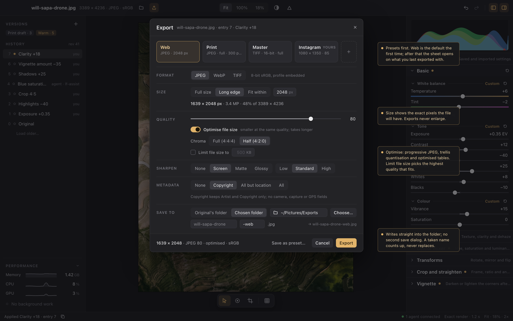

# Export settings

Status: **planned; implementation is not authorized by the planning request**. The owner asked for more comprehensive export with settings, JPEG, WebP and a lossless hand-off format, and optimised output by default for the web with a separate print setting. The owner's choices of 2026-10-07 are under [decisions](#decisions). The other defaults are recommendations recorded under [proposals](#proposals-with-recorded-defaults). [Tasks](../../tasks/rendering/export-settings.json) hold the implementation work. Today's export is the [JPEG export](export.md); this design extends it and keeps its freeze, render, publish and never-replace rules unchanged.

Boards: [Web preset](export-settings/web.png), [Print preset, changed](export-settings/print.png), [many photographs from Select](export-settings/batch.png) and [components and states](export-settings/components.png). The standalone pages are under [export-settings/html](export-settings/html/index.html).

## Behavior and scope

### The Export sheet

`Cmd+E`, the Export menu's **Export…** and the palette open the **Export sheet**. It is a modal panel over the dimmed workspace, using the same scrim and stacking as the Settings sheet. It exports the displayed entry under the existing rules: the current entry, a history preview, or the fixed After entry while Compare is open, and never a draft. From top to bottom it has:

1. **Preset cards.** Web, Print and Master are built in. The person's own presets follow, then **+**, which saves the current settings as a new preset. The sheet opens on the last settings exported with. The first time, it opens on Web. Changing any setting marks the selected card *Changed from preset*. It never saves the change silently: the footer offers **Update "Name"…** for the person's own preset or **Save as preset…**, and Export uses the changed settings once. A built-in preset cannot be updated, renamed or deleted; **Duplicate** makes an editable copy. Right-clicking one of the person's presets offers Update with current settings, Rename…, Duplicate and Delete.
2. **Format.** JPEG, WebP or TIFF. The rows below show only the controls that apply to that format.
3. **Size.** Full size, Long edge *N* px or Fit within *W* × *H* px. A readout below gives the exact output pixels, megapixels and the scale against the output stage. An export is never enlarged: a photograph already within the bound keeps its size, and the readout says so.
4. **Print size** (shown when a density is set). The pixels per inch written to the file, and the physical size at that density in inches and centimetres. It changes no pixels.
5. **Quality** (JPEG and WebP). A 1–100 slider, then:
   - **Optimise file size.** The format's slower, smaller encoding at the same quality (see [encoding](#encoding)).
   - **Chroma** (JPEG only). Full (4:4:4) or Half (4:2:0).
   - **Limit file size to** *N* KB. Chooses the highest quality, at most the slider's, whose file fits the limit. The slider is disabled while the limit is on.
6. **Bit depth** (TIFF). 16-bit or 8-bit. For TIFF, **Optimise file size** means lossless compression.
7. **Sharpen.** None, Screen, Matte or Glossy, with Low, Standard or High. This row arrives with [output sharpening](#output-sharpening), the second delivery. The first delivery leaves it out of the sheet entirely rather than showing a placeholder.
8. **Metadata.** None, Copyright, All but location or All (see [metadata](#metadata)).
9. **Save to.** The original's folder or a chosen folder (**Choose…** opens the native folder dialog), then the name: the photograph's stem, an editable suffix and the format's extension. A name already taken is reported in the sheet, with the name that will be written instead (`-2`, `-3` and so on). Nothing is ever replaced.

The footer summarises the export (output pixels, format, quality and colour) beside **Save as preset…**, **Cancel** and **Export**. Escape and Cancel close the sheet without exporting. Export writes the file directly into the folder, with no second save dialog, and closes the sheet. The status bar then reports the export as it does today, now with what the settings decided: *Exported will-sapa-drone-web.jpg · 1639 × 2048 · 612 KB · quality 80*, or *quality 71 to fit 500 KB*.

### Large images and progress

Optimisation and file-size limits have no memory cap (owner, 2026-10-08): they use whatever memory the image needs, and the sheet says so up front.

- **Warning.** When an optimised JPEG's output exceeds **24 MP**, or a size limit applies to an output above 24 MP, the sheet shows an amber notice under Quality. For example: *Large image: optimising 60.2 MP holds about 720 MB while encoding and is several times slower. Turn Optimise off to write it as it renders.* The memory figure comes from `export.plan`'s estimate. In batch mode the notice counts the photographs over the threshold and gives the largest estimate. The notice warns; it never blocks or asks for confirmation. Export again and Export with preset show no sheet, so their progress bar is the warning.
- **Progress bar.** Every export reports determinate progress over its phases, rounded to whole percent: rendering, resampling, each encoding pass of an optimised JPEG (through libjpeg's progress monitor), each attempt of a limit search, and writing. The status bar shows a bar with the phase and percent, for example *Optimising DSC_0042-print.jpg · 64%*, as soon as the plan carries the large-image notice, and otherwise once an export has run for one second, so quick exports never flash a bar. Clicking it opens the Performance section, where the export's row has **Cancel**, as every long job does.

The sheet is a client of the API; it holds no export rules of its own. Its readout, suggested name and notices come from `export.plan`. The sheet asks for a plan when the format, size, density, folder or suffix change, never at the quality slider's rate, with at most one plan in flight and the newest change pending.

### The Export menu and shortcuts

The title bar's Export button opens a menu:

- **Export…** (`Cmd+E`) opens the sheet.
- **Export again as *Preset*** (`Shift+Cmd+E`) exports at once with the last export's settings, folder and suffix, counting the name up if it is taken. It is disabled until something has been exported.
- **Export with preset** lists every preset. Choosing one exports at once with that preset's own settings and folder.

The command palette lists the same entries, one per preset (*Export with preset: Print*), and keeps **Export reference render…**, which opens the sheet and sends `reference: true`. This replaces the two-item menu and the Keep metadata shortcut: metadata is now a setting.

### Many photographs

The Select workspace's **Export N…** opens the same sheet, titled *Export 5 photos* and listing how many are RAW and how many JPEG. One set of settings applies to every photograph. Long edge and Fit within describe each photograph's own bound. With Original's folder, each file is written beside its own original. The name rule is the photograph's stem plus the suffix and the extension, counting up per folder exactly as a single export does. A photograph the settings cannot be applied to is reported as left out, with its reason, never skipped silently: for example, WebP over 16,383 px a side, or an original that is missing. Progress, Cancel and the report are the batch's existing ones in the Performance section and the batch sheet.

### Built-in presets

| Preset | Format | Size | Quality | Other settings | Metadata | Density | Suffix |
| --- | --- | --- | --- | --- | --- | --- | --- |
| **Web** | JPEG | Long edge 2048 px | 80 | Optimise on, chroma 4:2:0 | Copyright | none | `-web` |
| **Print** | JPEG | Full size | 95 | Optimise off, chroma 4:4:4 | All but location | 300 ppi | `-print` |
| **Master** | TIFF | Full size | lossless | 16-bit, lossless compression | All | 300 ppi | `-master` |

Every built-in preset saves to the original's folder. Web is optimised by default: smaller pixels, a smaller encoding and no personal metadata. Print favours fidelity and speed at full resolution: it streams as it renders, which is why its Optimise is off by default (see [encoding](#encoding)). Master is the lossless, high-bit hand-off for printing and other editors. Once output sharpening lands, Web uses Screen / Standard, Print uses Glossy / Standard and Master uses None.

Colour is sRGB with its profile embedded for every format. Wide-gamut output (Display P3, Adobe RGB) is not in this plan; it needs its own decision and tolerance ([decisions](../decisions.md#export)).

## Settings

One settings object, `ExportSettings`, is shared by `export.plan`, `export.write`, `batch.export`, presets and the remembered last export. Each field is validated by name. A field that does not apply to the chosen format is refused with `validation` rather than ignored.

| Field | Values | Applies to |
| --- | --- | --- |
| `format` | `jpeg`, `webp`, `tiff` | all |
| `size` | `{fit: "full"}`, `{fit: "long_edge", pixels}` or `{fit: "within", width, height}`, each bound 16–65,535 px | all |
| `quality` | 1–100 | JPEG, WebP |
| `optimise` | boolean | all; its meaning depends on the format |
| `chroma` | `444`, `420` | JPEG (WebP's lossy encoding is always 4:2:0) |
| `limit_bytes` | `null`, or 10,240–1,073,741,824 | JPEG, WebP |
| `bit_depth` | `8`, `16` | TIFF |
| `sharpen` | `null`, or `{medium: "screen" \| "matte" \| "glossy", amount: "low" \| "standard" \| "high"}` | all, second delivery |
| `metadata` | `none`, `copyright`, `no_location`, `all` | all |
| `pixels_per_inch` | `null`, or 1–65,535 | all |
| `folder` | `"original"`, or `{path}`, an absolute existing directory | all |
| `suffix` | 0–64 characters, with no path separator, no control character and no leading dot | all |

The output size is computed from the frozen entry's output stage, after orientation, transforms and crop, by scaling both sides by one factor and rounding to whole pixels. The factor is never above 1. A `null` density on the desktop means today's behaviour: on macOS the desktop names 72 pixels per inch for each physical pixel of a point ([export decision 7](export.md#decisions)); everywhere else, and through the API, no density is written.

## Rendering

The export still freezes the entry, renders through the owner's tile service with the reference renderer as fallback, encodes as the bands arrive where the format allows it, and publishes without replacement ([behavior](export.md#behavior)). Two new outputs join the existing full-size 8-bit export.

**Resized output.** The stage is resampled in linear light by a separable Lanczos-3 filter whose support scales with the reduction, then clamped and encoded once to the output.
- *The reference renderer* resamples its exact whole frame on a worker. Exact-buffer tests hold it against a stepwise reference.
- *On the GPU tile worker*, resampling is the stream's final staged sweep: the content stage is drawn into stage textures, as a staged stack's sweeps already are, and the resample sweep cuts the output bands from them. A stage whose textures do not fit `GPU_TILE_BUDGET` is the reference's (`tiles-budget`), as today.
- *Resize then encode.* Resizing happens before encoding, so the encoder never sees the full-size stage.

**16-bit output** (TIFF only). The output encoding produces 16-bit sRGB once, instead of 8-bit. The GPU's bands are read back at 16 bits per channel. The reference converts its frame once to 16-bit.

**Tolerances.** The owner asked that each of these outputs declare its tolerance when designed. This design declares them as follows; any cell that misses its limit is a defect to fix, not a reason to loosen the limit:
- *Resized output.* Judged against the reference export resized by the reference resampler, within the display limit of the stack's class: the four statistics over every pixel. A linear resampling filter does not add new error classes.
- *16-bit output.* Judged against the reference's 16-bit export, within the same class limits. ΔE00 is computed from the 16-bit values, so the limit is in the same perceptual units.
- *Sharpened output.* Judged against the reference's sharpened export, within the spatial class's limit.

Each output becomes a `gpu-qualification` export kind on the corpus.

**Output sharpening.** This is the second delivery. It is applied after resizing, at the final pixel size, to luminance only, in the encoded (gamma) domain, so it adds no colour fringes. Its radius follows the medium and the output density: Screen uses a small radius; Matte and Glossy derive theirs from the density, Matte the stronger. Low, Standard and High scale the amount. The kernel and constants are the implementer's, calibrated by eye on the corpus. Like resizing, it has a CPU reference unit with exact fixtures and a GPU program as the last sweep. It is an export setting, never a recipe layer: Detail's capture sharpening remains the recipe's.

## Encoding

| Format | Encoder | Streams bands | Optimise file size | Limit file size |
| --- | --- | --- | --- | --- |
| JPEG | libjpeg-turbo through the existing pinned `mozjpeg` crate | Yes, with Optimise off | Progressive scans, optimised Huffman tables and trellis quantisation, keeping the standard (Annex K) quantisation tables so a quality value means the same with Optimise on or off | Yes |
| WebP | libwebp through a pinned `libwebp-sys` with the vendored C source and its mux API | No: libwebp encodes a whole picture | The slowest, best method and sharp RGB-to-YUV conversion | Yes |
| TIFF | the pinned `tiff` crate | Yes, by strips | Lossless Deflate with the horizontal predictor | No (lossless) |

**JPEG optimisation needs memory.** Every mozjpeg optimisation (progressive scans, optimised tables, trellis) keeps the whole image's coefficients in two arrays. That is about 12 bytes per pixel at 4:4:4 and 6 at 4:2:0, about 720 MB for a 60 MP image at 4:4:4. By the owner's decision of 2026-10-08 Optimise always applies, whatever the size: the memory is bounded by the output's own size, not by a cap. `export.plan` reports the estimate, and the sheet warns above 24 MP ([large images](#large-images-and-progress)). The encoder reports each pass through libjpeg's progress monitor and checks cancellation between passes. With Optimise off, JPEG is the current streamed encoding.

**WebP** holds the output frame. It is limited to 16,383 px a side; a larger output is refused before anything renders, naming the limit. ICC, EXIF and XMP go in through the mux, as ICCP and EXIF chunks.

**TIFF** is RGB, 8 or 16 bits per channel, written by strips as the bands arrive. Its ICC profile goes in tag 34675, its EXIF in an Exif IFD, and its descriptive fields in IFD 0.

**Limit file size** holds the encoder's input, the output frame after resizing, and searches quality by bisection from the slider's value downward. It encodes into memory, at most eight encodes, and writes the best result that fits. It has no size cap: it holds the output frame at 4 bytes per pixel, and each attempt is a whole encode, so the sheet warns above 24 MP and progress counts the attempts. If nothing fits at quality 10, nothing is written, with the reason. The result names the quality used.

## Metadata

The levels select from the existing [supported fields](export.md#keep-metadata); nothing else is added or round-tripped:

| Level | Fields |
| --- | --- |
| None | No EXIF, IPTC or XMP: only the format's header and the ICC profile, as today without Keep metadata |
| Copyright | Artist, Copyright |
| All but location | Every supported field except the GPS group |
| All | Every supported field, today's Keep metadata |

Any level other than None also writes the structural fields the export defines (Orientation 1, ColorSpace sRGB, the output's pixel dimensions and `Software`), as today. JPEG carries them in its APP1 segment, WebP in its EXIF chunk, and TIFF in IFD 0 plus its Exif and GPS IFDs.

## API

| Method | Envelope | Behavior |
| --- | --- | --- |
| `export.plan {asset_id, entry_id?, settings}` | none | Renders nothing. Answers `{asset_id, entry_id, snapshot_id, stage: {width, height}, output: {width, height}, physical?: {inches, centimetres}, suggested, estimate, notices}`. `suggested` is the absolute path from `folder` and `suffix`, counting up as today and reading at most 64 names. `estimate` gives the bytes the encoder will hold beyond the streamed bands. `notices` holds codes with words, such as `large-image` (with the estimate), `webp-too-large` or `folder-missing`; a notice that refuses the export is the same code `export.write` refuses with |
| `export.write {asset_id, entry_id?, settings, destination, reference?}` | request | Replaces `export.jpeg`. The destination is an absolute path whose extension matches the format (`.jpg`/`.jpeg`, `.webp`, `.tif`/`.tiff`), refused with `conflict` if anything exists there. Queues one export job. A retry with the same request id and parameters is answered from the stored answer |
| `job.read` | none | As today, now with determinate progress: `progress.fraction` over the whole export, rounded to whole percent, and `progress.message` naming the phase (`rendering`, `resampling`, `encoding`, `optimising`, `limiting` with the attempt, `writing`). `result` is `{path, bytes, width, height, format, quality?, optimised?, metadata, renderer}`, where `quality` is the quality used |
| `batch.export {targets, settings, mutation}` | as today | Exports each photograph's current entry with the settings, into `folder` (each photograph's own folder for `"original"`) under the name rule. The report lists `written: [{asset_id, path, renderer, quality?}]` and the left-out photographs with their codes |
| `export.presets.list` | none | Built-in and the person's presets, `{preset_id, name, builtin, settings}`, built-in first |
| `export.presets.create {name, settings}` | change | Names are unique, 1–64 characters, case-insensitive. At most 100 presets |
| `export.presets.update {preset_id, name?, settings?}` | change | A built-in preset is refused with `validation` |
| `export.presets.delete {preset_id}` | change | A built-in preset is refused with `validation` |

The person's presets live in a JSON document of their own, `export-presets.json`, beside `preferences.json` in the host's configuration directory, outside every catalog. Every value in it is checked, and an unreadable or unsupported document is kept and refused by name rather than rewritten. The last export's settings and preset id are a remembered preference, `export_last`, with no Settings row. It is stored only after an export the person started from the sheet, the menu or the palette succeeds. It replaces the remembered `export_folder`, whose role a chosen folder now plays. `schema.list` describes `ExportSettings` once, and every method above refers to it.

## Bounds and cost

- **Full size, Optimise off.** JPEG and TIFF keep today's streaming bounds: at most three bands of the output's width. A 16-bit band is twice an 8-bit one.
- **Resized output on the GPU.** The content stage is held as stage textures on the tile worker inside `GPU_TILE_BUDGET`, as staged sweeps are today, plus bands of the output's width.
- **Resized output on the reference.** The reference renders its existing exact frame and resamples it into an output frame, at most the stage's size. Both stay inside the 512 MiB evaluated-frame limit.
- **Optimised JPEG.** Coefficient arrays of about 12 bytes per output pixel at 4:4:4, or 6 at 4:2:0, with no cap (owner, 2026-10-08). This follows the shared memory budget rule: the budget is a target that keeps memory low, not a limit that refuses the person's work ([decisions](../decisions.md#rendering-memory)). One export runs at a time on the lane, and a batch exports one photograph at a time, so at most one image's arrays are held.
- **Limit file size.** The output frame at 4 bytes per pixel, with no cap, plus one encoded candidate and the best result so far, each at most the limit. Attempts run one after another, so an optimised attempt's arrays are released before the next one starts.
- **WebP.** Holds the output frame, at most 16,383 px a side, inside the evaluated-frame limit, plus libwebp's own state. A WebP output whose frame and encoder state would pass that limit is refused before rendering.
- **Off the owner thread.** Nothing new runs on the catalog owner beyond planning in `O(layers)`, settings validation and bounded checks of at most 64 names. Encoding, resampling and limit searches run on the export lane. The export lane keeps one running job and four waiting.

## Decisions

Owner, 2026-10-07, choosing from proposed options after this design's boards:

1. **Formats are JPEG, WebP and TIFF.** DNG is not exported. The lossless hand-off is a 16-bit (or 8-bit) TIFF with the edits baked in, the Master preset.
2. **Lossy WebP is in,** through libwebp.
3. **The Export sheet writes directly** into the folder its settings name, with an editable suffix. There is no second save dialog. The same sheet serves batch export, Export again and Export with preset.
4. **Output sharpening is in this plan, delivered after the core:** formats, resizing, optimisation and presets first, then Screen / Matte / Glossy × Low / Standard / High with its own reference, GPU program and tolerance.

Owner, 2026-10-08:

5. **Optimisation has no memory cap.** Optimised JPEG and file-size limits use the memory the image needs, at any size. Long exports show a progress bar, and the sheet warns about large images.

The owner's request for settings supersedes the earlier "quality fixed at 90, metadata chosen per export, no export preference" ([preferences](preferences.md#decisions)). The never-replace, never-a-draft and displayed-entry rules of the [JPEG export](export.md#decisions) stand.

## Proposals with recorded defaults

Each of these stands until the owner records otherwise. The implementer owns routine layout, sizes and code organisation within them.

| Question | Default this plan builds | Alternative |
| --- | --- | --- |
| Built-in presets and their values | Web, Print and Master as tabled above | Other values or other presets |
| Where the person's export presets live | `export-presets.json` in the host's configuration directory, outside every catalog | In the catalog, as Develop presets are |
| Resampling filter | Separable Lanczos-3 in linear light, clamped | The existing linear-light area average, which is cheaper and softer |
| Large-image warning threshold | 24 MP of optimised or size-limited output | Another threshold, or a memory figure instead |
| When the status bar shows a progress bar | From the start when the plan warns; otherwise after one second | Always, or only in the Performance section |
| JPEG quantisation tables | The standard Annex K tables for both settings | mozjpeg's own tables when optimising, which change what a quality value means |
| Limit file size | JPEG and WebP at any size, bisection of at most eight encodes | JPEG only, as Lightroom does |
| Metadata levels | None, Copyright, All but location, All | Lightroom's finer set, such as Copyright and contact |
| Shortcuts | `Cmd+E` opens the sheet; `Shift+Cmd+E` exports again | `Shift+Cmd+E` opens the sheet on Web |
| Export reference render… | Opens the sheet and sends `reference: true` | Exports at once with the last settings |

## Acceptance and evidence

1. **Settings.** Every field validates by name, including fields a format does not use. Output sizes match an independent calculation for portrait, landscape, a cropped or rotated stage, and every fit with bounds above, at and below the stage, which is never enlarged.
2. **Formats.** Each file is decoded by an independent decoder: JPEG by `zune-jpeg`, WebP by `image-webp` (a test-only dependency), and TIFF by the `tiff` crate's decoder with the repository's own TIFF walker reading the tags. The dimensions, bit depth, chroma, progressive or baseline encoding, ICC profile, density and metadata fields each setting names are checked in the decoded file. A level's fields are exact against the field table.
3. **Optimise.** An optimised JPEG at a given quality is smaller than the baseline at the same quality on the corpus, with the standard tables. Optimise applies at every size, and `export.plan`'s memory estimate matches the coefficient arrays measured in tests. TIFF compression is lossless: the decoded pixels are identical with and without it.
4. **Limit file size.** The written file is at most the limit at the highest quality the bisection finds. The quality used is reported, and an unreachable limit writes nothing.
5. **Large images and progress.** The sheet's notice appears exactly when an output passes the warning threshold, with the plan's estimate. A job's progress rises monotonically through every phase, encoding pass and limit attempt. The status bar shows the bar from the start for a warned export and after one second otherwise, and Cancel in the Performance section stops an optimised encode between passes and a limit search between attempts.
6. **Pixels.** Exact-buffer tests cover the reference resampler and 16-bit output encoding, and later output sharpening. `gpu-qualification` holds the GPU's resized, 16-bit and sharpened exports to the reference within the declared limits on the corpus. A stream that stops part-way still restarts on the reference, so no file mixes renderers.
7. **Never destructive.** The original's checksum, the catalog's history and every existing file are unchanged by every export, refusal, cancellation and limit search. Temporary files are removed on failure and on cancel.
8. **Parity.** The sheet, the menu, Export again, Export with preset and Select's batch each send exactly what an independent JSON client sends for the same settings, and produce the same files. Presets created, updated and deleted through the API appear in the sheet, and the reverse.
9. **Rendered journey.** A background rendered journey on the owner's M4 correlates the sheet's state, logs, captures and written files across:
   - Web, Print and Master on a generated 24 MP JPEG and a supplied RAW
   - a changed preset that is saved, updated and deleted
   - Export again
   - a taken name
   - a batch of mixed sources with one left out
   - a refused WebP
   - an optimised 60 MP export, with its warning, progress bar and a cancel
10. **Measurement.** Measured once, after feature work, on the M4 in release, for 24 MP and 60 MP on both renderers: wall time and peak additional memory per format and preset, the cost of Optimise (whose measured rate may then refine the warning's wording), the number of encodes a limit search takes, and resampling's share of the export.

## Performance-rules review for implementation

- **Reading the original.** Unchanged. Export reads the original only through the prepared, verified source.
- **New full-frame allocations.** These are a resized reference's output frame, a WebP frame and a limit search's frame. The evaluated-frame limit still holds for frames. The GPU's stage textures stay inside the tile worker's budget. Optimised JPEG's coefficient arrays and a limit search's frame scale with the output, with no cap, by the owner's decision of 2026-10-08. They are reported in advance and warned about above 24 MP, and only one export holds them at a time. A band is shared with the encoder, not copied.
- **No frame for a plan or validation.** `export.plan` and settings validation never render. The sheet plans only on changes that affect the plan, one plan in flight.
- **Owner thread.** It does only planning, validation and bounded name checks. All frame work runs on the export lane or the tile worker.
- **Desktop messages.** The sheet adds plan calls and job reads only: no `asset.state`, history refresh, preview job or upload. The existing job-read stream reads the export.
- **Timers.** None are added. Job reads stay gated on a queued or running job. Progress is rounded to whole percent, so a running export sends at most about a hundred progress updates. The one-second delay before the bar appears uses the job's own elapsed time on its reads, not a new timer.
- **Caches.** None are added. A limit search re-encodes the frame it holds and never renders again.
- **Pixel tests.** The reference resampler and output sharpening have exact-buffer tests. GPU resized, 16-bit and sharpened exports go through `gpu-qualification` against the declared limits. Band-sharing tests support the no-copy claim.
- **Measurement scope.** The general 24 MP `editor-performance` workload does not measure export. The final task measures export directly and records that scope.

## Execution

Eight tasks in five waves:

1. Four independent outputs start together: the settings, presets and API; JPEG encoding options and the limit search; the WebP and TIFF encoders; and resized and 16-bit output on both renderers.
2. Integration joins them into `export.write` and `batch.export`.
3. The desktop's sheet, menu and batch are the first useful delivery, with their rendered journey and current documentation.
4. Output sharpening is the second delivery.
5. Qualification on the corpus, the measurements and the final documentation come last.

None of these tasks asks the owner a question or waits for approval. Re-review each task against current `main` before implementing it. The plan uses the roadmap's high-tier model minimum.
