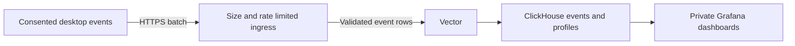

# Optional usage and performance statistics

Status: planned at the owner's request of 2026-10-08; implementation is not authorized. The [task plan](../../tasks/project/usage-statistics.json) separates consent, collection, desktop controls and delivery from backend preparation and final qualification. No statistics are collected by this design change, and `api.luxforge.app` has no implemented ingestion API yet. Production reporting stays switched off in every build until that endpoint is deployed and checked ([build identity and activation](#build-identity-and-activation)).

## Outcome and scope

Ask once when a person opens the desktop whether they want to help improve Luxforge by sharing usage and performance statistics. After an explicit yes, record meaningful operations across Select, Develop, tools, masks, history, presets, settings, import and export as a timeline of typed events, with periodic performance samples, app/OS versions and bounded CPU/GPU/memory details. A random persistent installation ID links reports across launches, and a random per-launch session ID strings one session's events together, so a session can be followed in order and an installation's sessions compared over time. Settings always offers opt-in and opt-out. Editing, opening, importing, exporting and quitting never wait for delivery.

An event says what kind of thing happened, when, and in Develop to which image by a keyed image ID. For example, a session's timeline can show that image `3f9c…` was opened in Develop, Basic was committed twice, a mask was added and that image was exported 812 ms later, and a later session can show the same image opened again. It cannot name the photograph, show its contents, report the Exposure value or say which file was exported, and the image ID cannot be turned back into the file. Event order, timing and per-image linking are the point (owner, 2026-10-09); personal information and photo contents, names and metadata remain excluded. Delivery is best effort: losing statistics is preferable to retaining a backlog or slowing the editor, and lost events show as gaps in a session's sequence numbers.

The client contract and a locally runnable, open-source backend reference, including per-session timeline and simple path queries, are in scope. Accounts, unique-person counts, crash reporting, remote configuration and production hosting are outside it. A reporting-installation count is possible; it must not be described as people or physical devices. DNS, certificates and a production deployment are external inputs to a live-endpoint check, not prerequisites of client implementation or local verification.

The owner's additional requirements for a persistent ID, device details, linkable timelines and per-image IDs make these reports **pseudonymous**, not fully anonymous. This is the current contract; no name, contact information, IP address, photo content or photo metadata is collected or retained as statistics. Do not promise that a stable random ID or a device profile is impossible to link to other information.

## Consent and first launch

Consent belongs to the person's application configuration, outside catalogs and recipes, alongside existing [preferences](preferences.md). A new or existing configuration with no statistics choice starts off. A release update or a different catalog does not reset the choice.

Persist a protected `usage_statistics` record in `preferences.json`:

```json
{"prompt_shown": true, "enabled": false, "disclosure_version": 1}
```

An absent record means `prompt_shown: false`, `enabled: false`. An enabled record additionally holds an `installation_id`: a cryptographically random UUIDv4 created and persisted on the disabled-to-enabled transition, never derived from a username, hardware identifier, catalog, photo, IP address or machine fingerprint. It stays stable across launches, app upgrades and catalog changes for this configuration while sharing is enabled; setting an already enabled choice to true is a no-op and keeps the ID. A successfully saved opt-out deletes it; a later explicit opt-in creates a new ID. No ID exists before agreement or for a refusal. It is a reporting identifier, not an authentication secret. The same transition creates an `image_key`, 32 cryptographically random bytes that key the [image ID](#privacy-device-context-and-the-event-registry); it is stored and removed with the installation ID, and unlike it is never uploaded, logged or returned by any read. The disclosure version identifies the described data classes and destination. The only supported record shape is the current shape; unsupported or malformed preferences remain unchanged and statistics stay off. The startup prompt is suppressed when the preferences cannot be read or written. There is no recovery path that replaces the person's file or treats a read failure as permission.

On the first eligible desktop opening, after the workspace can be used, the desktop calls the proposed `usage.prompt.claim`. A bounded atomic write marks `prompt_shown: true` and keeps collection disabled **before** the notice is displayed. Only the instance winning that claim displays it. The write is bookkeeping, an explicit exception to the ordinary rule that preferences store only chosen values. A crash, dismissal or close after the claim cannot produce another automatic prompt. Once means once per retained configuration; deleting that configuration removes the record.

Use a small non-modal notice in the workspace, with no focus grab or keyboard trap. It does not cover the photograph's controls, defer the first usable frame or queue behind editing commands. Delay presentation while a native dialog or another consent notice is open; if the app closes first, do not ask again. No option is selected automatically:

> Help improve Luxforge?
>
> Luxforge can send usage events to api.luxforge.app for debugging and analytics. They never include your name, contact details, IP address, photos, filenames or photo metadata. You can change this in Settings › Privacy.

Buttons: **Share statistics** and **No thanks**. Close or Escape means No thanks. No thanks is neutral, equally accessible and never followed by another startup request or reminder.

Share statistics becomes effective only after its choice and new ID are saved successfully. Nothing from before consent is buffered or backfilled, including the current launch or work already in progress. Settings uses the same disclosure and command. A setting changed to off immediately disables producers, advances the collection generation, clears every buffer/device snapshot and cancels the active request before its persistence is attempted. A successful off write removes the stored ID without resetting `prompt_shown`. A failed off write leaves this process off, shows the ordinary preference-save error and makes clear that the stored choice/ID were not changed; it must not be silently re-enabled by a readback. Bytes already received by the server cannot be recalled; accepted events expire under the backend's 90-day retention.

## Settings and programmatic parity

In an eligible launch, add a **Privacy** tab to the existing Settings sheet with **Share usage and performance statistics**, off by default, the same disclosure, and a collapsed **What is sent** list of the event, ID and device fields below for anyone who wants the detail. The disclosure itself says only that events are tracked for debugging and analytics and what they never include (owner, 2026-10-09); it does not claim the reports are anonymous or contain no personal data, since they carry persistent random identifiers. Changing it applies at once without a relaunch. The switch reports the effective choice and any failure to save it. There is no Send now button, connectivity warning, backlog indicator or automatic retry toast.

All methods below are proposed, not existing commands. Register their schemas in the same command service used by the GUI:

| Method | Contract |
| --- | --- |
| `usage.read {}` | Return `prompt_shown`, stored consent, effective collection state, disclosure version, destination, the local installation ID when enabled, and a fixed reason when disabled (choice, launch mode, build, inactive destination, unreadable configuration or changed disclosure). Return the current session ID (never the image key), the machine-readable event/device allowlist and delivery limits, and bounded local diagnostics (events recorded, dropped and sent); expose no buffered events, file contents or network error text. No network request. |
| `usage.prompt.claim {mutation}` | Require the host's existing permission authority. Atomically claim the first eligible startup notice; return `show_prompt: true` only to its first claimant. A duplicate request returns no instruction to show it again. Already answered, ineligible and headless cases return false. |
| `usage.set {enabled, disclosure_version?, mutation}` | An explicit true requires permission authority and the current disclosure version, as grants do today. A false is allowed to ordinary connected clients as revocation; reject a disclosure argument on false. Save outside the catalog, emit a local change event and return effective state. Unsupported keys or versions fail explicitly. |

Use the existing `{request_id, actor}` mutation envelope and authoritative request handling. An actor string or same-user socket access cannot grant consent. The live-session CLI can read or disable statistics but cannot enable them, matching [module consent](module-capabilities.md#capability-and-consent-contract). A trusted programmatic host with explicit permission authority can use the same enable command; the desktop's notice is not an independent source of permission.

`preferences.read` also reports the stored protected record without its `image_key`; `preferences.set` cannot modify or reset it, even with `null`. Its generic reset path must not cause another prompt or bypass permission authority. Both command schemas describe that restriction. Telemetry operations and their reads are never counted as usage events. Local consent events can contain their ordinary actor/request metadata; they never enter uploaded statistics.

One process-wide statistics supervisor serves all of a desktop process's catalogs and clients. Consent changes from its own clients update an open Privacy tab through existing event synchronization. There is no preferences file watch or polling timer: before detaching a window and again before every network handoff, the worker rereads the stored record off the owner. A stored opt-out, or an installation ID different from the one in memory (another process opted out and back in), ends the current generation, clears every buffer and stops producers in this process, so another process's revocation can never be followed by an upload. A request already handed to the transport has the same unavoidable cancellation limit as a local one.

Collection and prompting are suppressed for debug/developer, hidden, background, evidence, test and headless launches regardless of stored consent. `luxforge-json` never starts this feature. A CLI or future MCP call attached to an eligible, opted-in desktop is counted at the shared operation boundary. Tests inject a receiver and explicit test eligibility into isolated configurations; they cannot contact the production origin. There is no command or environment override that forces real collection without consent.

### Build identity and activation

Every build is version `0.0.0` today, and only `cargo xtask package` records a source revision (in `build.json`), so the version alone cannot separate builds when performance is compared. `cargo xtask package` therefore also embeds the clean source revision in the executable at build time. The reported release is the workspace version plus the first 12 hexadecimal characters of that revision (`0.0.0+9d4138ca1f2e`), a public fact about open-source code. A build without an embedded revision (an ordinary `cargo` or `cargo xtask develop` build) or from a dirty tree is not eligible for production reporting.

Production delivery also has one checked-in activation switch in the core, off in this plan. While it is off, every build behaves as an ineligible launch: no startup notice, no prompt claim, no collection and no Privacy tab, so no build shows a control that cannot work. `usage.read` reports `inactive destination`. Turning it on is a separate, authorized one-line change, made only after the deployment checklist has passed against the real `api.luxforge.app` endpoint, because the notice promises behavior (no IP records, 90-day expiry) that only a deployed backend can keep. Until then, the working client is exercised through explicit test eligibility and a loopback receiver, which need neither the switch nor a packaged build.

## Privacy, device context and the event registry

The envelope contains the public app release, installation ID, session ID and this strictly bounded device context, acquired on a worker only after consent:

| Field | Allowed information |
| --- | --- |
| OS | Family (`macos`, `windows`, `linux`, `other`), numeric major/minor/patch and build/revision when available; Linux distribution from a fixed family enum with numeric release and numeric kernel version only, with no raw suffix/PrettyName. |
| Architecture | `arm64`, `x86_64` or `other`. |
| CPU | Vendor family (`apple`, `intel`, `amd`, `qualcomm`, `other`), physical/logical core counts in `1..=1024`, and normalized model information: x86 family/model/stepping integers or Apple silicon generation/tier. Other supported chips use a reviewed finite model enum; unknown stays unknown. No raw CPU brand string. |
| System memory | Installed-memory upper-bound band in GiB: `8, 16, 32, 64, 128, 256, 512, 1024, over1024`. No DIMM serials or other inventory. |
| GPU | At most two already selected renderer/tile adapters, deduplicated by model. Backend/type/vendor enums, numeric vendor/device **model** IDs where available, normalized model family (including Apple generation/tier), unified-memory status and a dedicated-memory capacity band if already available. Device/adapter UUIDs, serials and PCI bus locations are excluded. Numeric normalized driver version is optional; unrecognized/raw driver strings are omitted. |
| Renderer | Actual `gpu` or `reference` path and a fixed fallback-reason enum when needed; no error text. |

Every optional field has a known source and fixed schema/range. OS/build/driver versions use bounded numeric components (at most four `u32` components; platform build letters only through a fixed parser), never a free-form system string. Preserve version distinctions needed to group performance results without sending usernames, hostnames, environment variables, local paths, locale, timezone, network interfaces, MAC/IP addresses, machine/device identifiers or arbitrary provider descriptions. Unknown fields are omitted or use the defined unknown enum, with no raw-string fallback. The release is the bounded `version+revision` string from [build identity and activation](#build-identity-and-activation); an unrevisioned or dirty build does not report.

Reuse the safe platform-counter crate and the app's existing adapter selection/info for these fields. Do not create a GPU device, enumerate disks/network interfaces, inspect other processes or run external system commands for reporting. Gather once per enabled launch and refresh only when the existing renderer reports an adapter/path change; metadata work never runs on the UI/owner or introduces a polling loop. Include the bounded profile in each existing batch so no discovery request, handshake or extra device-report endpoint is needed.

Three identifiers link reports, and no others are uploaded:

- The **installation ID** is the only persistent one, with the lifetime described under consent.
- The **session ID** is a cryptographically random UUIDv4 held only in memory, created when collection becomes effective in a launch: at startup with consent already saved, or at a mid-launch opt-in. It is never persisted. A consent generation change (off and on again) or a new launch starts a new session.
- The **image ID** names a photograph open in Develop: the first 16 bytes, as 32 lowercase hexadecimal characters, of HMAC-SHA-256 (RFC 2104, over the locked `sha2` crate, with no new dependency) keyed by the installation's `image_key` over the photograph's catalog fingerprint, the SHA-256 of its original that every developed photograph already has. It reads no file and costs one HMAC when a photograph is adopted. It is stable across launches, catalogs, renames, moves, relinking and duplicate copies of the same bytes for as long as the installation ID lasts, and changes with it after an opt-out. Without the key, which never leaves the machine, it cannot be matched to a file, even by someone holding the photograph.

A hash of the filename and creation time was considered and rejected: names collide across cameras (`DSC_0001.JPG`), change on rename or copy, can themselves contain a person's name, and an unkeyed hash of a guessable name and time can be reversed by guessing. An unkeyed content hash would let anyone holding a published photograph confirm that this installation edited it.

No user/account identity, machine identifier, catalog, catalog asset, request or trace ID is uploaded. Timestamps, event order and exact durations are sent, as described under the wire protocol. No originals, previews, pixels, hashes other than the keyed image ID, filenames, paths, EXIF, camera/lens identifiers, resolution/megapixel/file-size/input-format labels, names of presets/versions/folders, free text, error messages, editing values, credentials, module settings or URLs are accepted by the statistics API. Images-added events carry a count only, with no per-photo attributes. Do not hash excluded values or IPs as a substitute for excluding them; the image ID is a keyed hash of the content fingerprint, never of a filename, path or metadata.

Use typed, finite event names, enum fields and bounded numeric fields defined by a checked-in registry. There is no `record(name, JSON)` or arbitrary label API. Unknown module IDs, commands, actions and strings have no upload representation until deliberately mapped into the registry. Adding a module does not automatically send its descriptor, action arguments or settings. Mark every currently registered command as an approved operation or an explicit exemption, so full-app coverage is reviewable without exporting the command log.

Initial events (every event also carries its sequence number and time, described under the wire protocol):

| Event | Meaning and permitted fields |
| --- | --- |
| `image.open` | A photograph became the open photograph in Develop; `image`. Reopening the same photograph later emits it again. |
| `session.start` | The session's first event, at time 0; `trigger: launch/opt-in`. No retrospective events from before consent. |
| `app.presented` | The window became visible or hidden (minimized or explicitly hidden, by the [visibility](visibility-and-monitoring.md) rules); `state: visible/hidden`. |
| `app.idle` | No deliberate interaction for one minute, or interaction resumed after that; `state: idle/active`. Active time is derived from these and `app.presented`, not sent as a total. |
| `workspace.enter` | A deliberate transition to Select or Develop; `workspace`. Initial state restoration is excluded. |
| `interaction` | A completed deliberate operation in navigation, zoom, compare, clipping, information, history, versions, presets, copy/paste, masks, catalog organization, Locate, preferences and export; fixed `feature` enum, and `image` when it acts on the open Develop photograph. A continuous gesture is one event at its completion. Reads, discovery, polling, progress, redraws and automatic preference restoration are excluded. |
| `tool.commit` | One per built-in adjustment group that a successful recipe transaction actually changed; fixed built-in `tool` enum and the `image` it changed. No parameter name or value. A multi-tool preset or paste emits one event per changed group, at the same time; automatic first-open lens/look entries and intermediate drag ticks emit nothing. |
| `images.added` | One per committed add operation, with `count` (1 to 1,000,000) newly committed original photographs and no photo attributes. Reopening/re-importing an existing photograph, directory indexing, grid thumbnails and failed/skipped rows add nothing. The current Develop/pick-develop paths publish their committed new-row count. |
| `operation.end` | The terminal outcome of a fixed operation: source preparation, catalog scan, export or Auto tone; `outcome: completed/cancelled/refused/failed`, `duration_ms` from its start, and for export `count`, the images written. Source preparation, Auto tone and an export of the open Develop photograph also carry `image`; a multi-photograph export or catalog scan carries none. No error codes or messages. |
| `preview.settled` | A settled preview completion; `image`, `renderer: gpu/reference` and `duration_ms`. No photo-derived size/format fields, frame-by-frame timings or per-tile events. |
| `process.sample` | A process performance sample: `cpu_percent` (percent of one core from existing CPU-time deltas, not normalized to the core count), `memory_mib` with `memory_kind: footprint/resident/private`, and `gpu_percent` and `gpu_memory_mib` where existing platform counters support them. A missing, reset or invalid counter is omitted, never a synthetic zero; GPU memory is not added to process memory on unified-memory machines. |

Numeric fields are integers with registry ranges: durations are clipped to 24 hours, percentages to 0–102,400 and memory to 0–16,777,216 MiB. Nonfinite or negative observations are dropped. The registry, not the client, decides which fields each event may carry.

Use the authoritative command/completion boundaries, not Iced click handlers or a copy of `events.since`. A retried/deduplicated mutation emits once. Intentional API actions and GUI actions on the same desktop produce identical events; worker jobs report their single terminal outcome. Automatic sub-operations must not emit a second user operation. An operation started before enabling, or whose generation was revoked, emits no completion or timing after enabling. Cancelling/superseding a draft is not a tool commit; deliberate reset to a different value is.

The instrumentation task produces an inventory mapping every current user-facing command/action and GUI-only workspace operation to its event and emission semantics, or its privacy/internal/read exemption. Include shortcuts, palette actions, brush/gradient completion, catalog batches and asynchronous failure/cancellation. This inventory describes shipped operations only; planned tools are added when delivered.

The stable installation ID deliberately permits linking that configuration's sessions, timelines and device profiles across launches while consent remains enabled, the session ID links one session's events in order, and the image ID links one photograph's Develop events across that installation's sessions. It is random and carries no encoded identity, but reports are pseudonymous and can still permit inference; no assertion of complete anonymity or that the identifier is categorically non-personal data is made. No names/contact details or photo data are collected. The backend must not enrich reports with IP geography, cookies or other identifiers, and must never log, hash, persist, index or rate-limit by IP address. The network must use source/destination addresses to make a connection; those transport addresses are not report fields or statistics records.

## Bounded collection and performance sampling

The core owns consent, typed collection and its invariants. The desktop owns presentation visibility and GUI-local gesture completion; network implementation stays in `luxforge-net`. Reuse `Transport`, `JobControl`, process resources and worker completion seams; do not add an analytics SDK, second HTTP client, GPU query, image read or rendering pass. This is a host service, not an editing module.

Producers check a cheap enabled/generation gate, take the next session sequence number and time, and write one fixed-size event record (a typed name, enum fields and bounded integers, no strings) into the active bank. The disabled path creates no statistics buffers, worker, sampler timer or endpoint lookup. Enabled producers do constant bounded work with no formatting, serialization, filesystem access, allocation per event, blocking channel send or waiting for the exporter. Contention or a full bank drops the event and counts it; its sequence number is still consumed, so the gap is visible. The banks are the only event storage. Routine lock-free or non-blocking bank design is delegated to the implementer.

A window holds at most 512 events. Two banks at most (active and detached, 1,024 event records), a device context of at most 2 KiB, a single serialized batch, and coalesced control messages fit within **256 KiB of new application-owned statistics storage combined**. Count allocation capacity, not just used bytes. Thread stack and the existing transport's TLS/platform allocations are outside this buffer bound and must be measured separately; this is not a total process-memory guarantee. Nothing scales with photograph count, pixels, history or time offline. A device-context change closes the old window without forcing an early upload; never attribute old events to a new profile.

Event time is milliseconds since the session started. The implementer chooses a monotonic platform clock that advances through system sleep, or starts a new session after a sleep, so that times within a session never go backwards or silently compress.

Sample process performance at most once per 60 seconds of presented activity, each sample one `process.sample` event, independently of whether Performance is expanded. Reuse a recent report from the existing [resource sampler](performance-panel.md#resource-counters) when available; coordinate freshness so the telemetry sampler does not duplicate the panel's system calls. Otherwise read through the same process-wide sampler on the statistics worker, off the UI and owner. The first CPU/GPU read establishes a baseline. Drop invalid/reset deltas, and reset the baseline after hiding, sleep or consent changes. Do not include unavailable-counter explanations in uploads.

Reuse native [visibility](visibility-and-monitoring.md) and deliberate-operation wakes. Hidden/minimized windows do not sample or start uploads; they record only the `app.presented` transition and any terminal outcomes of background jobs. A remaining nonempty batch may have one scheduled flush while the window is presented; an empty idle collector has no timer. The worker blocks until data/control or its next necessary sampling/flush deadline. It never wakes the GUI for timer ticks, sample results, upload progress or failures. A long background job may contribute its terminal outcome if still in the consent generation, but does not keep an idle performance sampler awake.

## Delivery policy

| Limit | Initial contract |
| --- | --- |
| Destination | Only `https://api.luxforge.app/v1/usage/batches`; no query string, cookies, authentication token or redirect following |
| Normal flush | Ten minutes after the first event in a fresh window, or as soon as the window holds 512 events, plus 0–60 seconds jitter; no immediate startup/opt-in request |
| Traffic | No hourly or daily request or byte cap (owner, 2026-10-09). Attempts are at least 60 seconds apart, so a flood of events fills windows rather than sending back to back |
| Body | One JSON document, at most 64 KiB and 512 events; no compression or splitting into extra requests |
| Concurrency | One background worker and one request in flight; no pending request queue |
| Timeouts | Connect 2 s, idle 2 s, total 5 s, including resolution under the existing transport's bounded contract |
| Response | At most 1 KiB of body; ignored. Existing transport header limits apply. |
| Retention | In-memory only; discard a window once its oldest contribution exceeds 30 minutes. On resume, drop expired data before scheduling anything. No disk spool or crash recovery. |
| Quit | Cancel and discard. No final upload, network wait or close delay, so a session's timeline normally lacks up to its last ten minutes. Ordinary preference persistence retains its existing close behavior. |

Volume is bounded by the schedule, not a quota: one request at most every 60 seconds, each at most 64 KiB, with the failure cooldown and `429` below. Restarting does not replay data. A window that fills while the next attempt is not yet allowed drops further events, which become a sequence gap. If serialization would exceed 64 KiB, omit `process.sample` events first and then the newest events, count them as dropped, and send the rest. Never send a partial JSON document or manufacture success.

Before detaching data and immediately before network handoff, check effective eligibility, the consent generation and stored permission. Producer observations, detached banks, scheduled work and completion callbacks carry that generation. Opt-out cancels its `JobControl`; a late callback cannot resurrect the worker, requeue bytes or enable collection. Existing transport cancellation shuts the socket; DNS/connect cancellation retains its declared bounded limitation. In-memory reports from before a disable are not used after a later opt-in.

Each detached batch has **one transmission attempt**. Discard it regardless of success; do not retry an ambiguous request or replay events that might already have arrived. `200`, `202` and `204` mean accepted, without requiring durable backend storage. Network/TLS/timeout failures, `408` and `5xx` delay attempts for fresh data using a 20, 40, 80, 160 then 360 minute cooldown with up to 10% positive jitter. A successful attempt resets this cooldown. `429` honors a valid `Retry-After` for future batches, clamped to 10 minutes–24 hours; otherwise use the cooldown. Ignore malformed/oversized values. Other `4xx`, including the nonexistent endpoint's `404`, and any `3xx` suspend sending until the next launch; they do not change saved consent. No health check, connectivity poll or remote configuration fetch exists.

Empty batches are never sent. Cooldowns do not keep an empty worker ticking. Incoming events may be recorded during a cooldown within the same memory/age limits; expired windows are replaced, not accumulated. Performance samples do not themselves create activity. Delivery status is only a bounded local diagnostic (`attempts`, `accepted`, `dropped`, cooldown/suspension reason); it neither adds another telemetry stream nor appears in the status bar.

## Wire protocol

Choose a small Luxforge JSON schema over HTTPS, carrying **an ordered list of typed events** with the installation and session IDs and approved device context. This uses the current bounded HTTP transport and lets the ingress enforce the entire privacy allowlist without accepting arbitrary event attributes. It is deliberately not advertised as OTLP.

The envelope's `session_start` is the client's UTC wall-clock time when the session began, to the second. `batch_seq` counts this session's batches from 0. Each event's `seq` counts this session's events from 0, including dropped ones, and its `t` is milliseconds since `session_start`, so events are ordered by `seq` and `t` never decreases. `dropped` is the number of this window's events that were not sent. A gap in `seq` or `batch_seq` is a lost event or batch.

Example:

```json
{
  "schema": 1,
  "disclosure_version": 1,
  "release": "0.0.0+9d4138ca1f2e",
  "installation_id": "c9a10716-1b78-4cbe-8d1c-b8309e5e7247",
  "session_id": "5f0c2e3a-8d47-4b6e-9a1f-2c7d9e4b1a60",
  "session_start": "2026-10-09T14:03:12Z",
  "batch_seq": 2,
  "dropped": 0,
  "device": {
    "os": {"family": "macos", "version": [15, 5]},
    "arch": "arm64",
    "cpu": {"vendor": "apple", "generation": 4, "tier": "pro",
            "physical_cores": 12, "logical_cores": 12},
    "memory_gib_band": 32,
    "gpus": [{"vendor": "apple", "backend": "metal", "type": "integrated",
              "generation": 4, "tier": "pro", "unified_memory": true}],
    "renderer": "gpu"
  },
  "events": [
    {"seq": 41, "t": 1203400, "name": "workspace.enter", "workspace": "develop"},
    {"seq": 42, "t": 1219050, "name": "tool.commit", "tool": "basic",
     "image": "3f9c2a7e5b1d48c09e6f1a2b3c4d5e6f"},
    {"seq": 43, "t": 1260000, "name": "process.sample", "cpu_percent": 37,
     "memory_mib": 2140, "memory_kind": "footprint"},
    {"seq": 44, "t": 1284711, "name": "operation.end", "operation": "export",
     "outcome": "completed", "duration_ms": 812, "count": 1,
     "image": "3f9c2a7e5b1d48c09e6f1a2b3c4d5e6f"}
  ]
}
```

Send `Content-Type: application/json`. The existing transport supplies its fixed public User-Agent and connection framing; put the reporting and session IDs only in the body, never in a URL/header/log. Each batch carries only events not sent before. The backend derives fleet totals and distributions from events, follows a session's timeline by session ID and `seq`, and compares an installation's sessions and performance over time. Loss, self-selection, the missing tail of a session, malicious reports and possible backend duplicates make these estimates; sessions are not users, and distinct installation IDs are consenting configurations, not people or physical machines. Opt-out/reinstall/config copies can change or duplicate this relationship.

The implemented registry/schema must validate client encoding and ingress decoding: exact allowed envelope/device keys and enum values, canonical random UUIDv4 installation and session IDs, a `session_start` in the canonical second-precision UTC form, bounded numeric version/model fields, at most two GPU profiles, the 2 KiB device-context cap, exactly the fields each event may carry, strictly increasing `seq` with non-decreasing `t`, integer/range constraints and both byte/event limits. Unknown schema/disclosure versions, extra keys, arbitrary strings or malformed records reject the **whole** batch with `400`; overlarge bodies use `413`, wrong content types `415`. Only the latest schema is supported, without migrations or historical-client compatibility. A new disclosure scope cannot inherit old consent: keep collection off and `prompt_shown` true until the person explicitly enables the new disclosure in Privacy, without another automatic startup prompt.

### Options considered

| Option | Decision |
| --- | --- |
| Aggregate counters and histograms only | The previous recommendation. Smaller and harder to link, but it cannot string a session's events together, which the owner asked for on 2026-10-09. Fleet totals and distributions are derived from events instead. |
| OTLP/HTTP logs | An established [HTTP/Protobuf or JSON protocol](https://opentelemetry.io/docs/specs/otlp/) with a log/event record shape. Viable, but its free-form attributes/resources and exporter behavior need restrictions for this consented use. The limited initial schema avoids adding a general SDK or exposing a broad OTLP receiver. A server-side adapter can be added if later infrastructure needs it; it is outside this plan. |
| Luxforge HTTPS event batches | Selected: finite approved device fields and event vocabulary, random installation and session IDs, no photo/PII fields, explicit losses and hard resource limits. The API can evolve with the current pre-release shapes; backend choice does not enter editing modules. |

## Open-source backend reference

Prepare a separate Rust backend service under `services/usage-ingest/`, a standalone package with its own empty `[workspace]` table and `Cargo.lock` outside the root workspace, so desktop builds, core tests and `cargo xtask check` gain no server dependency while its own tests run with `tools/cargo-cached test --manifest-path services/usage-ingest/Cargo.toml`. The repository's pinning, notice and advisory checks are extended to cover its lockfile. It is a small stateless validating ingress, not an account or analytics product. Provide a local compose configuration and runbook under `services/usage-statistics/`; paths are proposed outputs and do not exist yet.



The ingress rejects unsupported bodies before forwarding, removes all connection metadata, and converts an accepted batch into one row per event: installation ID, session ID, `session_start`, `batch_seq`, `seq`, `t`, the event name and its registry fields, plus the server receive time to the second. The release and device profile are stored once per session and replaced when a later batch carries a changed profile. Store no raw HTTP bodies or additional linking key. Retain events, sessions and associated profiles for 90 days, with tested expiry, no indefinitely retained device inventory, and bounded transient buffers. Queries deduplicate on `(session_id, seq)` so a possible duplicate batch does not double-count. Order a session by `seq`; place it in wall-clock time by `session_start + t`, and keep receive time for detecting client clock skew. The image ID is an ordinary event column, so one image's events can be followed across sessions of the same installation.

[Vector's HTTP source](https://vector.dev/docs/reference/configuration/sources/http_server/) can receive the private event rows and its [ClickHouse sink](https://vector.dev/docs/reference/configuration/sinks/clickhouse/) writes JSONEachRow. The raw public endpoint is the validator, not an unrestricted Vector endpoint. [Vector (MPL-2.0)](https://github.com/vectordotdev/vector/blob/master/LICENSE), [ClickHouse (Apache-2.0)](https://github.com/ClickHouse/ClickHouse/blob/master/LICENSE) and [Grafana OSS (AGPL-3.0)](https://github.com/grafana/grafana/blob/main/LICENSE) provide the open-source reference stack; pin the images and required Grafana datasource plugin when implementing, preserve notices, and do not claim a manual dependency audit.

The public ingress requires no embedded secret: an open-source desktop cannot protect one. Bound request size, parsing depth, concurrency, global queue size and request time. Use global rate limits and optionally a bounded in-memory limiter keyed by the already approved reporting ID, with entries expired within 15 minutes; never key by, hash or record IP addresses, even for abuse analytics. Validate size/shape and global admission before allocating ID-specific state. Limits affect only the statistics route; exact capacity/rates are delegated within the best-effort contract. IDs can be forged, so they are not authentication and global limits remain necessary. A full buffer drops/refuses requests, never spills to unbounded disk. Replies cannot issue commands or change collection policy.

Configure every network hop, reverse proxy, container, ingress, Vector, database and dashboard to avoid logging IPs, User-Agent/header values, payloads, reporting or session IDs or rejection bodies. No forwarding of `X-Forwarded-For`, cookies or other request identifiers to analytics. Disable public-route access/security logs containing peer addresses, body capture, query logs containing input rows, traces and third-party analytics; backend diagnostics contain only fixed status classes and aggregate counts. Use private database/collector/dashboard networks and authenticated dashboard access. Any infrastructure that records client IPs, including default CDN/WAF analytics or IP-based access records, is unsuitable for this deployment. Source/destination addresses necessarily exist in network packets and connection state, but never enter statistics, persistent logs or an IP-keyed tracking table.

Provision private dashboards for feature/tool use, images added/exported, active time, operation outcomes and timing/resource percentiles by app/OS/CPU/GPU/memory cohorts; a per-session timeline view; simple path queries (for example, the share of sessions that go from adding images to Develop to a completed export, and what precedes a failed operation); per-image histories (what was done to one image, in which order, across sessions, and how long its previews and exports took); and per-installation history for performance debugging. They must disclose best-effort loss, the missing session tail and opt-in bias. Session and installation counts must not be labelled users or physical devices, and image IDs from different installations are unrelated even for the same photograph; no account join or photo lookup exists. Pseudonymous device profiles, timelines and sparse cohorts do not prove anonymity.

The local reference is fully testable before `api.luxforge.app` exists. Prepare deployment instructions, privacy checks and a synthetic live-endpoint probe; provisioning or publishing is outside this planning request. Before distributing an eligible client, the real endpoint must be deployed with the same schema, limits, IP/body non-retention and expiry controls. Real users' reports are not test fixtures. Its absence only leaves live delivery unverified; it must not block a working local delivery or be hidden as a pass.

## Acceptance and evidence

- Activation: with the activation switch off, or in an unrevisioned or dirty build, no notice, claim, Privacy tab, collection or network work exists and `usage.read` reports the reason; a packaged build embeds its clean revision in the reported release.
- Consent: first eligible launch shows the notice once after a durable claim; Allow, No thanks, Escape, close, crash/relaunch, catalog changes, concurrent claimants, corrupted/read-only files and saved choices behave as specified. No collection or network/DNS/TLS work occurs before consent or in suppressed modes. Authority tests reject ordinary-client enable and generic-preference bypasses.
- Revoke: an opt-out during queued work, serialization, resolution, a blocked socket or a late response clears both banks and prevents future handoffs; off/on never leaks the previous generation. A failed persistence attempt stays off in process and reports its actual stored state. Another process's saved opt-out or ID change is caught by the stored-record check before detaching or handoff, and nothing from the old generation is sent.
- Coverage: the inventory accounts for all shipped user-facing operations. GUI, keyboard, palette and API parity, mutation deduplication, meaningful tool commits, import counts, failures/cancellation and continuous-gesture coalescing have focused tests. Read/poll/progress paths produce zero events.
- Timeline: a scripted session yields events in the order performed, with strictly increasing `seq`, non-decreasing `t`, a fresh session ID per launch and per off/on, and the same installation ID across launches. Dropped events and discarded batches appear as `seq`/`batch_seq` gaps and in `dropped`, never as reordered or invented events.
- Privacy/device context: random installation ID and image key creation/persistence/removal, in-memory-only session IDs, image IDs stable across rename/move/relink/catalog and changed after opt-out and opt-in, and scope changes are tested; the image key never appears in a request, read, log or stored row; no ID or device probing precedes consent. Known CPU/GPU/version profiles encode, while raw strings, hostnames, serials, machine/device UUIDs, IPs, filenames, paths, EXIF, photo sizes/formats, actors, preset names and error text cannot appear in requests, stored rows or logs. Installation and session IDs appear only in approved private bodies/rows, never URLs/headers/diagnostic logs. Unknown events or fields, out-of-range values, out-of-order sequences and unsupported shapes fail closed. Verify every hop and any rate limiter is IP-free; packet routing addresses are not misrepresented as absent.
- Bounds and delivery: fake-clock/transport tests prove storage capacity, the 512-event window and early flush, 60-second attempt spacing, nonempty jittered scheduling, no replay, cooldown/429 handling, timeout/cancellation, hidden/sleep behavior, stale-window loss and immediate quit. Flood/long-offline cases cannot grow memory or wake the GUI repeatedly.
- Rendered integration: one background-only app journey with an isolated configuration and injected local receiver correlates the startup notice, Privacy row, command state, logs and captured batches. Extend the existing `settings` smoke/evidence path rather than launching the editor directly or granting real production consent. Test across launches with the same isolated preferences; suppress real traffic even in those intentionally eligible test launches.
- Working delivery: client functionality and the local receiver journey are delivered before broad backend/native qualification. Update the preference/settings/Performance designs, command reference, architecture, guide and feature status to describe what was actually implemented; no rendered/performance evidence is claimed by this plan.
- Final measurement: after integration, compare opted-out and opted-in release builds on a quiet M4 with generated 24 MP/60 MP inputs and available authentic RAWs, including rapid tool drags, imports, export, idle/minimized states and a slow/offline receiver. Record input-to-frame distributions, producer cost, resource-sampling cost, process CPU/memory, TLS/stack overhead, request volume and shutdown behavior. Initial targets: producer p95 below 10 µs, no sustained latency increase above 1 ms or 5% (whichever is larger), and no extra GUI redraws attributable to collection/delivery. Targets are unmeasured, not guarantees. Ordinary exact/reference rendering checks remain in force. Missing private RAW/native platform inputs remain explicitly unrun; functional headless results are not native GPU evidence.

## Performance-rules checklist

- **Original reads, pixels and full-frame allocations:** none. Producers record committed counts, static operation categories and existing timing/resource values. The image ID is one HMAC over the catalog fingerprint already held when a photograph is adopted. Device context is gathered once after consent from safe system metadata and existing adapter reports, off the UI/owner, with no new GPU device or external command. No new decode, hash, render, texture, upload or point query.
- **Owner/UI threads:** constant bounded producer work; only ordinary bounded consent writes are owner work. Serialization, system sampling, DNS/TLS and sends run on the statistics worker. No activity/progress UI or per-event message.
- **Buffers/queues:** two fixed event banks of 512 records each, a device profile up to 2 KiB and one 64 KiB body, total new statistics storage 256 KiB; no other event queue, disk backlog or image-sized allocation. Only consent and the random ID are persisted locally, without buffered reports. The buffer cap is separate from measured thread/TLS overhead.
- **Timers/subscriptions:** none while disabled; while enabled, visibility/control wakes and only necessary off-UI sampling/flush deadlines, with no preferences watch (the worker rereads stored consent before handoff). No idle connectivity poll, GUI timer or statistics-driven redraw.
- **Reuse/cancellation:** existing network and process services; generation tagging and socket cancellation; late work cannot reinstate revoked consent. No shutdown network wait.
- **Exactness and measurement:** editing and image output remain unchanged; producer and native whole-editor measurements occur after working integration, with scope and unavailable evidence recorded.

## Decisions and delegation

Owner requirements: ask once on opening, explicit opt-in, event coverage across the app including tools/imports/performance, delivery to `api.luxforge.app`, background-only quiet batching, best-effort loss, and Settings opt-in/out. The owner additionally requests device details, a unique persistent ID, OS/app versions and CPU/GPU information to diagnose performance and target support, with no PII, IP tracking or photo/metadata information. On 2026-10-09 the owner added that a usage timeline is acceptable, and useful, as long as there is no PII: events from a single installation or session should be linkable in order. The owner then asked for a stable ID per image in Develop (suggesting a hash of filename and creation time), removed the hourly and daily caps, and asked that the disclosure say only that events are tracked for debugging and analytics, while ensuring there is no PII. Only import/export counts survive the photo-information exclusion. Protocol choice is explicitly delegated and an open-source backend is preferred.

Recorded planning choices: non-modal once-per-configuration notice; protected host consent; a random consent-lifetime installation ID stable across launches and rotated after opt-out, a random in-memory session ID per launch, approved bounded device profiles, and pseudonymous timelines of typed events with session-relative millisecond times and sequence numbers, with no PII, photo contents, names or metadata and no editing values; a keyed image ID (HMAC of the catalog fingerprint under a local installation key) on Develop events rather than a filename/creation-time hash; a short disclosure with the field list collapsed in Settings; ten-minute or 512-event HTTPS event batches at least 60 seconds apart, with no hourly or daily cap; bounded memory with no durable queue or retries of a sent batch; a process performance sample event at most once per minute of presented activity; a release identity of version plus embedded clean source revision, with unrevisioned builds ineligible; a checked-in activation switch, off until the real endpoint passes the deployment checklist; cross-process revocation through a stored-consent and ID check before handoff rather than a file watch; a standalone Rust ingress and Vector/ClickHouse/Grafana reference with per-event rows, timeline and path queries; 90-day event/session/profile retention and no IP-based logging/limiting. These are recommendations within the requested plan, not evidence of owner approval to implement or deploy. The implementer owns internal types/worker seams, responsive notice layout, static operation/model mapping and pinned backend packages within this contract. No material product question or additional research prerequisite is left in the task DAG.
